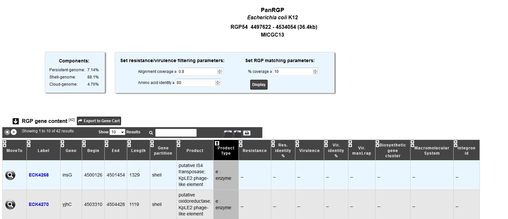
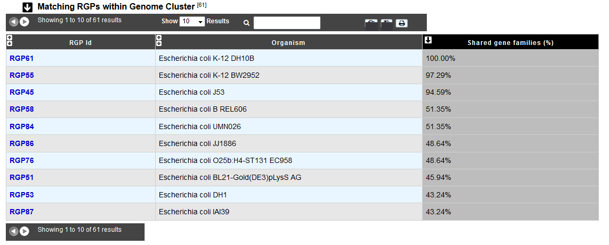

######################
How to explore an RGP?
######################

The RGP visualization page allows you to access a detailed description of the RGP composition.

The "Components" table gives the percentage of genes for each partition within the RGP.

The "RGP gene content" table contains information about the genes which define the given RGP and results with other methods:

 - Resistance genes: Antibiotic resistance prediction using `CARD method <https://microscope.readthedocs.io/en/latest/content/compgenomics/card.html>`_
 - Virulence genes: `Virulence prediction <https://microscope.readthedocs.io/en/latest/content/compgenomics/virulence.html>`_
 - Biosythetic gene clusters: `AntiSMASH Prediction <https://microscope.readthedocs.io/en/latest/content/metabolism/antismash.html>`_
 - Macromolecular systems: `MacSyFinder Prediction <https://microscope.readthedocs.io/en/latest/content/compgenomics/macsyfinder.html>`_
 - Integrons: `IntegronFinder Prediction <https://microscope.readthedocs.io/en/latest/content/compgenomics/integron.html>`_

To personalize the resistance/virulence search within the RGP, you can set alignment parameters using the form above.
 

The "Matching RGPs within Genome Cluster" table compares the given RGP with the predicted ones in the other organisms of the same MICGC (see method of  `Genome Clustering <https://microscope.readthedocs.io/en/latest/content/compgenomics/genoclust.html>`_ ). 
The percentage of shared gene families correspond to the number of  `MICFAM <https://microscope.readthedocs.io/en/latest/content/compgenomics/pancoreTool.html#how-the-analysis-is-computed>`_ (MicroScope gene families) that are present in the RGP of the compared organism. 

You may use the filter parameter "% coverage" to change the minimal value of "Shared gene families (%)" in the table.

