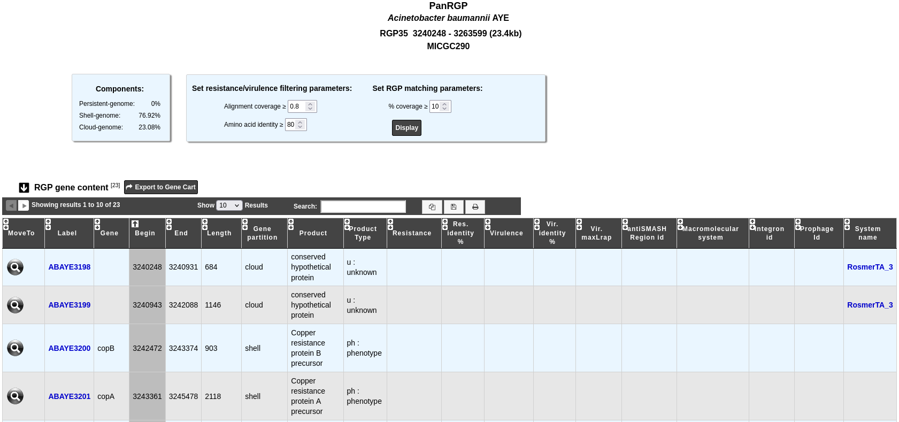
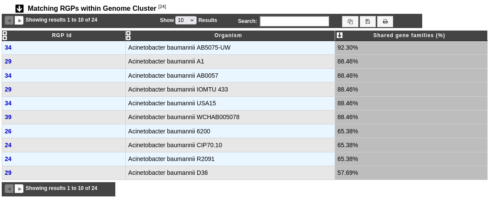

.. _rgpexplorer:

######################
How to explore an RGP?
######################

The RGP visualization page allows you to access a detailed description of the RGP composition.

The "Components" table gives the percentage of genes for each partition within the RGP.
To personalize the resistance/virulence search within the RGP, you can set alignment parameters using the form above.

The "RGP gene content" table contains information about the genes which define the given RGP and results with other methods:

 - **Label**: Label of the genomic object.
 - **Gene**: Name of the gene, if any.
 - **Begin**, **End** and **Length** indicate the location and the length of the genomic object on the sequence.
 - **Gene partition**: Partition of the gene (*persistent*, *shell*, *cloud*).
 - **Product** and **Product type**: Name and type of the genomic object product.
 - **Resistance** and **Res. identity %**: Antibiotic resistance prediction using the :ref:`CARD method <card>`.
 - **Virulence**, **Vir. identity %** and **Vir. maxLrap**: Virulence prediction using the :ref:`Virulence prediction <virulence>`.
 - **antiSMASH Region id**: Region prediction using :ref:`antiSMASH <antiSMASH>`. Click on it to open the detailled :ref:`antiSMASH cluster visualization window <domainviewer>` page.
 - **Macromolecular system**: Macromolecular system prediction using :ref:`MacSyFinder <macsyfinder>`. Click on it open the :ref:`MacSyFinder System visualization window <macromolecular-system-vizualization>` page.
 - **Integron id**: Integron prediction using :ref:`IntegronFinder <integron>`. Click on it open the detailled :ref:`IntegronFinder cluster visualization window <integron-cluster-vizualization>` page.
 - **Prophage id**: Prophages region predicition using :ref:`Phigaro <prophages-defense-systems>`. Clicking on this element will open an :ref:`interface <how-to-explore-a-prophage>` to explore the content of this region.
 - **System name**: Defense system prediction using :ref:`DefenseFinder <prophages-defense-systems>`. Clicking on it will open a detailled :ref:`description <how-to-explore-a-defense-system>` of this system.

The "Matching RGPs within Genome Cluster" table compares the given RGP with the predicted ones in the other organisms of the same MICGC (see method of :ref:`Genome Clustering <genoclust>`). 
The percentage of shared gene families correspond to the number of :ref:`MICFAM <pancore-analysis>` (MicroScope gene families) that are present in the RGP of the compared organism. 

You may use the filter parameter "% coverage" to change the minimal value of "Shared gene families (%)" in the table.

