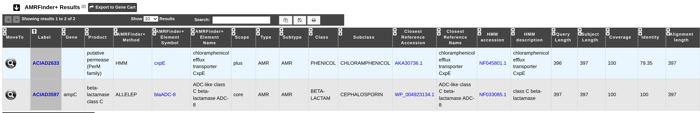

.. _amrfinder:

=========
Resistome
=========

What is AMRFinder+?
--------------------

The `AMRFinderPlus <https://github.com/ncbi/amr>`_ software and the accompanying database are designed to find acquired antimicrobial resistance genes and point mutations in protein sequences. 

AMRFinderPlus uses an `AMR protein database <https://www.ncbi.nlm.nih.gov/pathogens/refgene/>`_,  `HMMs <https://www.ncbi.nlm.nih.gov/pathogens/hmm/>`_, a hierarchy of AMR protein families, and a custom rule set to identify AMR genes and point mutations, stress response genes, and virulence genes.

The database is highly curated with hierarchical structure for AMR proteins, manually curated cutoffs, and associated hierarchical names. It also includes point mutations, stress response and virulence genes, and it contains additional descriptive fields for each gene or point mutation.

**References:**

`Feldgarden M, Brover V, Gonzalez-Escalona N, Frye JG, Haendiges J, Haft DH, Hoffmann M, Pettengill JB, Prasad AB, Tillman GE, Tyson GH, Klimke W. AMRFinderPlus and the Reference Gene Catalog facilitate examination of the genomic links among antimicrobial resistance, stress response, and virulence. Sci Rep. 2021 Jun 16;11(1):12728. doi: 10.1038/s41598-021-91456-0. PMID: 34135355; PMCID: PMC8208984. <https://pmc.ncbi.nlm.nih.gov/articles/PMC8208984/>`_

How to access to the Antibiotic Resistance predictions?
--------------------------------

AMRFinderPlus predictions are available through the Comparative Genomics section, in the main navigation menu.

How to read AMRFinder+ results?
--------------------------------

AMRFinder+ is ran with the protein sequences as input using the *"plus"* and the *"organism"* options. 
1. the *"plus"* option provides results from "Plus" genes such as virulence factors, stress-response genes, etc.
2. the *"organism"* option delivers optimized organism-specific results (only for organisms which have been curated). It screens known resistance causing point mutations specific typing (Stx Type for _Escherichia) and blacklists common, non-informative genes. 

All the results displayed are thouroughly described at AMRFinder+ `documentation <https://github.com/ncbi/amr/wiki/Running-AMRFinderPlus#output-format>`_. We recommand checking this page for more details.

* **Method:** Type of hit found by AMRFinder+ among 'ALLELEP','EXACTP','PARTIALP','PARTIAL_CONTIG_ENDP','BLASTP','HMM','POINTP'. The suffix of 'P' refers to the fact that the method was employed using protein sequences. 
* **AMRFinderPlus Element Symbol**: Gene or gene-family symbol for protein or nucleotide hit, with a link to its entry in the `Reference Gene Catalog <https://www.ncbi.nlm.nih.gov/pathogens/refgene/>`_. 
* **AMRFinderPlus Element Name**:  Full-text name for the protein, RNA, or point mutation.
* **Scope**: AMRFinderPlus splits the database into two subsets : *core* and *plus*.
* **Type and Subtype**: These fields describe the classification of the AMRFinderPlus gene. "Element type" is split into 3 categories, AMR, STRESS, or VIRULENCE. "Element subtype" is a duplicate of "Element type" unless a more specific category has been defined.
* **Class**:  For AMR genes this is the class of drugs that this gene is known to contribute to resistance of.
* **Subclass**: If more specificity about drugs within the drug class is known it is elaborated here.
* **Closest Reference Accession**: RefSeq accession for reference hit by BLAST if a blast alignment was detected otherwise NA. The link leads to its entry in the `ncbi <https://www.ncbi.nlm.nih.gov/protein>`_.
* **Closest Reference Name**: Full name assigned to the closest reference hit if a blast alignment was detected, otherwise NA.
* **HMM accession**:  Accession for the HMM, with a link to its entry in the `Reference HMM Catalog <https://www.ncbi.nlm.nih.gov/pathogens/hmm/>`_.
* **HMM description**: The family name associated with the HMM.
* **Query Length**: The length of the query protein or gene.
* **Subject Length**: The length of the Reference protein or nucleotide in the database if a blast alignment was detected.
* **Coverage**:  % of reference covered by blast hit if a blast alignment was detected.
* **Identity**: % amino-acid identity to reference protein if a blast alignment was detected.
* **Alignment length**: Length of BLAST alignment in amino-acids if a blast alignment was detected.

For all tables, you can export the genes by clicking on Export to Gene Cart.