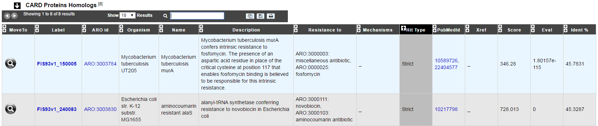
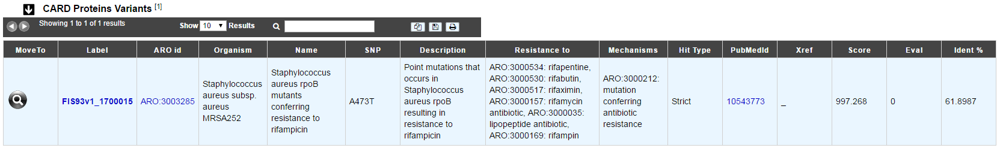

######################
Antibiotic Resistance
######################

What is CARD?
-------------------------------------------------------

The CARD is a rigorously curated collection of known resistance determinants and associated antibiotics, organized by the Antibiotic Resistance Ontology (ARO) and AntiMicrobial Resistance (AMR) gene detection models.

Know  more about `CARD <https://card.mcmaster.ca/home>`_

**References:** 

`McArthur et al. 2013. The Comprehensive Antibiotic Resistance Database. Antimicrobial Agents and Chemotherapy, 57, 3348-3357. [PMID 23650175] <http://www.ncbi.nlm.nih.gov/pubmed/23650175>`_

`Jia et al. 2016. CARD 2017: expansion and model-centric curation of the comprehensive antibiotic resistance database. Nucleic Acid Research. [PMID 27789705] <http://www.ncbi.nlm.nih.gov/pubmed/27789705>`_

What is RGI?
-------------------------------------------------------

Resistance Gene Identifier (RGI) predicts antibiotic resistance genes from genome sequence data. The RGI integrates ARO, bioinformatics models and molecular reference sequence data to broadly analyze antibiotic resistance at the genome level.

Know  more about `RGI <https://card.mcmaster.ca/analyze/rgi>`_

How to access to the Antibiotic Resistance predictions?
----------------------------------------------------------

CARD predictions are available through the **Comparative Genomics** section, in the main navigation menu.

What are these tables?
--------------------------------------------------------

The table **CARD Proteins Homologs** shows all CDS results with a Perfect or Strict hit for the **protein homolog model**.

- The **Perfect** algorithm detects perfect matches from the curated reference sequences and mutations in CARD.
- The **Strict** algorithm detects previously unknown variants of known AMR genes.
- The **Loose** algorithm works outside of the detection model cut-offs to provide detection of new, emergent threats and more distant homologs of AMR genes, but will also catalog homologous sequences and spurious partial hits that may not have a role in AMR.

The table **CARD Proteins Variants** shows all CDS results with a Perfect or Strict hit for the **protein variant model**.

You can access the CARD database entry by clicking on any **ARO id**
