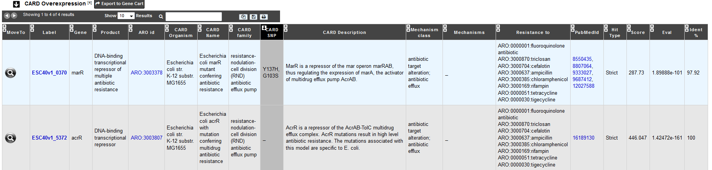

.. _card:

######################
Resistome
######################

What is CARD?
-------------------------------------------------------

The CARD is a rigorously curated collection of known resistance determinants and associated antibiotics, organized by the Antibiotic Resistance Ontology (ARO) and AntiMicrobial Resistance (AMR) gene detection models at McMaster University.

Learn more about CARD `here <https://card.mcmaster.ca/home>`_.

.. Don't use CARD as the name since that would make
   a duplicate with the label.

**References:** 

`McArthur et al. 2013. The Comprehensive Antibiotic Resistance Database. Antimicrobial Agents and Chemotherapy, 57, 3348-3357. [PMID 23650175] <http://www.ncbi.nlm.nih.gov/pubmed/23650175>`_

`Jia et al. 2016. CARD 2017: expansion and model-centric curation of the comprehensive antibiotic resistance database. Nucleic Acid Research. [PMID 27789705] <http://www.ncbi.nlm.nih.gov/pubmed/27789705>`_

What is RGI?
-------------------------------------------------------

Resistance Gene Identifier (RGI) predicts antibiotic resistance genes from genome sequence data. The RGI integrates ARO, bioinformatics models and molecular reference sequence data to broadly analyze antibiotic resistance at the genome level.
This software use different models describe below (CARD Proteins Homologs, CARD Proteins Variants ...) to detect the AMR and gives different types of hit:

- A **Perfect** match is 100% identical to the reference sequence along its entire length.
- A **Strict** prediction is a match above the bitscore of the curated BLASTP bitscore cutoff.
- **Loose** matches are other sequences with a match bitscore less than the curated BLASTP bitscore. It provide detection of new, emergent threats and more distant homologs of AMR genes, but will also catalog homologous sequences and partial hits that may not have a role in AMR.

Know  more about `RGI <https://card.mcmaster.ca/analyze/rgi>`_

For all the matches we select only the hits with a E-value < 5.234390e-02, which allow us to keep only the better 'loose' hit 

How to access to the Antibiotic Resistance predictions?
----------------------------------------------------------

CARD predictions are available through the **Comparative Genomics** section, in the main navigation menu.

What are these tables?
--------------------------------------------------------

The **General Information** table summarize information about CARD results for the selected organism.

The table **CARD Proteins Homologs** shows all CDS results with a 'perfect', 'strict' or 'loose' hit for the **protein homolog model**.

Protein homolog models detect a protein sequence based on its similarity to a curated reference sequence. A protein homolog model has only one parameter: a curated BLASTP bitscore cutoff for determining the strength of a match. The matches are classified in the three hit types for this models ('perfect', 'strict', 'loose')

.. image:: img/CARD_Homologs.PNG 

The table **CARD Proteins Variants** shows all CDS results with a 'strict' or 'loose' hit for the **protein variant model**.

Protein variant models are similar to protein homolog models, they detect the presence of a protein sequence based on its similarity to a curated reference sequence, but secondarily search submitted query sequences for curated sets of mutations shown clinically to confer resistance relative to wild-type. This model includes a protein reference sequence, a curated BLASTP cut-off, and mapped resistance variants (single resistance variants, insertions, deletions, co-dependent resistance variants, nonsense SNPs, and/or frameshift mutations). 
Regardless of BLASTP bitscore, **if a sequence does not contain one of the mapped resistance variants, it is not considered a match** and not detected by the protein variant model. If the match score is better than the cutoff the hit will be label as 'strict' otherwise it will be a 'loose' (there is not 'perfect' for this models).

.. image:: img/CARD_Variants.PNG

The table **CARD Overexpression** shows all CDS results with a 'perfect', 'strict' or 'loose' hit for the **protein over-expression model**.

This model detects protein overexpression based on the presence of mutations:

- The detection of the protein without an associated mutation indicates that the protein is likely to be expressed at low or basal levels.
- The detection of the protein with the mutation indicates that the protein is likely over-expressed.

This model reflects that even if certain proteins are functional with and without mutations, the difference in the level of expression can lead to resistance to specific drugs. Protein over-expression models have two parameters: a curated BLASTP cutoff, and a curated set of mutations (single resistance variants, frameshift mutations, indels ...) shown clinically to confer resistance. This model type is a combination of the protein homolog and protein variant model which can categorized hit as 'perfect', 'strict', or 'loose' with no mutation(s) or as 'strict' or 'loose' with mutation(s).
If a mutation is detected, the **CARD SNP** field will give the position and the amino acid(s) involved in the mutation.

For all tables, you can export the genes by clicking on **Export to Gene Cart**.

You can access the CARD database entry by clicking on any **ARO id**.
