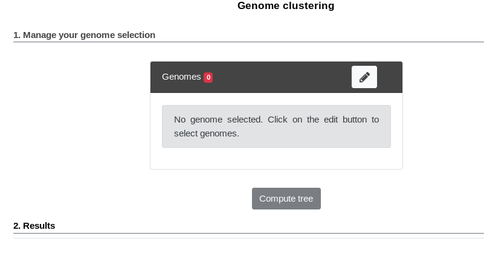

.. _genoclust:

==================
 Genome Clustering
==================


This interface allows the user to select a set of genomes and display a tree that groups them by genomic similarity.
The tree is constructed from the pairwise distances (see `Pairwise Genome Distance and ANI`_) between the selected genomes using a neighbor joining algorithm (see `Tree Construction`_).

Moreover, the genomes are grouped in "species cluster" according to the pairwise distance (see `Clustering Genomes`_).
Those clusters are called MicroScope Genome Cluster (MICGC for short).
The interface also displays the cluster to which the organism belong.

Note that genomes for which CheckM detected more than 5% contamination or less than 90% completeness are not assigned to MICGC clusters.
Such genomes will however appear in the organism selector and are displayed in black in the tree.
You can consult CheckM results in the :ref:`genome-overview` page.

.. figure:: img/genoclust-workflow.png
   :align: center

   Microscope Genome Cluster (MICGC) workflow.

Interface Overview
------------------

Below is a screenshot of the genome selection interface.



The first part uses the advanced selector (in **Genome Selection** mode) to select the genomes on which the tree will be computed.
See :ref:`here <advanced-selector>` for help on how to use this selector.

Next by clicking "Save and Run", the tree is computed and displayed under **Results**.

Below is a screenshot of a tree.
The user can navigate within the tree.
Next to each organism, the name of the MICGC cluster is displayed.
The user can click on the species cluster to get more information (in this example, the user selected the cluster `MICGC13`).
Contaminated or incomplete genomes (not associated to MICGC clusters) are displayed in black in the tree.

.. _tree_and_micgc:

.. figure:: img/genoclust-modif.png
   :align: center

   MICGC and Tree.

Pairwise Genome Distance and ANI
--------------------------------

In order to quickly calculate the pairwise genome distance, we use Mash. Mash extends the MinHash dimensionality-reduction technique to include a pairwise mutation distance and a statistical significance test.
Mash distance strongly correlates with the Average Nucleotide Identity (ANI).
If :math:`D` denotes the Mash distance then :math:`D \simeq 1 - \text{ANI}`.

ANI represents the average nucleotide identity between homologous genomic regions shared by two genomes and offers robust resolution between strains of the same or closely related species (80-100% ANI).
It closely reflects the traditional microbiological concept of DNA-DNA hybridization relatedness for defining species (:math:`94\% \text{ANI} \simeq70\% \text{DNA-DNA hybridization}`).
Typically, two bacteria belong to the same species when :math:`\text{ANI} \geq 95\%` (*i.e.* :math:`D \leq 0.05`).

To know now more about Mash, see `their website <https://github.com/marbl/Mash>`_.

**Reference:**

1. `Konstantinidis, K. T. & Tiedje, J. M. Genomic insights that advance the species definition for prokaryotes. Proc Natl Acad Sci U S A 102, 2567–2572 (2005). <http://www.pnas.org.insb.bib.cnrs.fr/content/102/7/2567>`_
2. `Ondov, B. D. et al. Mash: fast genome and metagenome distance estimation using MinHash. Genome Biology 17, 132 (2016). <https://genomebiology.biomedcentral.com/articles/10.1186/s13059-016-0997-x>`_

Tree Construction
-----------------

The tree is constructed from the Mash distance matrix.
It is computed dynamically directly in the browser using a `rapid neighbour joining algorithm <https://github.com/biosustain/neighbor-joining>`_.

This algorithm can assign negative length to a branch.
In order to avoid that and to keep the total distance between an adjacent pair of terminal nodes unchanged, we set negative branch length to zero and transfer the difference to the adjacent branch (see `here <https://www.sequentix.de/gelquest/help/neighbor_joining_method.htm>`_ for more information).

Note that we insert a virtual organism that is very far from all others organisms when computing the tree.
The tree is then re-rooted at this outgroup (which is not displayed).

Clustering Genomes
------------------

The goal is to detect groups of genomes (the clusters) that are close together
(in the sense of the Mash distance) and far from other groups.

We use an approach that originates from network science called community detection.

The first step is to create a network of genomes.
The process is as follows:

  * first, all nodes are pairwise connected: the length of the edge is Mash distance between the 2 organisms - see **step 3** on the figure;
  * second, as we want groups that overlap with traditional species, we remove edges that are longer than a given threshold - see **step 4** on the figure;
  * third, we use CheckM to remove incomplete or contaminated genomes - see **step 5** on the figure.

The goal of those steps is to produce a biologically relevent network.

Then we extract communities from that network with the `louvain community detection algorithm <https://github.com/taynaud/python-louvain/>`_ - see **step 6** on the figure.

The parameters were chosen to provide the best reconstruction of `Progenome <http://progenomes.embl.de/>`_ species clusters.
The selected parameters are:

  * Mash distances are computed with kmer size = 18 and sketch size = 5000;
  * distances above 0.06 (*i.e.* :math:`\text{ANI} \le 94\%`) are removed;
  * contamination must be below 5% and completeness above 90%;
  * the resolution parameter used for louvain is 2.

Export
------

By clicking on the "Export" button:

  - the tree can be exported in SVG or Newick format
  - the distances can be exported in TSV format (as a matrix or as a pairwise list)

Note that due to limitations of the Newick format, some characters in the strain name (namely ``,``, ``;``, ``:``, ``(`` and ```)``) are not exported.
To circumvent this, you can choose to replace the strain name by the NCBI taxid when exporting to Newick.

**Reference:**

1. `Blondel, V. D., Guillaume, J.-L., Lambiotte, R. & Lefebvre, E. Fast unfolding of communities in large networks. J. Stat. Mech. 2008, P10008 (2008). <http://iopscience.iop.org/article/10.1088/1742-5468/2008/10/P10008/meta>`_

