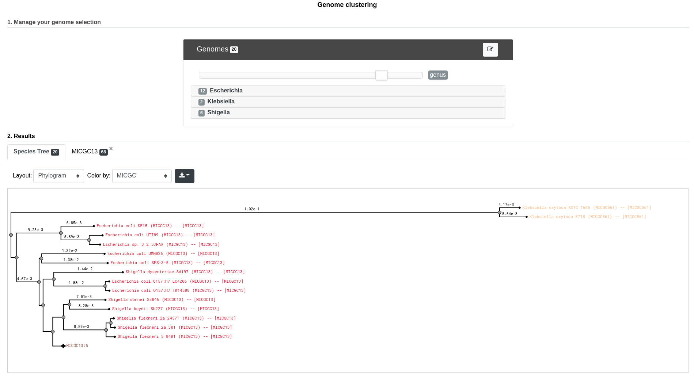

===================
 Genome Clustering
===================

This interface allows the user to select a set of genomes and display a tree compute from a distance matrix where the distances strongly correlates the Average Nucleotide Identity (ANI). From this distance matrix, we group these genomes in order to get clusters close to the "species cluster" (ANI >= 94%).

Distance Matrix And ANI
-----------------------

In order to quickly calculate the pairwise genome distance, we use Mash. Mash extends the MinHash dimensionality-reduction technique to include a pairwise mutation distance and P value significance test. Mash distances strongly correlates ANI like: :math:`D = 1 - ANI`.

ANI represents the average nucleotide identity of all orthologous genes shared between any two genomes and offers robust resolution between strains of the same or closely related species (80-100% ANI). It closely reflect the traditional microbiological concept of DNA-DNA hybridization relatedness for defining species ( :math:`94\%\simeq70\%{}` DNA-DNA hybridization ). 

Know More about `Mash <https://github.com/marbl/Mash>`_

**Reference:**
`1.Konstantinidis, K. T. & Tiedje, J. M. Genomic insights that advance the species definition for prokaryotes. Proc Natl Acad Sci U S A 102, 2567–2572 (2005). <http://www.pnas.org.insb.bib.cnrs.fr/content/102/7/2567>`_
`2.Ondov, B. D. et al. Mash: fast genome and metagenome distance estimation using MinHash. Genome Biology 17, 132 (2016). <https://genomebiology.biomedcentral.com/articles/10.1186/s13059-016-0997-x>`_

Genome Clustering
-----------------

Typically, two bacterias belong to the same species when ANI >= 95%.

In order to construct these species clusters, we remove the pairwise genome distances that don't match this ANI threshold. Then we extract communities from that network.

From our test, we obtain better results to reconstruct `Progenome <http://progenomes.embl.de/>`_ species clusters with a threshold of <= 0.06 (>=94% ANI) for Mash distances, kmer size = 18 and sketch size = 5000.

To detect the communities, we use the `louvain community detection algorithm <https://github.com/taynaud/python-louvain/>`_.

**Reference:**
`1.Blondel, V. D., Guillaume, J.-L., Lambiotte, R. & Lefebvre, E. Fast unfolding of communities in large networks. J. Stat. Mech. 2008, P10008 (2008). <http://iopscience.iop.org/article/10.1088/1742-5468/2008/10/P10008/meta>`_

