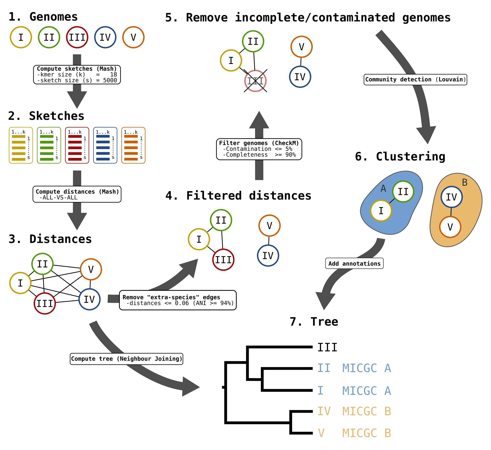
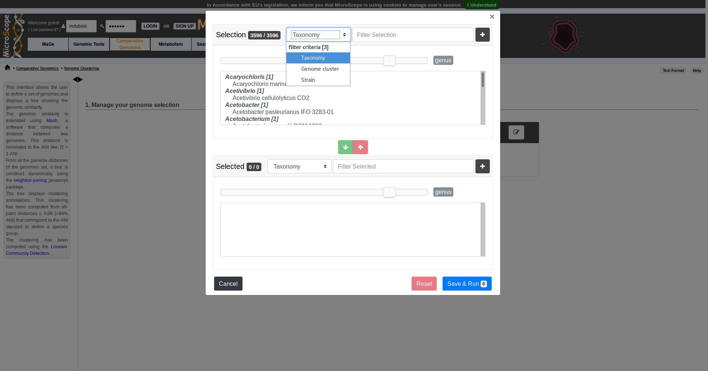
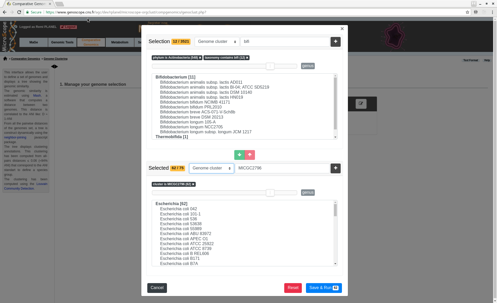
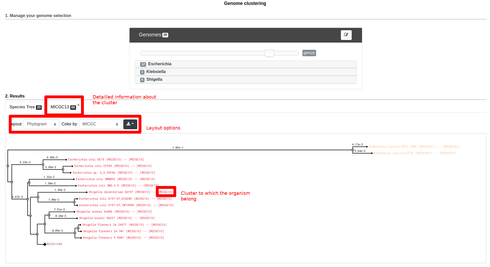

===================
 Genome Clustering
===================

This interface allows the user to select a set of genomes and display a tree that groups them by genomic similarity.
The tree is constructed from the pairwise distances (see `Pairwise Genome Distance and ANI`_) between the selected genomes using a neighbor joining algorithm (see `Tree Construction`_).

Moreover, the genomes are grouped in "species cluster" according to the pairwise distance (see `Clustering Genomes`_).
Those clusters are called MicroScope Genome Cluster (MICGC for short).
The interface also displays the cluster to which the organism belong.

Note that genomes for which CheckM detected more than 5% contamination or less than 90% completeness are not assigned to MICGC clusters.
Such genomes will however appear in the organism selector and are displayed in black in the tree.
You can consult CheckM results in the :ref:`genome-overview` page.

   Microscope Genome Cluster (MICGC) workflow.

Interface Overview
------------------

Below is a screenshot of the genome selection interface.
It allows to select organisms according to the NCBI taxonomy, by strain name or by MICGC cluster.
The upper list is the list of all the available organisms in MicroScope.
The lower list is the list of currently selected organisms that will be used for the tree.
The user can add organisms or remove organisms in the lower list using the green and red arrows.

Both list are searchable.
For each criteria, the user can choose exact matching or partial matching and can use several criteria to refine the search.
In this example, the user searched MicroScope organisms in the `Actinobactearia` phylum and whose strain name contains `bifi`.

Next by clicking "Save and Run", the tree is computed.
Below is a screenshot of the tree obtained with those organisms.
The user can navigate within the tree.
Next to each organism, the name of the MICGC cluster is displayed.
The user can click on the species cluster to get more information (in this example, the user selected the cluster `MICGC13`).
Contaminated or incomplete genomes (not associated to MICGC clusters) are displayed in black in the tree.

.. _micgc:

Pairwise Genome Distance and ANI
--------------------------------

In order to quickly calculate the pairwise genome distance, we use Mash. Mash extends the MinHash dimensionality-reduction technique to include a pairwise mutation distance and a statistical significance test.
Mash distance strongly correlates with the Average Nucleotide Identity (ANI).
If :math:`D` denotes the Mash distance then :math:`D \simeq 1 - \text{ANI}`.

ANI represents the average nucleotide identity between homologous genomic regions shared by two genomes and offers robust resolution between strains of the same or closely related species (80-100% ANI).
It closely reflects the traditional microbiological concept of DNA-DNA hybridization relatedness for defining species (:math:`94\% \text{ANI} \simeq70\% \text{DNA-DNA hybridization}`).

To know now more about Mash, see `here <https://github.com/marbl/Mash>`_.

**Reference:**

1. `Konstantinidis, K. T. & Tiedje, J. M. Genomic insights that advance the species definition for prokaryotes. Proc Natl Acad Sci U S A 102, 2567–2572 (2005). <http://www.pnas.org.insb.bib.cnrs.fr/content/102/7/2567>`_
2. `Ondov, B. D. et al. Mash: fast genome and metagenome distance estimation using MinHash. Genome Biology 17, 132 (2016). <https://genomebiology.biomedcentral.com/articles/10.1186/s13059-016-0997-x>`_

Tree Construction
-----------------

A tree is constructed from the Mash distance matrix. This tree is computed dynamically directly in the browser using a `rapid neighbour joining algorithm <https://github.com/biosustain/neighbor-joining>`_.

This algorithm can assign a negative length to a branch.
In order to avoid that and to keep the total distance between an adjacent pair of terminal nodes unchanged, we set negative branch length to zero and transfer the difference to the adjacent branch (see `here <https://www.sequentix.de/gelquest/help/neighbor_joining_method.htm>`_ for more information).

Clustering Genomes
------------------

Typically, two bacteria belong to the same species when :math:`\text{ANI} \geq 95\%` (*i.e.* :math:`D \leq 0.05`).

In order to construct these species clusters, we remove the pairwise genome distances that don't match this ANI threshold.
Then we extract communities from that network.

From our tests, the best parameters to reconstruct `Progenome <http://progenomes.embl.de/>`_ species clusters are a threshold of 0.06 for Mash distances  (*i.e.* :math:`\text{ANI} \geq 94\%`), kmer size = 18 and sketch size = 5000.
We use those parameters.

To detect the communities, we use the `louvain community detection algorithm <https://github.com/taynaud/python-louvain/>`_.

Export
------

By clicking on the "Export" button:

  - the tree can be exported in SVG or Newick format
  - the distances can be exported in TSV format (as a matrix or as a pairwise list)

**Reference:**

1. `Blondel, V. D., Guillaume, J.-L., Lambiotte, R. & Lefebvre, E. Fast unfolding of communities in large networks. J. Stat. Mech. 2008, P10008 (2008). <http://iopscience.iop.org/article/10.1088/1742-5468/2008/10/P10008/meta>`_

