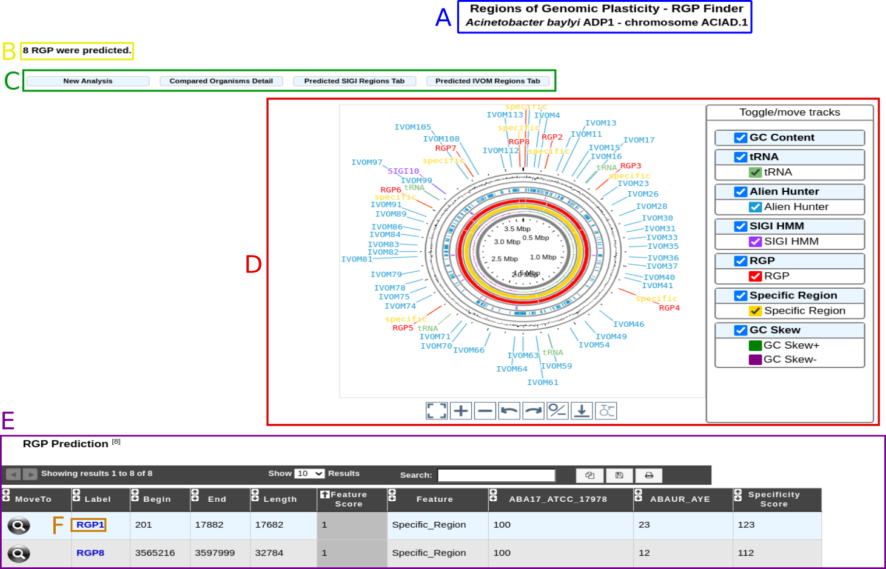
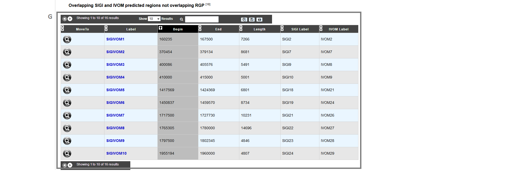

.. _rgpfinder:

##########################################
Regions of Genomic Plasticity - RGP Finder
##########################################

This interface allows the user to search for potentially horizontally transferred genes (HGT) which are gathered in genomic regions (Region of Genomic Plasticity).
Basically, a RGP is a region of a genome structurally not present in other related genomes.
RGPs can be sites of insertions of integrated Mobile Genetic Elements (MGEs) or the result of deletion of particular segments of DNA in one or more strains.
Therefore, the RGP designation does not make any assumption about the evolutionary origin or genetic basis of these variable chromosomal segments.

RGP Finder is mainly a comparative method.
The algorithm first starts with the identification of synteny breaks between the query genome and the reference genomes.
To be considered a RGP, a break must span at least 5kb and must not contain more than 2 genes in synteny.

Then the algorithm "scans" RGPs for well known HGT features (tRNA hotspot, mobility genes) to help characterize them.
In addition, two compositional methods are also used to capture other kinds of signals of the query sequence:

* AlienHunter (Vernikos and Parkhill, 2006): an Interpolated Variable Order Motif (IVOM) exploits compositional biases using variable order motif distributions (2-mer to 8-mer).
  The tool is launched with its default values and the results are stored for each query genome.

* SIGI-HMM (Waack et al., 2006): SIGI-HMM is a sequence composition method that is part of the Columbo package.
  This method uses a Hidden Markov Model (HMM) and measures codon usage to identify possible Genomic Islands (GIs).

We associate an IVOM or a SIGI-HMM region with a RGP if these regions overlap over at least 50% of the smallest one.
Those regions are called SIGIVOM regions.

GC deviation is also computed.

The graphical interfaces associated with this tool combined with the comparative genomic context available in MaGe are useful to explore in detail the predicted regions.
Consensus regions between comparative and compositional results can be viewed and explored.

How to read the interface?
--------------------------

.. image:: img/island1.png

* **item A**: use the «Change» button to set the query genome that will be used for the comparison.
              The current genome is displayed at the top of the window.

* **item B**: list of organisms in PkGDB (you can choose one or several organisms).

* **item C**: list of RefSeq organisms (you can choose one or several organisms).

* **item D**: percentage of genes conserved in synteny with the query genome.

* **item E**: compositional results availability :

	* **green** : Alien Hunter (IVOM) or SIGI-HMM results are available for the query genome.
	* **red** : Alien Hunter (IVOM) or SIGI-HMM results are not available for the query genome.

* **item F**: when one or several organisms of PkGDB and/or RefSeq have been chosen click here to launch the comparison.

.. tip:: Try to choose related organisms to avoid too much rearrangements from distant species (use item D).
	 The predicted regions depend on the reference organisms selected for comparison.
	 If you select phylogenetically unrelated organisms in term of synteny the predicted regions will then not only belong to flexible gene pool (HGT) but from taxon specific regions.

Results : circular view
-----------------------

* **item A**: query organism information.

* **item B**: number of predicted RGPs.

* **item C**: navigation panel:

	* **New analysis**: return to the main page of the tool.
	* **Compared Organisms details**: display the name of the reference organisms.
	* **Predicted SIGI Regions table**: display SIGI-HMM predicted regions.
	* **Predicted IVOM Regions table**: display Alien Hunter/IVOM regions.
	
* **item D**: circular view legend:

	* **pink**: tRNA positions.
	* **black**: predicted RGPs. Note that the RGP positions are the extension of the comparisons between the query sequence and all the reference organisms.
	* **purple**: SIGI-HMM results.
	* **blue**: Alien Hunter/IVOM results.
	* **gray**: RGP absent from **ALL** the reference organisms.
	
	
Results : RGP description
-------------------------

* **item E**: RGP prediction table:

	* **MoveTo**: display MaGe viewer centered on the selected RGP region.
	* **Label**: predicted RGP label (link to exploration page of the selected RGP region).
	* **Begin**: RGP begin position.
	* **End**: RGP end position.
	* **Length**: RGP length.
	* **Feature Score**: score associated with GI features (arbitrary score for sorting the table by feature: one feature = one point).
	* **Feature**: features associated with RGPs (tRNA, misc_RNA, integrase, other mobility gene, SIGIVOM region).
	* **Specificity Percentage** (one column by reference organism): % of CDS in RGP not involved in a synteny **OR** involved in groups of 2 genes in synteny inside a RGP (see description of the method).

	
* **item F** : link to explore selected RGP or SIGIVOM region.

* **item G** : table of SIGIVOM regions:

	* **MoveTo**: display MaGe viewer centered on selected SIGIVOM region.
	* **Label**: predicted SIGIVOM label (link to explore the selected SIGIVOM region).
	* **Begin**: SIGIVOM region begin.
	* **End**: SIGIVOM region end.
	* **Length**: SIGIVOM region length.
	* **SIGI Label**: SIGI region label component.
	* **IVOM Label**: Alien Hunter/IVOM label component.

Results : RGP or SIGIVOM exploration
------------------------------------

.. image:: img/island4.png

Clicking on a region label (RGP or SIGIVOM region) display information on the selected region.

* **item A**: region label, begin position and end position.

* **item B**: export genes in the region to a gene cart.

* **item C**: color intensity Bblance in correlation with similarity results. Modify minLrap, maxLrap or identity % to view gene correspondences in reference organisms.

* **item D**: region table : Each line in the table represents information about a gene. White background represents genes before and after the region (four genes at each side of the region).

	* **MoveTo**: display MaGe viewer centered on selected gene.
	* **Label**: gene label.
	* **Begin**: gene begin position.
	* **End**: gene end position.
	* **Type**: gene type (CDS, fCDS, tRNA, misc_RNA).
	* **Product**: gene product name.
	* **Gene**: gene name.
	* **matrix**: matrix used to predict CDS.
	* **GC Region**: indicates if gene GC percentage differs more than one standard deviation (+1SD) or two standard deviation (+2SD) from the whole genome.
	* **SIGI**: purple if gene belongs to a SIGI-HMM region.
	* **IVOM**: purple if gene belongs to an IVOM region.
	* **Codon Adapt. Index**: CAI of the gene.
	* **Gene correspondence** (one column by reference organism): gene similarity correspondence with genes in reference organisms:
	
		* **red**: no similarity above the identity defined in **item C**
		* **red with mentioned "no corresp"**: no similarity at all.
		* **green**: similar gene in the reference genome above the cut-off value (defined in **item C**).

