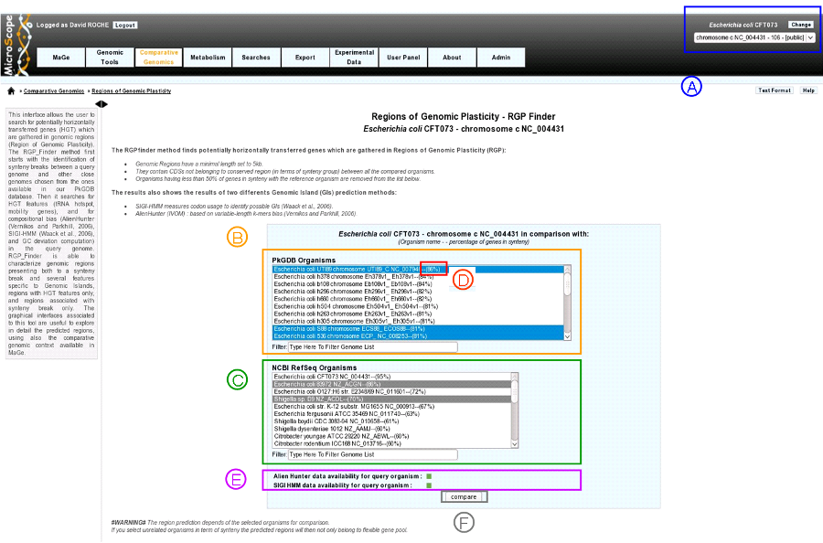
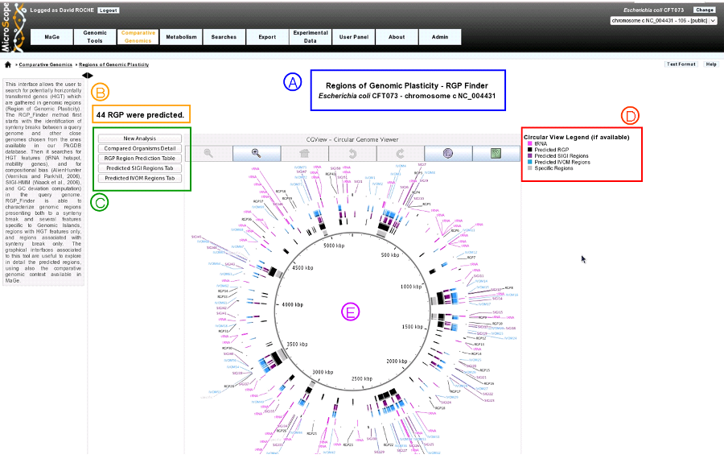
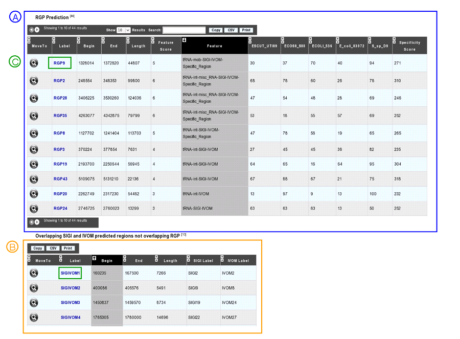
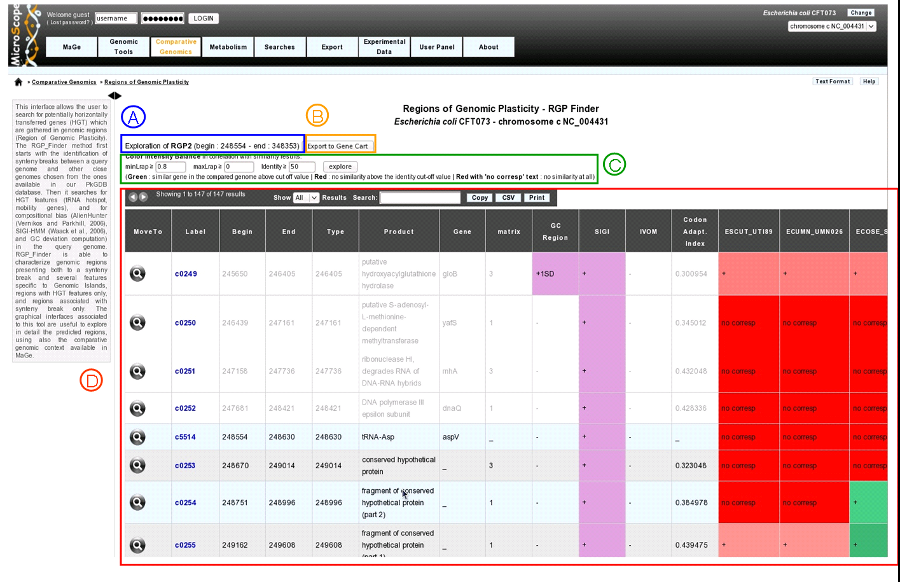

#############################
Regions of Genomic Plasticity
#############################

This interface allows the user to search for potentially horizontally transferred genes (HGT) which are gathered in genomic regions (Region of Genomic Plasticity). Basically, an RGP is a region of a genome structurally not present in related other(s). The RGPs can be sites of insertions of integrated Mobile Genetic Elements (MGE), or the result of deletions of particular segments of DNA in one or more strains. Therefore, the RGP designation does not make any assumption about the evolutionary origin or genetic basis of these variable chromosomal segments.

RGP finder method is mainly a comparative method. Algorithm first starts with identification of synteny breaks (at least 5kb) between a query genome and other close ones from the our database, the RGPs.

Then it ’scan’ RGPs for well known HGT features (tRNA hotspot, mobility genes) to help characterize them. In addition, two compositional methods are also used to capture other kinds of signals of the query sequence. AlienHunter (Vernikos and Parkhill, 2006) and SIGI-HMM (Waack et al., 2006). GC deviation is also compute. Consensus regions between comparative and compositionnal results can be viewed and explored.

AlienHunter : An Interpolated Variable Order Motif (IVOM) exploits compositionnal biases using variable order motif distributions (2mer to 8mer). The tool is launched with it’s defaut values and results are stored in databases for each query genome.

SIGI-HMM : SIGI-HMM is a sequence composition method that is part of the Columbo package. This method uses a Hidden MArkov Model (HMM) and measures codon usage to identify possible Genomic Islands (GIs).

We associate an IVOM or a SIGI-HMM region region with a RGP if these regions overlap themselves over at least 50% of the smallest one.

Then the graphical interfaces associated to this tool are useful to explore in detail the predicted regions, using also the comparative genomic context available in MaGe.

How to read the interface?
--------------------------

* **item A**: Use the «Change» button to set the reference genome that will be used for the comparison. The current reference genome is displayed as a subtitle at the top of the window.
* **item B**: organism list of our database PkGDB (you can chose one or several organism(s)).
* **item C**: organism list of RefSeq Organisms (you can chose one or several organism(s)).
* **item D**: Percentage of genes conserved in synteny with the query genome.
* **item E**:compositional results availability :
	* **green** : Alien Hunter (IVOM) or SIGI-HMM results are available for the query genome.
	* **red** : Alien Hunter (IVOM) or SIGI-HMM results are not available for the query genome.
* **item F**: When one or several organism(s) of PkGDB and/or RefSeq have been chosen click here to launch the comparison.

.. tip:: Try to choose related organisms to avoid too much rearrangements from distant species (use item D). The predicted regions depends of the selected organisms for comparison. If you select phylogenic unrelated organisms in term of synteny the predicted regions will then not only belong to flexible gene pool (HGT) but from taxon specific regions.

Results : circular view
-----------------------

* **item A**: query organism information.

* **item B**: number of predicted RGP.

* **item C**: navigation panel.
	* **New analysis**: return to the main page of the tool.
	* **Compared Organisms details**: display table with compared organisms name.
	* **RGP Region Prediction table**: move to predicted RGP table.
	* **Predicted SIGI Regions table**: display SIGI-HMM predicted regions table.
	* **Predicted IVOM Regions table**: display Alien Hunter/IVOM regions table.
	
* item D: Circular view legend.
	* **pink**: tRNA positions.
	* **black**: predicted RGPs. Note that the RGP posititions are the extension of the comparisons between the suery sequence and all the compared organisms.
	* **purple**: SIGI-HMM results.
	* **blue**: Alien Hunter/IVOM results.
	* **gray**: specific regions are particular RGP(region absent from *ALL* the compared organisms.
	
	
Results : RGP description
-------------------------

* **item A**: RGP prediction table.
	* **MoveTo**: display MaGe viewer centered on selected RGP region.
	* **Label**: predicted RGP label (link to exploration page of the selected RGP region).
	* **Begin**: RGP begin position.
	* **End**: RGP end position.
	* **Length**: RGP length.
	* **Feature Score**: score associated with GI features (arbitrary score for sorting the table by feature: one feature = one point)‏.
	* **Feature**: Features associated with RGPs (tRNA, misc_RNA, integrase, other mobility gene, overlapping SIGI-HMM, overlapping Alien Hunter/IVOM region)
	* **Specificity Percentage** (one column by compared organism): % CDS in RGP not involved in a synteny. (algorithm allowed blocks of 2 consecutives genes in synteny inside RGPs).
	
* **item B** : overlapping SIGI and IVOM table on 50% of the smallest region = SIGIVOM regions.
	* **MoveTo**: display MaGe viewer centered on selected SIGIVOM region.
	* **Label**: predicted SIGIVOM label (link to explore selected SIGIVOM region).
	* **Begin**: SIGIVOM begin position.
	* **End**: SIGIVOM end position.
	* **Length**: SIGIVOM length.
	* **SIGI Label**: SIGI region label component.
	* **IVOM Label**: Alien Hunter/IVOM label component.
	
* item C :link to explore selected RGP or SIGIVOM region.

Results : RGP or SIGIVOM exploration
------------------------------------

clicking on a region label (RGP or SIGIVOM region) diplay informations of the selected region.

* **item A**: region label, begin position, end position.

* **item B**: export gene list of the region to a gene cart.

* **item C**: color Intensity Balance in correlation with similarity results. Modify minLrap, maxLrap or identity % to view gene correspondences in compared organisms.

* **item D**: region table : Each line in the table represents information about a gene. White background represents genes before and after the region (four genes at each side of the region).
	* **MoveTo**: display MaGe viewer centered on selected gene.
	* **Label**: gene label.
	* **Begin**: gene begin position.
	* **End**: gene end position.
	* **Type**: gene type (CDS, fCDS, tRNA, misc_RNA).
	* **Product**: gene product name.
	* **Gene**: gene name.
	* **Matrix**: matrix used to predict CDS.
	* **GC_Region**: is gene GC% different than one standard deviation (+1SD) or two standard deviation (+2SD) from the whole genome.
	* **SIGI**: purple if gene belongs to a SIGI-HMM region.
	* **IVOM**: purple if gene belongs to an IVOM region.
	* **Codon_Adaptation_index**: CAI of the gene.
	* **Gene correspondance** (one column by compared organism): gene similarity correspondance with genes in compared organisms.
		* **red**: no similarity above the identity define in ’item 1’
		* **red with mentionned ’no corresp’**: no similarity at all.
		* **green**: similar gene in the compared genome abvce cut-off value (define in ’item 1’).
