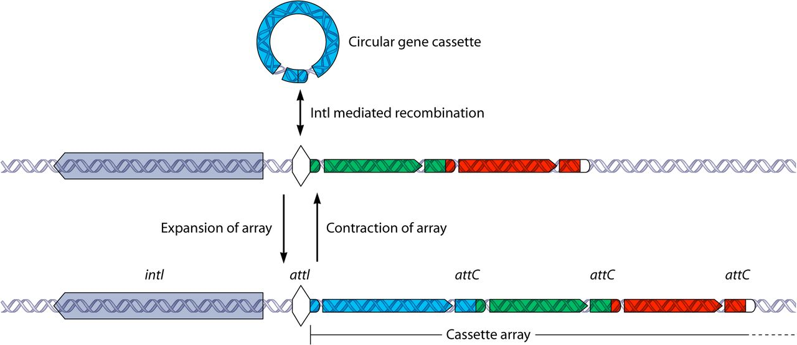
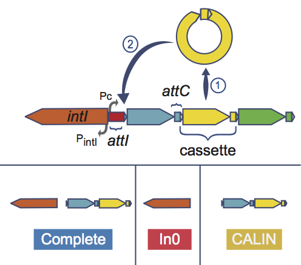
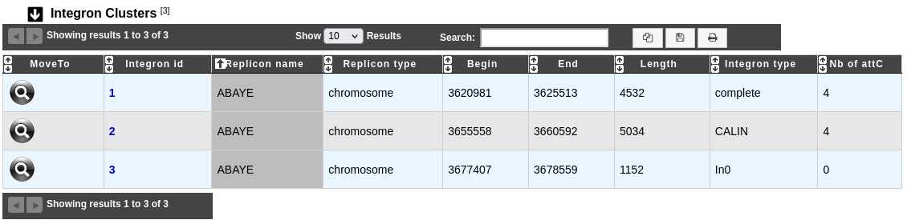

.. _integron:

########
Integron
########

What are Integrons ?
--------------------

**Integrons** are versatile gene acquisition systems commonly found in bacterial genomes. They are ancient elements that are a hotspot for genomic complexity, generating phenotypic diversity and shaping adaptive responses.

Integrons are composed of three essential core features:

* **intI**: Gene which encodes for an integron integrase whose protein catalyzes recombination between incoming gene cassettes and the second feature, an integron-associated recombination site.
* **attI**: Attachment integrase is a proximal recombination site which is recognized by the integrase and at which gene cassettes may be inserted.
* **Pc**: Promoter which directs transcription of a cassette-encoded gene.

Integrons acquire new genes as part of gene cassettes. These are simple structures, usually consisting of a single open reading frame (ORF) bounded by a cassette-associated recombination site known as **attC**.
Circular gene cassettes are integrated by site-specific recombination between **attI** and **attC**, a process mediated by the **intI**. This process is reversible, and cassettes can be excised as free circular DNA elements.
Insertion at the **attI** site allows expression of an incoming cassette, driven by the adjacent **Pc** promoter.

**Reference:**

`Gillings MR. 2014. Integrons: past, present, and future. Microbiol Mol Biol Rev 78:257–277. <https://doi.org/10.1128/mmbr.00056-13>`_

What is IntegronFinder ?
------------------------

**IntegronFinder** is a tool that detects integrons in DNA sequences with high accuracy. It is accurate because it combines the use of HMM profiles for the detection of essential protein, the site-specific **integron integrase**, and the use of Covariance Models for the detection of the recombination site, the **attC site**.
This tool also annotates gene casettes however we use our own annotations to make it run.

IntegronFinder distinguishes 3 types of elements:

* **Complete integron**: Integron including an integrase and at least one attC site,
* **In0 element**: Integron integrase only, without any attC site nearby,
* **CALIN (Clusters of AttC sites Lacking integron-INtegrases) element**: CALIN are composed of at least two attC sites.

Know more about `IntegronFinder <https://integronfinder.readthedocs.io/en/v2.0.2/>`_.

**Reference:**

`Néron B. et al. 2022. IntegronFinder 2.0: Identification and Analysis of Integrons across Bacteria, with a Focus on Antibiotic Resistance in Klebsiella. Microorganisms vol. 10,4 700. <https://doi.org/10.3390/microorganisms10040700>`_

How to access to Integrons data ?
---------------------------------

IntegronFinder predictions are available through the **Comparative Genomics** section, in the main navigation menu.

What is the 'Integron clusters' table ?
---------------------------------------

This table enumerates all integron clusters predicted for the selected organism and its replicons.

* **Integron id**: Identifier of the integron. Click on it open the detailled :ref:`IntegronFinder cluster visualization window <integron-cluster-vizualization>` page, which allows to access to a description of the integron structure.
* **Replicon name** and **Replicon type** give characteristics of the replicon where the integron is found.
* **Begin**, **End** and **Length** give informations about the location and the length of the integron on the sequence.
* **Integron type**: Type of integron (complete, In0, CALIN).
* **Nb of attC**: Number of attC sites found in the integron.

