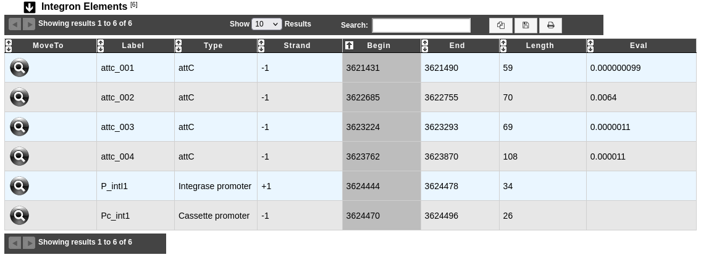
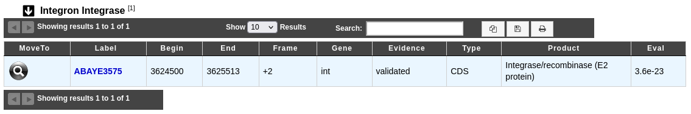
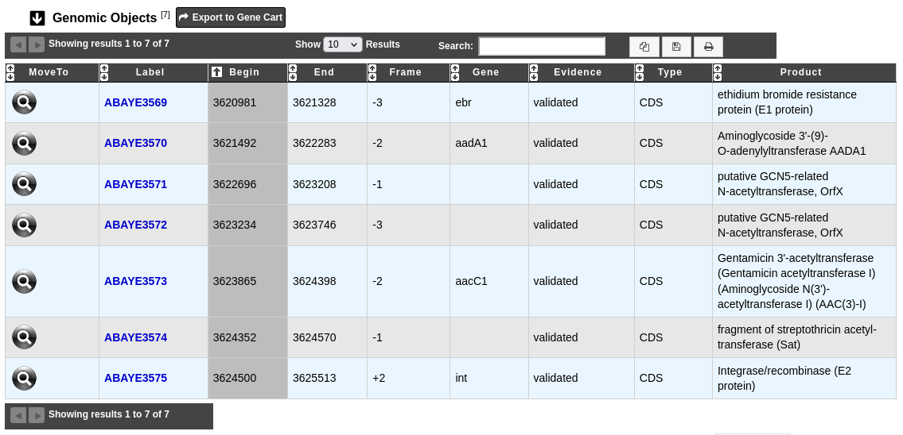

.. _integron-cluster-vizualization:

####################################
IntegronFinder cluster visualization
####################################

What is IntegronFinder ?
------------------------

Know more about `IntegronFinder <https://integronfinder.readthedocs.io/en/v2.0.2/>`_.

**Reference:**

`Néron B. et al. 2022. IntegronFinder 2.0: Identification and Analysis of Integrons across Bacteria, with a Focus on Antibiotic Resistance in Klebsiella. Microorganisms vol. 10,4 700. <https://doi.org/10.3390/microorganisms10040700>`_

How to explore an Integron cluster ?
------------------------------------

You can access to the **IntegronFinder cluster visualization** window by clicking on the number indicated in the **Integron id** field in the **Integron clusters** table.

This window allows you to access to a detailled description of the integron structure.

You can also use the main navigation menu in the **Comparative Genomics** section and **Integrons** subsection to obtain the :ref:`IntegronFinder predictions page <integron>`. This page enumerates all integrons detected for the selected organism and its replicons.

What is the 'Integron Elements' table ?
---------------------------------------

The table **Integron Elements** shows all attachment sites (**attC**, **attI**) and promoters (**Pc**, **Pi**) identified in the predicted integron.

* **Label**: Label of the element.
* **Type**: Type of element (attC, attI, Cassette promoter, Integrase promoter).
* **Strand**, **Begin** and **End**: Location of the element on the sequence.
* **Eval**: Evalue of the match between an attC site and the Covariance Model of attC site.

What is the 'Integron Integrase' table ?
----------------------------------------

The table **Integron Integrase** provides characteristics of the identified integrase **intI** of the predicted integron.

* **Label**: Label of the genomic object. Click on it allow to access to its annotation page.
* **Begin**, **End** and **Frame**: Location of the genomic object on the sequence.
* **Gene**: Gene name if any.
* **Evidence**: automatic/validated.
* **Type**: CDS,fCDS,tRNA,rRNA,misc_RNA,...
* **Product**: Description of the gene product of the genomic object.
* **Eval**: Evalue of the match between the integrase intI and the integrase HMM profil.

What is the 'Genomic Objects' table ?
-------------------------------------

The table **Genomic Objects** provides informations regarding the genomic objects present in the integron.

You can export the genes by clicking on **Export to Gene Cart**.

* **Label**: Label of the genomic object. Click on it allow to access to its annotation page.
* **Begin**, **End** and **Frame**: Location of the genomic object on the sequence.
* **Gene**: Gene name if any.
* **Evidence**: automatic/validated.
* **Type**: CDS,fCDS,tRNA,rRNA,misc_RNA,...
* **Product**: Description of the gene product of the genomic object.

