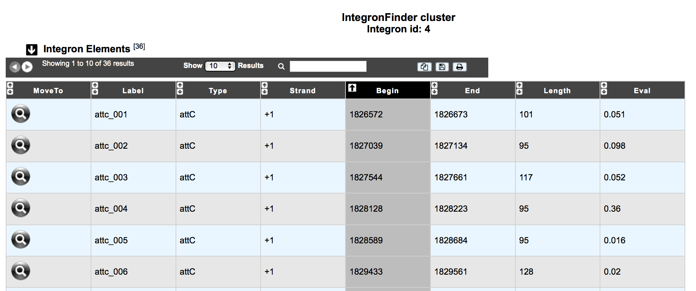
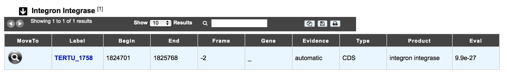
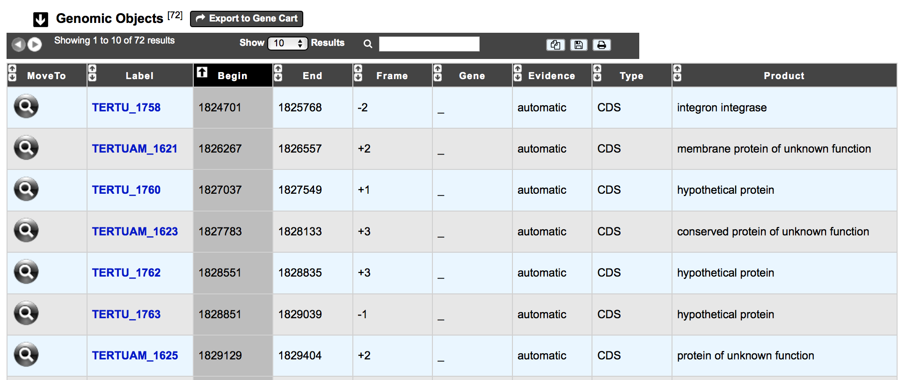

.. _integron-cluster-vizualization:

###################################
How to explore an Integron cluster?
###################################

The IntegronFinder cluster visualization window  allows you to access to a detailled description of the integron structure.

The table **Integron Elements** shows all attachment sites (attC, attI) and promoters (Pc and Pi) identified in the predicted integron.

The table **Integron Integrase** provides information on the identified integrase of the predicted integron.

The table **Genomic objects** provides information regarding the genomic objects included into the integron. You can export the genes by clicking on **Export to Gene Cart**.

