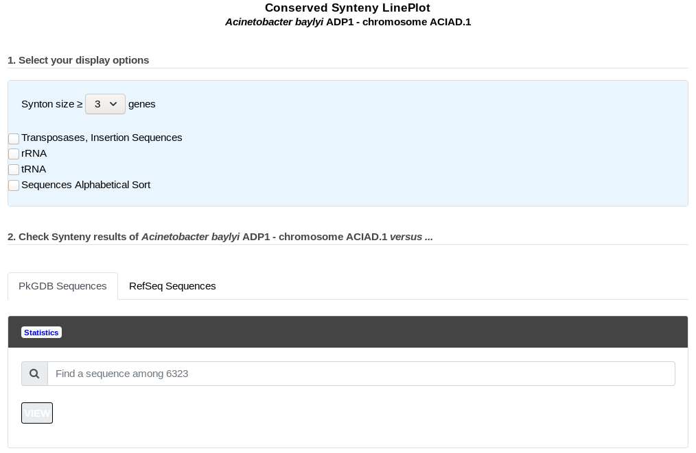
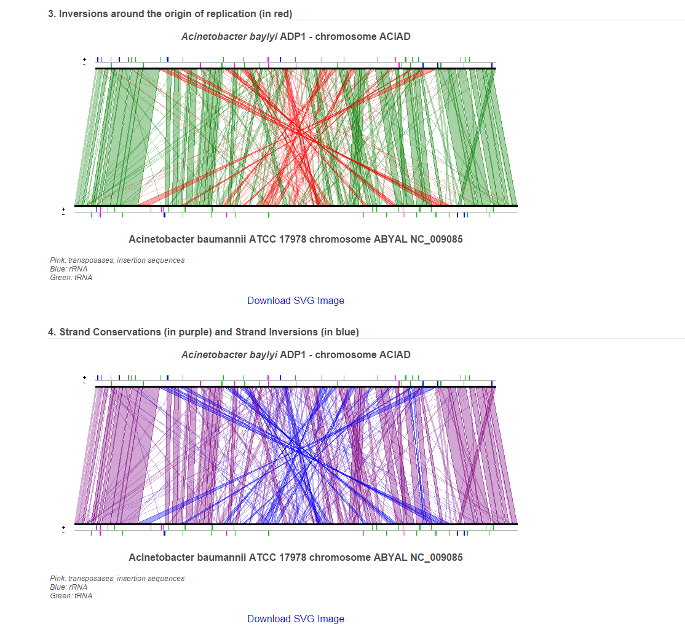

.. _lineplot:

########
Lineplot
########

This tool draws a global comparison, based on synteny results (the size of which can be selected by the user) between 2 bacterial genomes.
The picture gives an overview of the conservation of synteny groups between the query genome and another genome chosen from the ones available in our PkGDB database (i.e, (re)annotation of bacterial genomes or complete proteome downloaded from the RefSeq/WGS sections).

