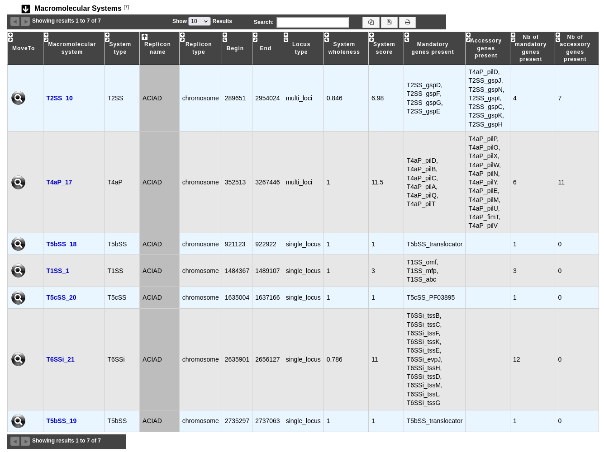

.. _macsyfinder:

######################
Macromolecular Systems
######################

What is MacSyFinder?
--------------------

Macromolecular System Finder (**MacSyFinder**) provides a flexible framework to model the properties of molecular systems (cellular machinery or metabolic pathway) including their components, evolutionary associations with other systems and genetic architecture.
Modelled features also include functional analogs, and the multiple uses of a same component by different systems.
Models are used to search for molecular systems in complete genomes or in unstructured data like metagenomes.
The components of the systems are searched by sequence similarity using Hidden Markov model (HMM) protein profiles.
The assignment of hits to a given system is decided based on compliance with the content and organization of the system model. 

Learn more about MacSyFinder `here <https://macsyfinder.readthedocs.io/en/latest/>`_.

.. Don't use MacSyFinder as the name of the link since that would make
   a duplicate with the label.

**Reference:** 

`Néron, Bertrand; Denise, Rémi; Coluzzi, Charles; Touchon, Marie; Rocha, Eduardo P.C.; Abby, Sophie S. MacSyFinder v2: Improved modelling and search engine to identify molecular systems in genomes. Peer Community Journal, Volume 3 (2023), article no. e28. <https://doi.org/10.24072/pcjournal.250>`_

What type of macromolecular systems can be detected?
----------------------------------------------------

MacSyFinder can detect two categories of macromolecular systems:

* A broad range of secretion systems (`TXSScan 1.1.3 <https://github.com/macsy-models/TXSScan>`_): Flagellum, MSH, T1SS, T2SS, T3SS, T4P, T4aP, T4bP, T5aSS, T5bSS, T5cSS, T6SSi, T6SSii, T6SSiii, T9SS, Tad, pT4SSi, pT4SSt.
* A list of conjugative, decayed conjugative and mobilisable elements (`CONJScan 2.0.1 <https://github.com/macsy-models/CONJScan>`_): MOB, T4SS_typeB, T4SS_typeC, T4SS_typeF, T4SS_typeFA, T4SS_typeFATA, T4SS_typeG, T4SS_typeI, T4SS_typeT, dCONJ_typeB, dCONJ_typeC, dCONJ_typeF, dCONJ_typeFA, dCONJ_typeFATA, dCONJ_typeG, dCONJ_typeI, dCONJ_typeT.

To search for them, MacSyFinder is run independently with each category of system. The results are then summarized in a single results table.

**References:**

* `Bongiovanni, T. R., Latario, C. J., Le Cras, Y., Trus, E., Robitaille, S., Swartz, K., Schmidtke, D., Vincent, M., Kosta, A., Orth, J., Stengel, F., Pellarin, R., Rocha, E. P. C., Ross, B. D., & Durand, E. (2024). Assembly of a unique membrane complex in type VI secretion systems of Bacteroidota. Nature communications, 15(1), 429. <https://doi.org/10.1038/s41467-023-44426-1>`_
* `Coluzzi, C., Garcillán-Barcia, M. P., de la Cruz, F., & Rocha, E. P. C. (2022). Evolution of Plasmid Mobility: Origin and Fate of Conjugative and Nonconjugative Plasmids. Molecular biology and evolution, 39(6), msac115. <https://doi.org/10.1093/molbev/msac115>`_
* `Denise, R., Abby, S. S., & Rocha, E. P. C. (2019). Diversification of the type IV filament superfamily into machines for adhesion, protein secretion, DNA uptake, and motility. PLoS biology, 17(7), e3000390. <https://doi.org/10.1371/journal.pbio.3000390>`_
* `Cury, J., Touchon, M., & Rocha, E. P. C. (2017). Integrative and conjugative elements and their hosts: composition, distribution and organization. Nucleic acids research, 45(15), 8943–8956. <https://doi.org/10.1093/nar/gkx607>`_
* `Abby, S. S., Cury, J., Guglielmini, J., Néron, B., Touchon, M., & Rocha, E. P. (2016). Identification of protein secretion systems in bacterial genomes. Scientific reports, 6, 23080. <https://doi.org/10.1038/srep23080>`_

How to access to MacSyFinder predictions?
-----------------------------------------

MacSyFinder predictions are available through the **Comparative Genomics** section and the **Macromolecular Systems** subsection, in the main navigation menu.

What is the 'Macromolecular Systems' table?
-------------------------------------------

This table enumerates all macromolecular systems predicted for the selected organism and its replicons.

* **Macromolecular system**: Label of the system in the organism. Click on it open the :ref:`MacSyFinder System visualization window <macromolecular-system-vizualization>` page, which allows to access to a detailled description of the selected macromolecular system.
* **System type**: Type of system detected by MacSyFinder.
* **Replicon name**: Identification of the replicon.
* **Replicon type**: Type of replicon (chromosome, plasmid, WGS).
* **Begin** / **End**: Location of the system on the replicon.
* **Locus type**: Type of locus (single_locus, multi_loci).
* **System wholeness**: Wholeness of the system.
* **System score**: MacSyFinder score of the system (see `here <https://macsyfinder.readthedocs.io/en/latest/user_guide/functioning.html#c-computing-candidate-systems-scores-ordered-mode>`_ for more details about its computation).
* **Mandatory genes present**: List of mandatory genes of the system identified in the organism.
* **Accessory genes present**: List of accessory genes of the system identified in the organism.
* **Nb of mandatory genes present**: Number of mandatory genes of the system identified in the organism.
* **Nb of accessory genes present**: Number of accessory genes of the system identified in the organism.

