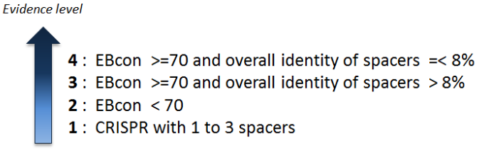
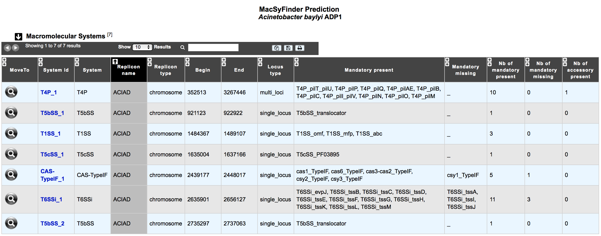
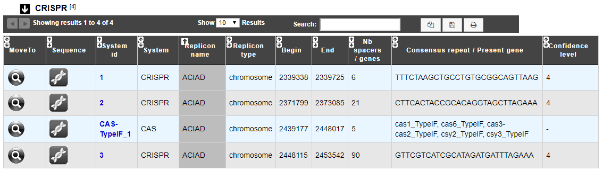

.. _macsyfinder:

######################
Macromolecular Systems
######################

What type of Macromolecular systems can be detected?
----------------------------------------------------------

* a broad range of secretion systems: T1SS, T2SS,T3SS,T4SS, T5SS, T6SS, T9SS, Flg, T4P, Tad (`Abby SS et al., Sci. Rep. 2016 <https://www.ncbi.nlm.nih.gov/pubmed/26979785>`_)
* CRISPR-Cas systems: Clustered regularly interspaced short palindromic repeats (CRISPR) arrays and their associated Cas (CRISPR-associated) proteins form the CRISPR-Cas system. CRISPR-Cas are sophisticated adaptive immune systems that rely on small RNAs for sequence-specific targeting of foreign nucleic acids such as viruses and plasmids.

What is MacSyFinder?
--------------------

Macromolecular System Finder (MacSyFinder) provides a flexible framework to model the properties of molecular systems (cellular machinery or pathway) including their components, evolutionary associations with other systems and genetic architecture.
Modelled features also include functional analogs, and the multiple uses of a same component by different systems.
Models are used to search for molecular systems in complete genomes or in unstructured data like metagenomes.
The components of the systems are searched by sequence similarity using Hidden Markov model (HMM) protein profiles.
The assignment of hits to a given system is decided based on compliance with the content and organization of the system model. 

Learn more about MacSyFinder `here <https://research.pasteur.fr/fr/software/macsyfinder-macsyview/>`_.

.. Don't use MacSyFinder as the name of the link since that would make
   a duplicate with the label.

**Reference:** 

`Abby SS, et al. 2014. MacSyFinder: a program to mine genomes for molecular systems with an application to CRISPR-Cas systems, PLoS ONE 2014;9(10):e110726 ; [PMID 25330359] <http://www.ncbi.nlm.nih.gov/pubmed/25330359>`_

What is CRISPRCasFinder ?
-------------------------

CRISPRCasFinder is a Perl script allowing to identify CRISPR arrays and Cas proteins. The CRISPR detection is based on Vmatch ( a software for large scale sequence analysis) which identify all repeat sequences regularly spaced. CRISPRCasFinder associate a notation level with each CRISPR detected. This evidence level is established using several criteria. Firstly, an index conservation of repeats based on Entropy (EBcon), secondly, the number of spacer and finally the overall percentage identity of this spacers. Four level can be attributed :

More information about CRISPRCasFinder `here <https://crisprcas.i2bc.paris-saclay.fr/>`_.

**Reference:** 

`D. Couvin et al. 2018. CRISPRCasFinder, an update of CRISRFinder, includes a portable version, enhanced performance and integrates search for Cas proteins, Nucleic Acids Research <https://doi.org/10.1093/nar/gky425/>`_.

How to access to MacSyFinder and CRISPRCasFinder predictions?
----------------------------------------------------------

MacSyFinder and CRISPRCasFinder predictions are available through the **Comparative Genomics** section, in the main navigation menu.

What is the 'Macromolecular Systems' table?
--------------------------------------------------------

This table enumerates all macromolecular systems predicted for the selected organism and its replicons.

* **System id**: identifier of the system in the organism
* **System:	type** of system detected by MacSyFinder
* **Replicon name**: identification of the replicon
* **Replicon type**: chromosome, plasmid or WGS
* **Begin** /	**End**:	Position of the system on the replicon
* **Locus type**:	single or multi locus
* **Mandatory present**:	list of mandatory genes of the system identified in the organism
* **Mandatory missing**:	ist of mandatory genes of the system not detected in the organism
* **Nb of mandatory present**: number of mandatory genes of the system identified in the organism
* **Nb of mandatory missing**: number of mandatory genes of the system not detected in the organism
* **Nb of accessory present**: number of accessory genes of the system identified in the organism

What is the 'CRISPR' table?
--------------------------------------------------------

This table enumerates all CRSIPR and Cas predicted for the selected organism and its replicons.

* **System id**: identifier of the system in the organism
* **System:	type** of system detected ( CRISPR or Cas)
* **Replicon name**: identification of the replicon
* **Replicon type**: chromosome, plasmid or WGS
* **Begin** /	**End**:	Position of the system on the replicon
* **Nb spacers / genes**: Number of CRISPR spacers / Number of CAS gene
* **Consensus repeat / Present gene**: Consensus repeat sequence predicted by CRISPRCasFinder / list of mandatory cas genes
* **Confidence level**:	Notation level given by CRISPRCasFinder (see more)

How to explore a Macromolecular System?
--------------------------------------------------------

The :ref:`MacSyFinder System visualization window <macromolecular-system-vizualization>` can be accessed by clicking on any cluster number in the System Id field. This window allows you to access to a detailled description of a selected Macromolecular System.
