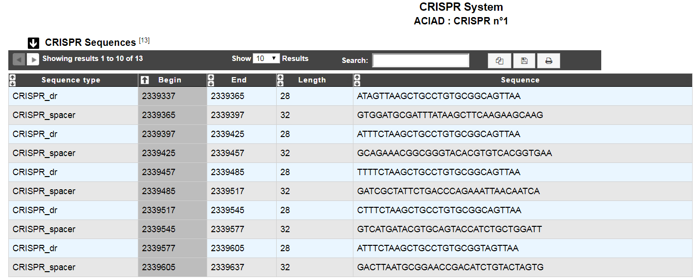

.. _macromolecular-system-vizualization:

########################################
How to explore a Macromolecular System?
########################################

The MacSyFinder System visualization allows you to access to a detailled description of a selected Macromolecular System.

.. image:: img/macSy_syst.png

The table **Genomic objects** provides information regarding the genomic objects composing the Macromolecular System such as :

* **Label**, **Begin**, **End**, **Gene**, **Product**: correspond to the annotation of the object in MicroScope
* **Gene status**:	mandatory or accessory, as defined in MacSyFinder
* **MacSy label**:	gene label proposed by MacSyFinder
* **Eval**:	Evalue of the match with MacSyFinder models
* **Query coverage**: coverage of the match on the genomic object
* **Subject coverage**:	coverage of the match on the MacSyFinder model
* **Begin match**:	begin position of the match on the genomic object
* **End match**: end position of the match on the genomic object

You can export the genes by clicking on **Export to Gene Cart**.

#########################
How to explore a CRISPR ?
#########################

The table **CRISPR Sequences** provides all repeats and spacers containing into the seleted CRISPR :

* **Sequence type**: "CRISPR_dr" if the sequence is a direct repeat or "CRISPR_spacer" if the sequence is a spacer
* **Begin/End**: Position of the sequence on the replicon	
* **Length**:	Length of the sequence
* **Sequence**: Nucleic acid sequence

