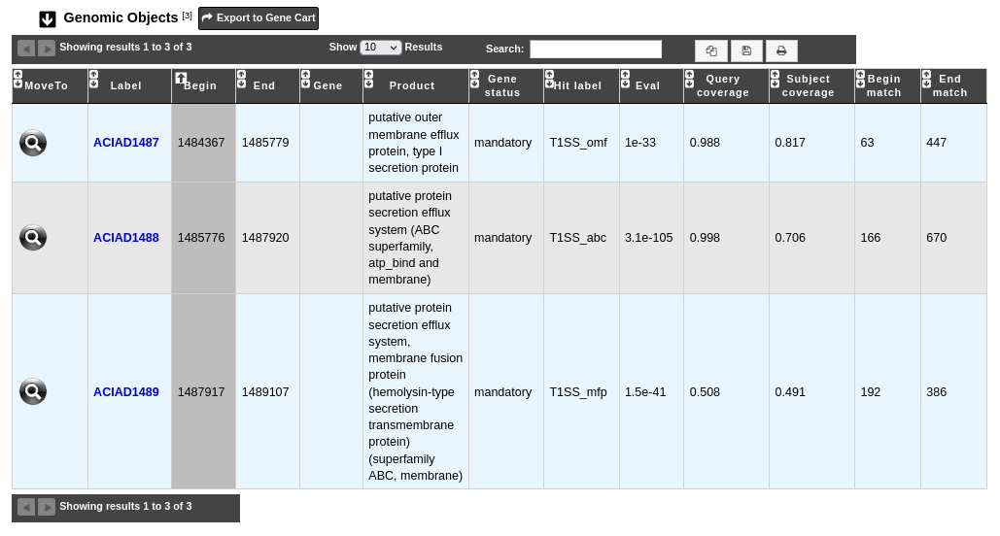

.. _macromolecular-system-vizualization:

###############################################
MacSyFinder macromolecular system visualization
###############################################

What is MacSyFinder ?
---------------------

Learn more about `MacSyFinder <https://macsyfinder.readthedocs.io/en/latest/>`_.

**Reference:**

`Néron, Bertrand; Denise, Rémi; Coluzzi, Charles; Touchon, Marie; Rocha, Eduardo P.C.; Abby, Sophie S. MacSyFinder v2: Improved modelling and search engine to identify molecular systems in genomes. Peer Community Journal, Volume 3 (2023), article no. e28. <https://doi.org/10.24072/pcjournal.250>`_

How to explore a MacSyFinder macromolecular system ?
----------------------------------------------------

You can access to the **MacSyFinder macromolecular system visualization** window by clicking on the label indicated in the **Macromolecular system** field in the **Macromolecular Systems** table.

This window allows you to access to a detailled description of the selected macromolecular system components.

You can also use the main navigation menu in the **Comparative Genomics** section and **Macromolecular Systems** subsection to obtain the :ref:`MacSyFinder predictions page <macsyfinder>`. This page enumerates all macromolecular systems detected for the selected organism and its replicons.

What is the 'Genomic Objects' table ?
-------------------------------------

The table **Genomic Objects** provides informations regarding the genomic objects present in the macromolecular system.

You can export the genes by clicking on **Export to Gene Cart**.

* **Label**: Label of the genomic object. Click on it allow to access to its annotation page.
* **Begin** and **End**: Location of the genomic object on the sequence.
* **Gene**: Gene name if any.
* **Product**: Description of the gene product of the genomic object.
* **Gene status**: Status of the gene in the system (mandatory, accessory, neutral).
* **Hit label**: Name of the MacSyFinder HMM profile which matchs with the sequence.
* **Eval**:  Evalue of the match.
* **Query coverage**: Coverage of the match on the sequence.
* **Subject coverage**: Coverage of the match on the MacSyFinder HMM profile.
* **Begin match** and **End match**: Location of the match on the sequence.

