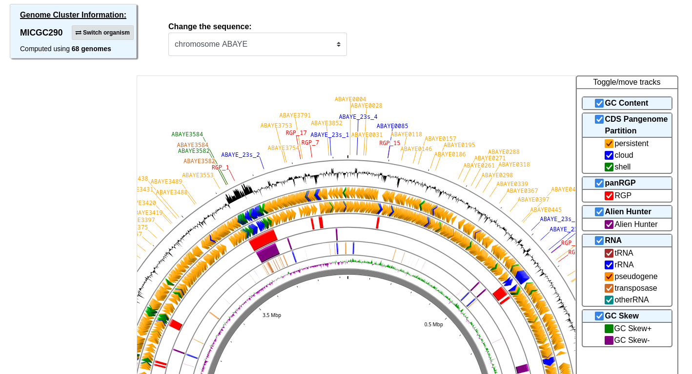
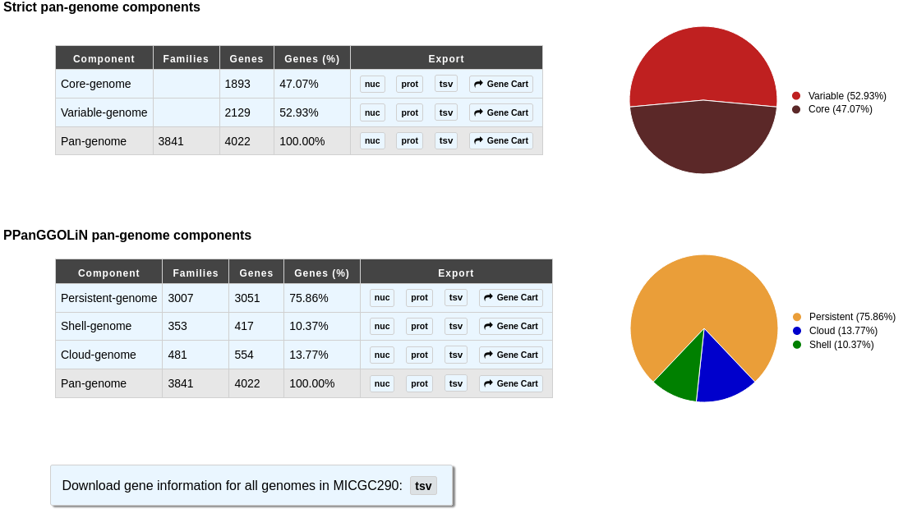
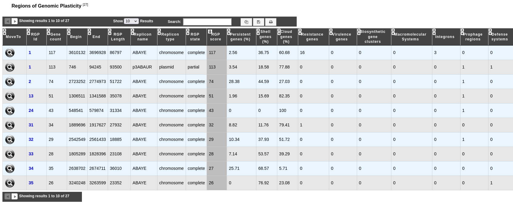

.. _panRGP:

######################################
Regions of Genomic Plasticity - panRGP
######################################

What is PPanGGOLiN ?
--------------------

panRGP is an analysis method of the  `PPanGGOLiN <https://github.com/labgem/PPanGGOLiN>`_ software.
PPanGGOLiN computes pangenomes for each :ref:`MicroScope Genome Cluster <genoclust>`  (MICGC correspond to clusters of genomes from the same species) (A).
It relies on a graph approach to modelize pangenomes in which nodes and edges represent families of homologous genes and genomic neighborhood information, respectively (B and C).
Homologous families are from :ref:`MICFAM <pancore-analysis>` computed with stringent parameters (80% of aa identity and 80% of alignment coverage).
PPanGGOLiN approach takes into account both graph topology (D.a) and occurrences of genes (D.b) to classify gene families into three partitions (i.e. persistent genome, shell genome and cloud genome) yielding to what we called Partitioned Pangenome Graphs (F).
More precisely, the method depends upon an Expectation/Maximization algorithm based on Bernoulli Mixture Model (E.a) coupled with a Markov Random field (E.b).

**Pangenome Graph Partitions:**

1) Persistent genome: equivalent to a relaxed core genome (genes conserved in almost all genomes).

2) Shell genome: genes having intermediate frequencies corresponding to moderately conserved genes (potentially associated to environmental adaptation capabilities).

3) Cloud genome: genes found at very low frequencies (potentially newly transferred genes).

.. image:: img/ppanggolin.png

As illustrated below, the PPanGGOLiN classification can be projected on each genome of the analyzed MICGC:

.. image:: img/projection.png

**Reference:**

`Gautreau G. et al. 2020 PPanGGOLiN: Depicting microbial diversity via a partitioned pangenome graph. PloS Computational Biology <https://doi.org/10.1371/journal.pcbi.1007732>`_

Dedicated site: `https://github.com/labgem/PPanGGOLiN <https://github.com/labgem/PPanGGOLiN>`_

.. Warning:: The panRGP tool is executed only on MICGC containing at least 15 strains.
   Please also note that we exclude genomes for which CheckM detected more than 5% contamination or less than 90% completeness as they are not assigned to MICGC cluster (see :ref:`Genome Overview <genome-overview>`).

What is a Region of Genomic Plasticity (RGP) ?
----------------------------------------------

A RGP is a region of a genome structurally not present in related others. RGPs can be sites of insertions of integrated Mobile Genetic Elements (MGE), or the result of deletions of particular segments of DNA in one or more strains.
Therefore, the RGP designation does not make any assumption about the evolutionary origin or genetic basis of these variable chromosomal segments.

Large RGP arising from Horizontal gene transfer (HGT) may correspond to Genomic Islands. These regions are known to encode virulence, antimicrobial resistance factors and contains genes conferring specific adaptation functions (pathogenicity, symbiosis properties, detoxification ...).

**Reference:**

`Bertelli C. et al. 2018 Microbial genomic island discovery, visualization and analysis. Briefings in Bioinformatics; [PMID 29868902] <https://www.ncbi.nlm.nih.gov/pubmed/29868902>`_

What is panRGP ?
------------------

The goal of panRGP is to efficiently detect RGPs within a partitioned pangenome graph.
Based on the projection of the partitioned PPanGGOLiN graph on a given genome, the method defines as a RGP a set of consecutive genes that are members of the shell or cloud genomes.

The panRGP method browses the genes along the genome to determine the RGP boundaries using a score-based algorithm.

**Reference:**

`Bazin A, Gautreau G, Médigue C, Vallenet D, Calteau A. panRGP: a pangenome-based method to predict genomic islands and explore their diversity. Bioinformatics. 2020;36(Suppl_2):i651-i658. <https://doi.org/10.1093/bioinformatics/btaa792>`_

How to access to panRGP data ?
------------------------------

panRGP predictions are available through the Comparative Genomics section, in the main navigation menu.

How to read the interface ?
---------------------------

In the genome cluster information table, you can find out which MICGC your organism belongs to and switch to another within the same genome cluster.
The total number of organisms in the MICGC that were used to compute the RPGs is also indicated.

.. Note:: You may not have access to all the organisms used to compute the RGPs, as some may have restricted access based on annotator access rights.

You can visualize the genome partition in a circular representation using CGView (see :ref:`cgview`).

Tracks (from the outside):

1. GC Content
2. CDSs in the negative strand: **yellow** for persistent genome, **green** for shell genome and  **blue** for cloud genome
3. CDSs in the positive strand (same color code as above)
4. Predicted RGPs (**red**)
5. Alien Hunter/IVOM results (**purple**)
6. tRNAs (**green**), rRNAs (**blue**), misc RNAs (**grey**), pseudogenes (**sea green**), transposases (**chocolate**) and others (**orange**)
7. GC Skew

The "Strict pan-genome components" table represents a summary of the :ref:`exact core-variable analysis <pancore>`.

The "PPanGGOLiN pan-genome components" table gives the number of genes and MICFAM families for each PPanGGOLiN partition.

You can extract all these genes in fasta format (nucleic and proteic), tsv with their annotation or in a gene card to do further analysis on them.

Finally, the "Regions of Genomic Plasticity" table gives you an overview of all the RGPs in the given organism that were predicted by the panRGP method.
     
 - **RGP id**: Identifier of the RGP. Click on it to open the detailled :ref:`RGP visualization <rgpexplorer>` page, which allows you to access to a detailed description of the RGP.
 - **Gene count**: Number of genes within the RGP.
 - **Begin**, **End** and **Length** give informations about the location and the length of the RGP on the sequence.
 - **Replicon name** and **Replicon type** give characteristics of the replicon where the region is found.
 - **RGP state** indicates whether the region is complete or probably partial, which can happen when the RGP is located on the contig edge.
 - **RGP score**: panRGP score of the RGP (see the panRGP paper for more details about its computation).
 - **Persistent genes(%)**, **Shell genes (%)** and **Cloud genes (%)** give the proportion of genes within the RGP for the different partitions.
 - **Resistance genes**: Number of genes predicted as involved in the antibiotic resistance using the :ref:`CARD method <card>`.
 - **Virulence genes**: Number of genes predicted as involved in the virulence mecanism using the :ref:`Virulence prediction <virulence>`.
 - **Biosynthetic gene clusters**: Number of the different regions predicted by :ref:`antiSMASH <antiSMASH>`.
 - **Macromolecular systems**: Number of the different macromolecular systems predicted by :ref:`MacSyFinder <macsyfinder>`.
 - **Integrons**: Number of the different integrons predicted by :ref:`IntegronFinder <integron>`.
 - **Prophage regions**: Number of the different prophage regions predicted by :ref:`Phigaro <prophages-defense-systems>`.
 - **Defense systems**: Number of the different defense systems predicted by :ref:`DefenseFinder <prophages-defense-systems>`.

How to explore panRGP ?
-----------------------

The :ref:`RGP visualization <rgpexplorer>` window can be accessed by clicking on any RGP number in the RGP id field.
This window allows you to access to a detailed description of the RGP.
