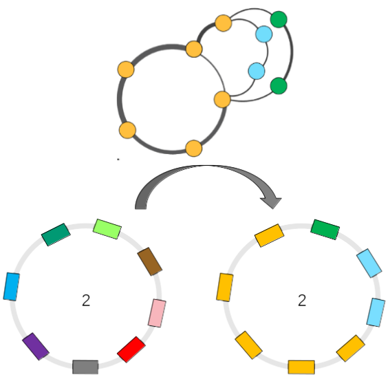
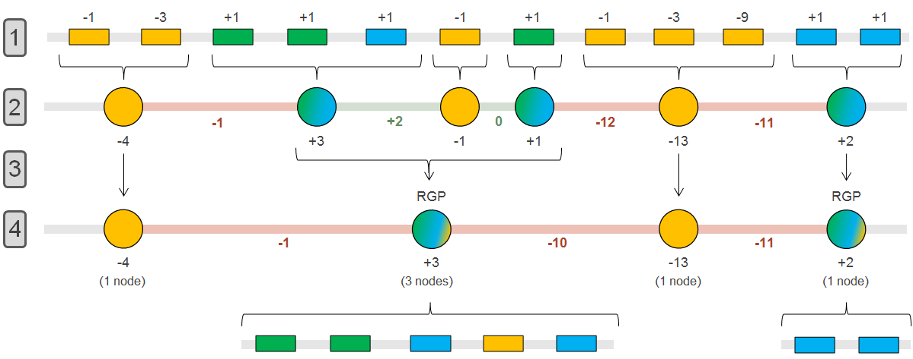
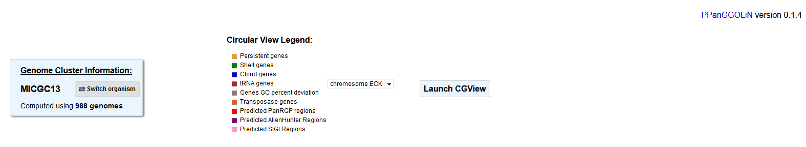
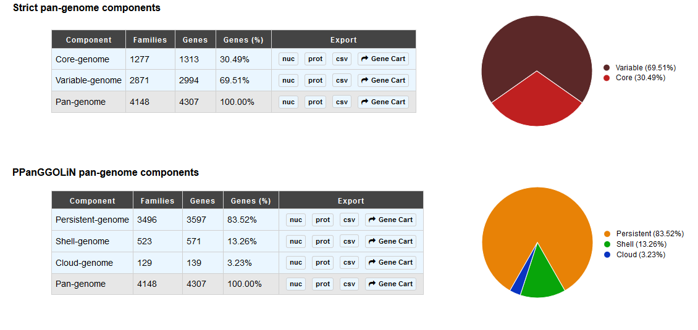
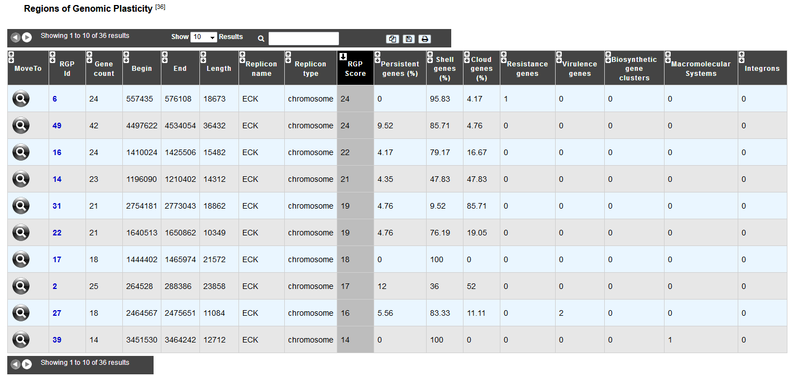

##########################################
Regions of Genomic Plasticity - panRGP
##########################################

What is PPanGGOLiN ?
-------------------------------------------------------

The panRGP tool uses the inputs of  `PPanGGOLiN <https://github.com/ggautreau/PPanGGOLiN>`_ software that computes pangenomes for each `MicroScope Genome Cluster <https://microscope.readthedocs.io/en/latest/content/compgenomics/genoclust.html>`_  (MICGC correspond to clusters of genomes from the same species) (A). PPanGGOLiN relies on a graph approach to modelize pangenomes in which nodes and edges represent families of homologous genes and genomic neighborhood information, respectively (B and C). Homologous families are from `MICFAM <https://microscope.readthedocs.io/en/latest/content/compgenomics/pancoreTool.html#how-the-analysis-is-computed>`_ computed with stringent parameters (80% of aa identity and 80% of alignment coverage). PPanGGOLiN approach takes into account both graph topology (D.a) and occurrences of genes (D.b) to classify gene families into three partitions (i.e. persistent genome, shell genome and cloud genome) yielding to what we called Partitioned Pangenome Graphs (F). More precisely, the method depends upon an Expectation/Maximization algorithm based on Bernoulli Mixture Model (E.a) coupled with a Markov Random field (E.b).

**Pangenome Graph Partitions:**

1) Persistent genome: equivalent to a relaxed core genome (genes conserved in almost all genomes).

2) Shell genome: genes having intermediate frequencies corresponding to moderately conserved genes (potentially associated to environmental adaptation capabilities).

3) Cloud genome: genes found at very low frequencies (potentially newly transferred genes).

.. image:: img/ppanggolin.png

As illustrated below, the PPanGGOLiN classification can be projected on each genome of the analyzed MICGC:

**More information about PPanGGOLiN is available `here <https://github.com/ggautreau/PPanGGOLiN>`_.**

.. Warning:: The panRGP tool is executed only on MIGC containing at least 15 strains. Please also note that we exlclude genomes for which CheckM detected more than 5% contamination or less than 90% completeness as they are not assigned to MICGC cluster (see `Genome Overview <https://microscope.readthedocs.io/en/latest/content/genomic/overview.html>`_ ). 

What is a Region of Genomic Plasticity (RGP) ?
-------------------------------------------------------

A RGP is a region of a genome structurally not present in related others. RGPs can be sites of insertions of integrated Mobile Genetic Elements (MGE), or the result of deletions of particular segments of DNA in one or more strains.  
Therefore, the RGP designation does not make any assumption about the evolutionary origin or genetic basis of these variable chromosomal segments.

These regions are known to encode virulence, antimicrobial resistance factors and contains genes conferring specific adaptation functions (pathogenicity, symbiosis properties, detoxification ...).

**Reference:**

`Bertelli C. et al. 2018 Microbial genomic island discovery, visualization and analysis. Briefings in Bioinformatics; [PMID 29868902] <https://www.ncbi.nlm.nih.gov/pubmed/29868902>`_

What is a panRGP ?
-------------------------------------------------------

The goal of panRGP is to efficiently detect RGPs within a partitioned pangenome graph. Based on the projection of the partitioned PPanGGOLiN graph on a given genome, the algorithm detects sets of consecutive genes that are members of the shell or cloud genomes.

The algorithm uses a sequence of genes that are represented by their family’s partition 
(**persistent: yellow**; **shell: green**; **cloud:blue**).

(1) A score is attributed to group of consecutive genes, based on their partition. Both cloud and shell genes get a score of +1.  Assuming than x+1 being the number of consecutive genes, persistent genes get a score of:  

.. math:: -(3)^x 

(2) Consecutive persistent genes (preserved region) and consecutive cloud and shell genes (variable region) are regrouped in nodes. 

(3) Each node representing a preserved region is evaluated to determine if it should be grouped with its surrounding node(s) or being seperated into 2 potential variable regions. The "node merge" is done only if the sum of the score of the preserved region and the minimum score of its neighboring RGP node is positive or equals to 0 (to allow a few persistant gene into a RGP). 

(4) All nodes have been processed, so variable regions can be parsed to extract the genes they encompass. Here, a RGP of 5 genes (3 shell, 1 persistent and 1 cloud) and one of 2 gene (2 cloud) are obtained.

.. Note:: The RGP have to be composed of at least 2 genes and have a lenght of 5000n minimum.

How to access to panRGP data ?
-------------------------------------------------------

panRGP predictions are available through the Comparative Genomics section, in the main navigation menu.

How to read the interface ?
--------------------------------------------------------

First, on the genome cluster information table, you can know the MICGC your organism is part of and switch to an other organism within the same group. You also have the total number of organism which compose the MICGC.

.. Note:: You can only switch to organism you have right on (or public ones). It is possible that the total number of organism and the number of organism available to you are different as there might be some private within the MICGC.

You can visualize the genome partition with the circular prospective using `CGView <https://microscope.readthedocs.io/en/latest/content/genomic/cgview.html>`_

Then, the "Strict pan-genome components" table represent a summary of the `traditional core-variable analysis <https://microscope.readthedocs.io/en/latest/content/compgenomics/pancoreTool.html>`_

The "PPanGGOLiN pan-genome components" table give the PPanGGOLiN gene partition of the given organism.

You can extract all these genes in fasta format (nucleic and proteic), csv with their annotation or in a gene card to do further analysis on them.

Finally, the "Regions of Genomic Plasticity" table, give you an overview of all RGP detected in the given organism using the panRGP method.

We analyze the RGP gene composition with some other method results:

 - Resistance genes: Antibiotic resistance prediction using `CARD method <https://microscope.readthedocs.io/en/latest/content/compgenomics/card.html>`_
 - Virulence genes: `Virulence prediction <https://microscope.readthedocs.io/en/latest/content/compgenomics/virulence.html>`_
 - Biosythetic gene clusters: `AntiSMASH Prediction <https://microscope.readthedocs.io/en/latest/content/metabolism/antismash.html>`_
 - Macromolecular systems: `MacSyFinder Prediction <https://microscope.readthedocs.io/en/latest/content/compgenomics/macsyfinder.html>`_
 - Integrons: `IntegronFinder Prediction <https://microscope.readthedocs.io/en/latest/content/compgenomics/integron.html>`_

How to explore panRGP ?
--------------------------------------------------------

The `IntegronFinder cluster visualization <https://microscope.readthedocs.io/en/latest/content/compgenomics/RGPExplorer.html>`_ window can be accessed by clicking on any RGP number in the RGP id field. This window allows you to access to a detailled description of the RGP.
