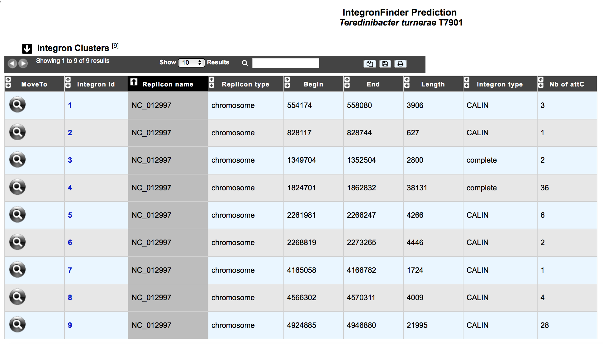

##########################################
Regions of Genomic Plasticity - panRGP
##########################################

What is PPanGGOLiN ?
-------------------------------------------------------

This tool compiles the genomic content of a MICGC (A) (group of organism made with our method of  `Genome Clustering <https://microscope.readthedocs.io/en/latest/content/compgenomics/genoclust.html>`_ to make a pangenome. It relies on a graph approach to modelize pangenomes in which nodes and edges represent families of homologous genes (B and C) made with `MICFAM <https://microscope.readthedocs.io/en/latest/content/compgenomics/pancoreTool.html#how-the-analysis-is-computed>`_ (stringent parameter) and neighborhood information. This approach takes into account both graph topology (D.a) and occurrences of genes (D.b) to classify gene families into three partitions (i.e. persistent genome, shell genome and cloud genome) yielding to what we called Partitioned Pangenome Graphs (F). More precisely, the method depends upon an Expectation/Maximization algorithm based on Bernoulli Mixture Model (E.a) coupled with a Markov Random field (E.b).

Partitions:

1) Persistent genome: equivalent to a relaxed core genome (genes conserved in almost all genomes).

2) Shell genome: genes having intermediate frequencies corresponding to moderately conserved genes (potentially associated to environmental adaptation capabilities).

3) Cloud genome: genes found at very low frequencies (potentially newly integrated genes).

.. image:: img/ppanggolin.png

Finally, as illustrated below, PPanGGOLiN projects on each organism the result of the graph partionning.

.. image:: img/projection.png
   :align: right
   :scale: 50 %

**More information:** `PPanGGOLiN <https://github.com/ggautreau/PPanGGOLiN>`_

.. Warning:: Genomes are not computed using PPanGGOLiN: 

 1) Genomes for which CheckM detected more than 5% contamination or less than 90% completeness are not assigned to MICGC cluster (see `Genome Overview <https://microscope.readthedocs.io/en/latest/content/genomic/overview.html>`_ ).  
 2) If MICGC contains less than 15 organisms this analysis is not performed to ensure the statistical robustness of the method. 

What is a Region of Genomic Plasticity (RGP) ?
-------------------------------------------------------

A RGP is a region of a genome structurally not present in related other(s). The RGPs can be sites of insertions of integrated Mobile Genetic Elements (MGE), or the result of deletions of particular segments of DNA in one or more strains.  
Therefore, the RGP designation does not make any assumption about the evolutionary origin or genetic basis of these variable chromosomal segments.

Studying those regions are known to encode virulence, antimicrobial resistance factors and contains genes conferring specific adaptation functions (pathogenicity, symbiosis properties, detoxification ...).

**Reference:**

`Bertelli C. et al. 2018 Microbial genomic island discovery, visualization and analysis. Briefings in Bioinformatics; [PMID 29868902] <https://www.ncbi.nlm.nih.gov/pubmed/29868902>`_

What is a panRGP ?
-------------------------------------------------------

The goal of panRGP is to efficiently extract RGPs within a partitioned pangenome graph. 

Based on the partitioned pangenome content of a given genome (so after projection), the algorithm uses the chaining of gene families partitions to determine the RGPs within this genome, relying on a double pass linked-list partitioning method

.. image:: img/panRGP.png

The algorithm uses a sequence of genes that are represented by their family’s partition (**persistent: yellow**; **shell: green**; **blue:cloud**). 

(1) A score is attributed to group of consecutive genes, based on their partition. Persistent genes get a score of 
.. math:: -(3)^x (x+1 being the number of consecutive genes) and both cloud and shell genes get a score of +1.

(2) Consecutive persistent genes (preserved region) and consecutive cloud and shell genes (variable region) are regrouped in nodes.

(3) Each node representing a preserved region is evaluated to determine if it should be grouped with its surrounding node(s) or being seperated into 2 potential variable regions. The "node merge" is done only if the sum of the score of the preserved region and the minimum score of its neighboring RGP node is positive or equals to 0 (to allow a few persistant gene into a RGP).

(4) All nodes have been processed, so variable regions can be parsed to extract the genes they encompass. Here, a RGP of 5 genes (3 shell, 1 persistent and 1 cloud) and one of 2 gene (2 cloud) are obtained. 

How to access to panRGP data ?
-------------------------------------------------------

What is the 'panRGP' table?
--------------------------------------------------------

How to explore panRGP ?
--------------------------------------------------------

