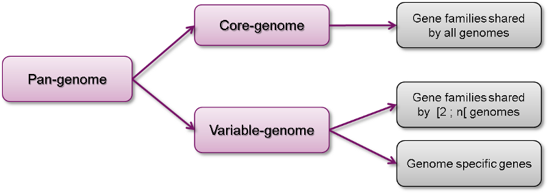
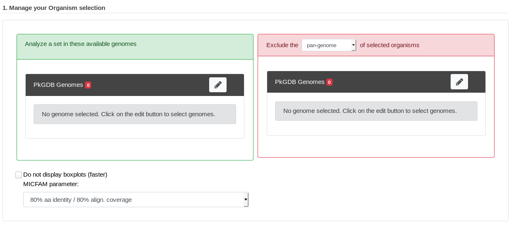
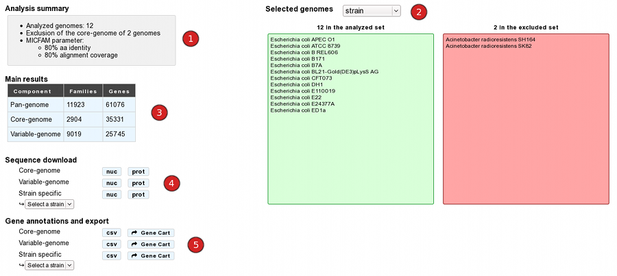
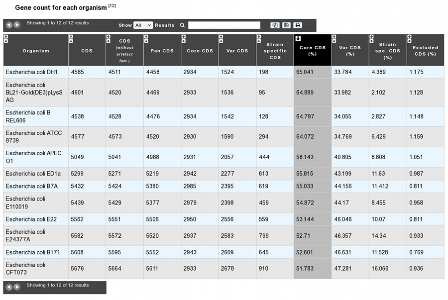
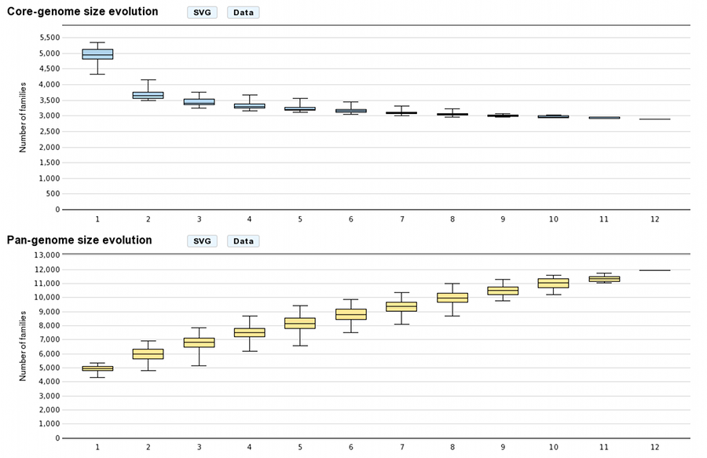
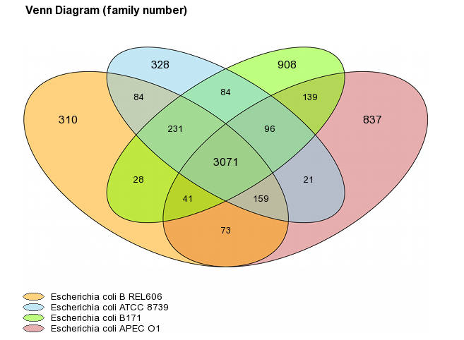

.. _pancore:

###############
Pan/Core Genome
###############

How to access to the pan/core-genome analysis tool?
---------------------------------------------------

Pan/core-Genome tool is accessible in the **Comparative Genomics** section of the main navigation menu.

What is pan-genome and core-genome?
-----------------------------------

The **pan-genome** describes the full complement of genes in a list of organisms.

It is the union of all the gene families and specific genes of all the strains. It includes :

* The **core-genome** containing gene families shared by all the organisms (intersection of gene families).
* The **variable-genome** containing genes families shared by two or more organisms and strain specific genes.

What is the usefulness of this tool?
------------------------------------

This tool allows the users to :

* Compute pan-genome and core-genome sizes and their evolutions for a genome set
* Exclude another pan/core/variable-genome from the analysis
* Determine the common and variable genome proportion for each genome
* Extract core-genome, variable-genome and strain specific sequences and annotations.

.. _pancore-analysis:

How the analysis is computed?
-----------------------------

- **MICFAM: MicroScope gene families**

	* **Clustering algorithm** : 
	
		This tool is based on MicroScope gene families (MICFAM) which are computed using an algorithm implemented in the SiLiX software (http://lbbe.univ-lyon1.fr/-SiLiX-.html ): a single linkage clustering algorithm of homologous genes sharing an amino-acid alignment coverage and identity above a defined threshold. 

		This algorithm operates on the “*The friends of my friends are my friends*” principle by comparing genes together. If two genes are homologous, they are clustered. Moreover, if one of this gene is already clustered with another one, these three genes are clustered into the same MICFAM. 

		Reference: `Miele V, Penel S, Duret L. Ultra-fast sequence clustering from similarity networks with SiLiX. BMC Bioinformatics. 2011 Apr 22;12:116. <http://www.ncbi.nlm.nih.gov/pmc/articles/PMC3095554/>`_

	* **MICFAM parameters**: 
	
	Two sets of alignment constraints are defined to compute the MICFAM families :
	
		* **80/80**: 80% amino-acid identity, 80% amino-acid alignment coverage (stringent parameter)
		* **50/80**: 50% amino-acid identity, 80% amino-acid alignment coverage (permissive parameter)

- **Pan-genome analysis method**

	* The pan-genome analysis is computed using these **MICFAM**:
		
		* If a MICFAM is associated with at least one gene from every compared genomes: this MICFAM is a part of the **core-genome**.
		* If a MICFAM is associated with [1;n[ compared genomes : It is a part of the variable-genome.
		* If a gene is not clustered in a MICFAM, it is a **singleton** and is a part of the variable-genome.
		* And the pan-genome represents the core-genome and variable-genome sum.
	
	* **Counting methods**: 
	
	For the family count, the MICFAM weight is 1. 
	For the gene count, the MICFAM weight is the number of genes of the analyzed organisms clustered in this MICFAM. 
	For singletons, the weight is 1 in every case.

	* **Artefact families**: 
	
	CDS flagged as artefacts are not taking into account in the computation. Moreover, if an artefact CDS is a member of a MICFAM, the artefact information is propagated in the whole MICFAM (tagged as "artefact family"). Thus, this MICFAM is not considered for the analysis.

	* **Exclusion of another pan/core/variable-genome**: 
	
	In the case of exclusion, gene families of the excluded component (pan/core/variable-genome of an excluded set) are compared with families computed from analyzed organisms. Common gene families are removed of the analysis. Some singletons can also be removed if some excluded organisms are in the analyzed set too (with exclusion of their pan-genome or variable-genome).

How to perform a pan-genome analysis?
-------------------------------------

At first, genomes and MICFAM parameters must be selected: 

The form is composed of two organism lists:

* In the left-hand list, at least two genomes to analyze must be selected.
* In the **optional** right-hand list, one or several genomes can be selected. In this case, the component of these organisms to exclude must be chosen (*at least two "excluded genomes" must be selected for the core and variable components*). 

This form uses advanced selectors (in **Genome Selection** mode) to select the genomes of interest.
See :ref:`here <advanced-selector>` for help on how to use this selector.

MICFAM parameters must be selected according to the desired confidence level.

And the pan/core-genome evolution (boxplots) can be disabled with the checkbox (faster computation with many organisms).

How to read the analysis main results?
--------------------------------------

After the analysis submission, a result page is provided:

1) The "**analysis summary**" gives the number of selected/excluded genomes and MICFAM parameters.

2) The “**Selected genomes**” module lists included/excluded strains and proposes an overview of this selection at different taxonomic levels.

3) The “**Main results**” table displays the size of pan-genome, core-genome and variable-genome by number of families and genes.

4) The “**Sequence download**” module allows the users to download core-genome variable-genome and strain specific multi-fasta sequences. Label of sequences is organized as follow:

		>MICFAM identifier|CDS identifier|CDS label|CDS product [Strain]
		
5) The “**Gene annotations and export**” module allows the users to download annotations of core-genome, variable-genome and strain specific genes in a tabulated file. There is 23 columns to describe each feature:

	* *MICFAM_Id*: MicroScope gene family identifier. Singletons are identified with a “single” tag in this column.
	* *NbOrganismsFAM*: number of organisms linked to the family. For core-genome and strain specific files, this value is constant (respectively : n and 1). For the variable-genome file, this value ranges from 1 to (n-1). (with n = the number of included organism).
	* *Organism*: organism name / strain
	* *GO_id*: CDS identifier
	* *Label*: CDS locus tag
	* *Type*: CDS or fCDS
	* *Evidence*: source of the annotation and its status
	* *Gene*: name of the gene
	* *Product*: biological product
	* *ECnumber*: Enzymatic Commission number (for enzymes only)
	* *Mutation*: mutation type
	* *ProductType*: classification according to the type of biological product
	* *Localization*: classification according to the cellular localization of the * protein
	* *Roles*: classification according to the biological role
	* *BioProcess*: another classification according to the biological role
	* *PubmedID*: related publication(s) about the CDS (PMID)
	* *AmigeneStatus*: no/COMMON/Wrong/New
	* *Class*: annotation confidence level
	* *CreationDate*: date of last modification of the annotation
	* *Frame*: CDS reading frame
	* *Begin*: sequence begin position
	* *End*: sequence end position
	* *Length*: length of the CDS.

It also allows the users to export these genes in gene carts (availables in the **User Panel** section).

How to read the gene count table?
---------------------------------

The analysis page provides a table of gene count for each organism, with 11 columns.

* *Organism*: organism name and strain
* *CDS*: Total number of genes in the organism (CDS+fCDS)
* *CDS without artefact fam.*: Total number of genes used for the analysis. Genes members of artefact families are excluded.
* *Pan CDS*: (Core CDS + Var CDS) = (CDS without artefacts - homologous CDS with excluded organisms)
* *Core CDS*: CDS number in the core-genome component
* *Var CDS*: CDS number in the variable-genome component
* *Strain specific CDS*: CDS number in the variable-genome component specific to this strain only.
* *Core CDS (%)*: Core CDS percentage
* *Var CDS (%)*: Var CDS percentage
* *Strain spe. CDS (%)*: Strain specific CDS percentage
* *Excluded CDS (%)*: Percentage of excluded CDS (in exclusion case)

How about figures?
------------------

* Core/Pan-genome size evolution

These graphs allow the users to visualize the core-genome and pan-genome sizes evolutions according to the number of genomes considered in the selected genome set. 
The last values correspond respectively to the core-genome and the pan-genome sizes. Other values are depicted by `boxplots <http://en.wikipedia.org/wiki/Box_plot>`_ to represent all or a subset of value combinations. (for example : There is 12 combinations of 1 genome in a 12 genomes selection) 

With **more than 10 selected genomes**, approximately 1000 combinations are sampled within the total combination distribution (proportional stratified random sampling without replacement) to limit the combinatorial explosion. 

These graphs are in the **SVG** (Scalable Vector Graphics) format and can be downloaded with the “SVG” button. 
The “Data” button allows the users to download formatted data. To read and plot these data with R, use the commands as follow:

**R commands**::

	data<-lapply(strsplit(readLines("boxplot_core.txt"), "\t"), as.integer)
	boxplot(data)

Venn Diagram (Organism number less than 6)

For a number of selected organisms **less than six**, core-genome, variable-genome and strain specific sizes are represented with a Venn diagram. Values on diagram represent the numbers of MICFAM families for each organism intersections.
