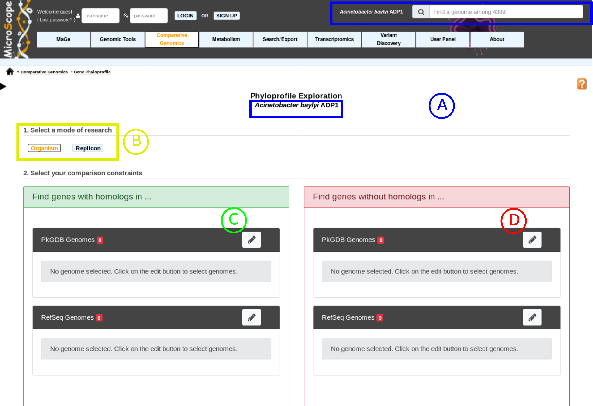
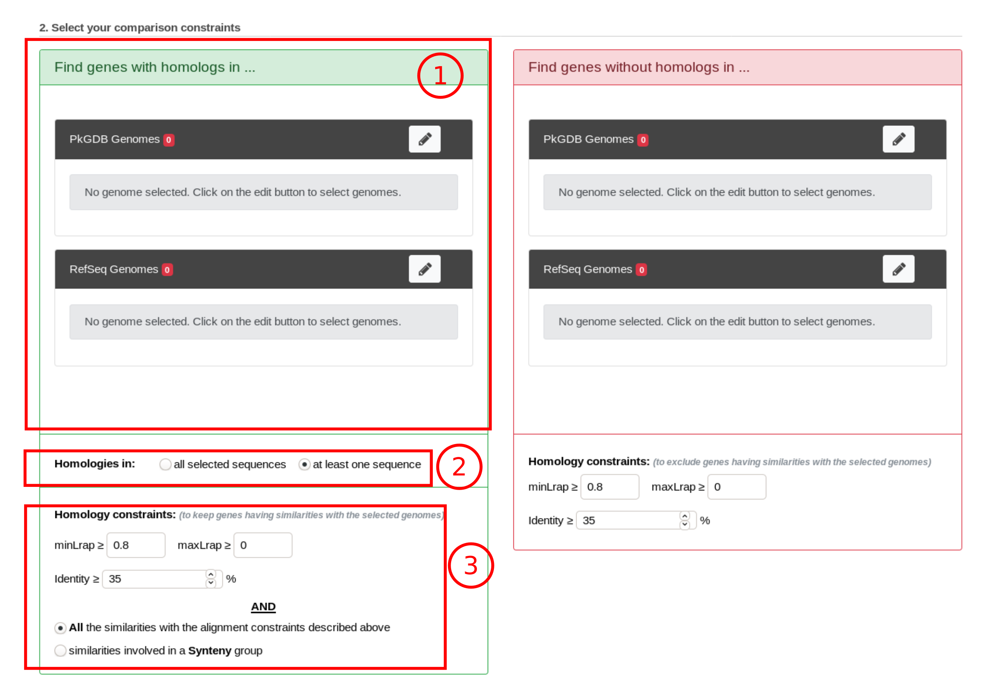
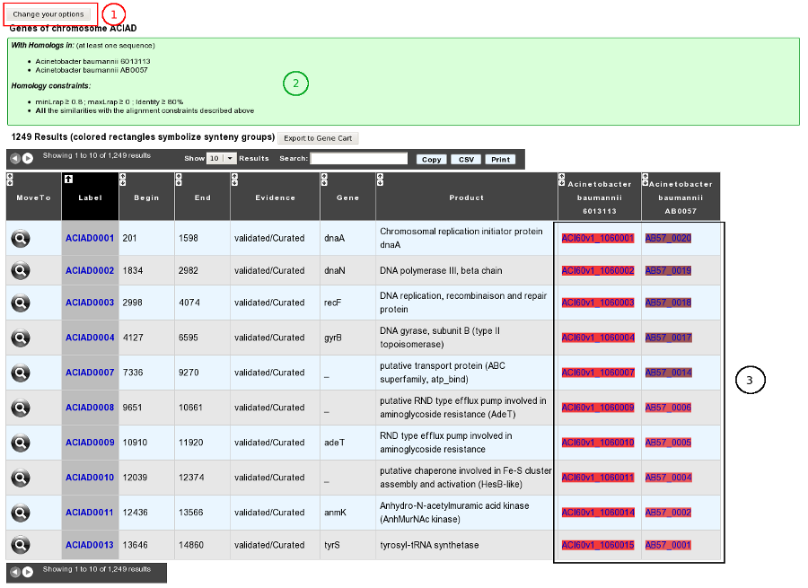
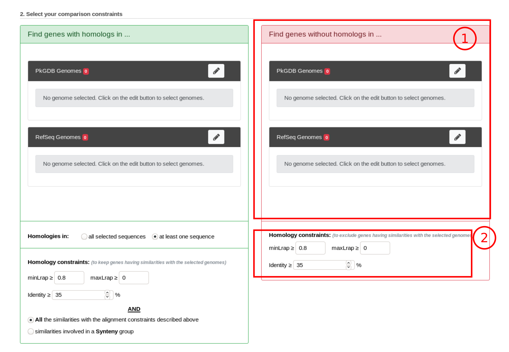
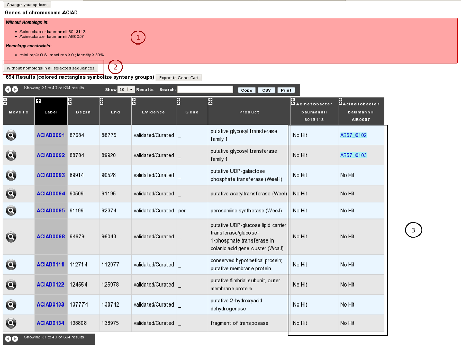
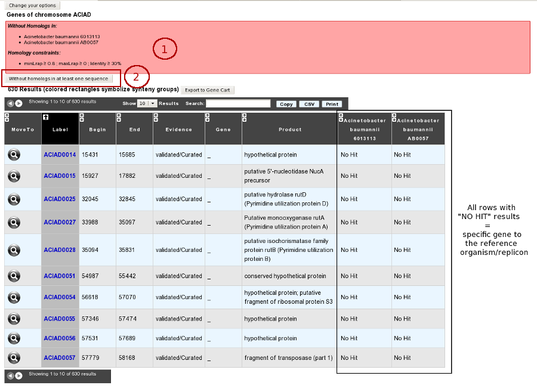

#################
Gene phyloprofile
#################

This interface allows the user to search for common OR specific genes/regions between a query genome and other genomes or replicons chosen from the ones available in our PkGDB database (i.e, (re)annotation of bacterial genomes) or complete proteome downloaded from the RefSeq/WGS sections.

How to read the interface?
--------------------------

* **item A**: Use the «*Change*» button to set the reference genome that will be used for the comparison. The current reference genome is displayed as a subtitle at the top of the window.

* **item B**: Use this box to select the **mode** of comparison

	* in *Organism* mode, search is performed within all replicons of the selected organisms
	* in *Replicon* mode, search is performed within a specific replicon (chromosome/plasmid)
	
* **item C**: Use this form to search for genes in your reference genome which have homologs in other organisms/replicons coming from PkGDB and/or RefSeq databases.

* **item D**: Use this form to search for specific genes in your reference genome compared to a selection of organisms/replicons coming from PkGDB and/or RefSeq databases. 

Forms **C** and **D** use the multiple organism selector.
See :ref:`here <multiple-selector>` for help on how to use it.

.. tip:: You can mix the use of **item C** and **item D** to perform a very sensitive search. For example: get CDS of *Acinetobacter baylyi ADP1* (reference genome, item A) which have homologs in *Acinetobacter baumannii 6013113* and Acinetobacter baumannii AB0057 (item C), but **NO** homologs in *Acinetobacter baumannii AYE* (item D)

How to get genes with homologs in other organisms/replicons?
------------------------------------------------------------

**Results**

How to get specific genes of your reference genome compared to other organisms/replicons?
-----------------------------------------------------------------------------------------

**Results**

