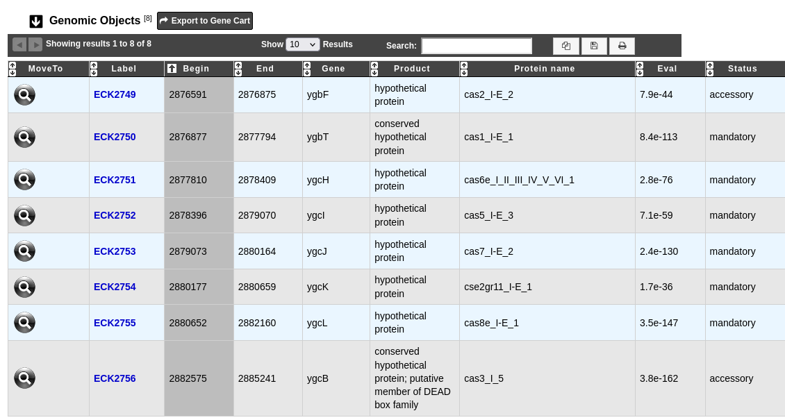

.. _prophages-defense-systems:

###########################
Prophages & Defense Systems
###########################

********
Overview
********

This page displays prophages and defense systems found in the genome.

A prophage is a bacteriophage genome that is integrated within a prokaryote genome.
We use Phigaro to detect such regions.

A defense system is a molecular system used to defend the prokaryote against bacteriophages.
We use DefenseFinder to detect such regions.

What is Phigaro?
================

Phigaro is a standalone command-line application that is able to detect prophage regions taking raw genome and metagenome assemblies as an input.
It also produces dynamic annotated "prophage genome maps" and marks possible transposon insertion spots inside prophages.
It is applicable for mining prophage regions from large metagenomic datasets.
Phigaro uses the `pVOG HMM profiles <http://dmk-brain.ecn.uiowa.edu/pVOGs/>`_ to detect bacteriophage genes.

Know more about `Phigaro <https://github.com/bobeobibo/phigaro/>`_.

**Reference:**

`Elizaveta V. Starikova, Polina O. Tikhonova, Nikita A. Prianichnikov, Chris M. Rands, Evgeny M. Zdobnov, Vadim M. Govorun Phigaro: high throughput prophage sequence annotation <https://doi.org/10.1093/bioinformatics/btaa250>`_

.. note::
  By default Phigaro predicts genes by using Prodigal.
  However we use the gene calling provided by our own pipeline.

What is DefenseFinder?
======================

DefenseFinder is a program to systematically detect known anti-phage systems based on MacSyFinder.
The decision rules are typically defined by a list of mandatory, accessory, or forbidden proteins necessary for the
detection of a given system.
A system can also contain neutral proteins.

Know  more about `DefenseFinder <https://github.com/mdmparis/defense-finder/>`_.

**Reference:**

`"Systematic and quantitative view of the antiviral arsenal of prokaryotes" Nature Communication, 2022, Tesson F., Hervé A. , Mordret E., Touchon M., d’Humières C., Cury J., Bernheim A. <https://www.nature.com/articles/s41467-022-30269-9.pdf>`_

****************************************************
How to access Prophage & Defense System predictions?
****************************************************

Prophage & Defense System predictions are available through the **Comparative Genomics** section, in the main navigation menu.
This page presents the prophages and the defense systems found in the current genome and allows to explore their content.

What is the Prophages table?
============================

This table enumerates all prophages predicted for the selected genome:

.. image:: img/prophages_prediction.png

* **MoveTo**: allows to display the region in the :ref:`viewer`
* **Prophage Id**: identifier of the prophage in the genome;
  clicking on this element will open an interface to explore the content of this region (see :ref:`below <how-to-explore-a-prophage>`)
* **Replicon name**: identification of the replicon
* **Replicon type**: chromosome, plasmid or WGS
* **Begin / End**: position of the prophage on the replicon
* **Length**: length of the prophage
* **Prophage Family**: family of the bacteriophage

.. _how-to-explore-a-prophage:

How to explore a prophage?
==========================

The prophage visualization interface can be accessed by clicking on the **Prophage Id** field of the Prophages table.
This interface displays the detailed description of a selected prophage.

.. image:: img/prophage_vizualization.png

The table **Genomic objects** provides information regarding the genomic objects composing the prophage such as :

* **Label**, **Begin**, **End**, **Gene**, **Product**: correspond to the annotation of the object in MicroScope
* **pVOG**: the pVOG corresponding to the genomic object (if any);
  clicking on this will open the detailed description of the pVOG
* **Eval**: E-value of the match between the genomic object and the pVOG

You can export the genes by clicking on **Export to Gene Cart**.

What is the Defense Systems table?
==================================

This table enumerates all defense systems predicted for the selected genome

.. image:: img/defensesystems_prediction.png

* **MoveTo**: allows to display the region in the :ref:`viewer`
* **System name**: name of the defense system;
  clicking on this element will open an interface to explore the content of this system (see :ref:`below <how-to-explore-a-defense-system>`)
* **Replicon name** and **Replicon type**: identification and type of the replicon on which the system is located
* **Begin / End**: position of the defense system on the replicon
* **Length**: length of the defense system
* The next columns present the list and the number of mandatory, accessory and neutral proteins found in this system

.. Au cas-où
  * **Mandatory proteins in system**: list of mandatory proteins of the system identified in the genome
  * **Nb of mandatory present**: number of mandatory proteins of the system identified in the genome
  * **Accessory proteins in system**: list of accessory proteins of the system identified in the genome
  * **Nb of accessory present**: number of accessory proteins of the system identified in the genome
  * **Neutral proteins in system**: list of neutral proteins of the system identified in the genome
  * **Nb of neutral present**: number of neutral proteins of the system identified in the genome

.. _how-to-explore-a-defense-system:

How to explore a defense system?
================================

The defense system visualization interface can be accessed by clicking on the **System name** field of the Defense Systems table.
This interface displays the detailed description of a selected defense system.

The table **Genomic objects** provides information regarding the genomic objects composing the Defense System such as :

* **Label**, **Begin**, **End**, **Gene**, **Product**: correspond to the annotation of the object in MicroScope
* **Protein name**: name of the protein
* **Eval**: e-value of the match with MacSyFinder models
* **Status**: mandatory, accessory or neutral, as defined by MacSyFinder

You can export the genes by clicking on **Export to Gene Cart**.
