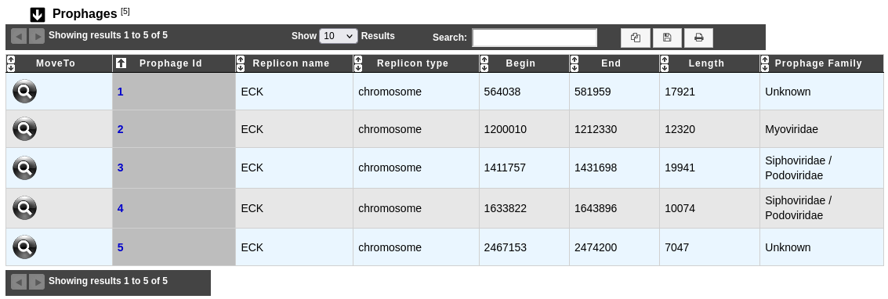
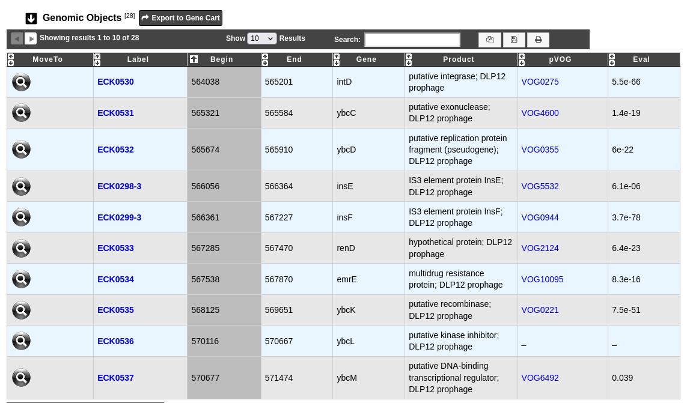
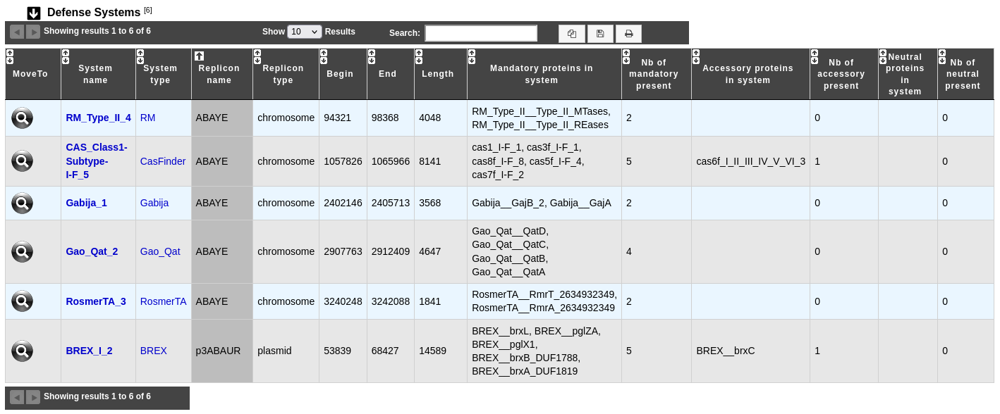
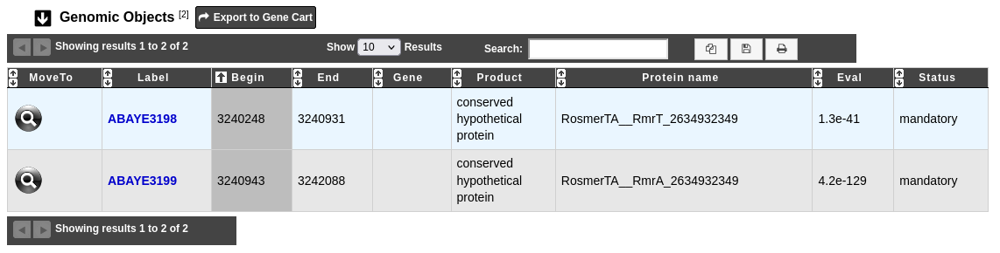
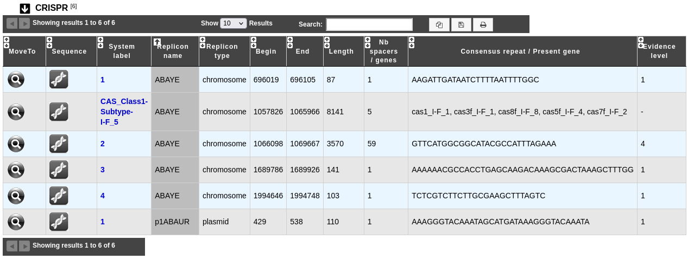
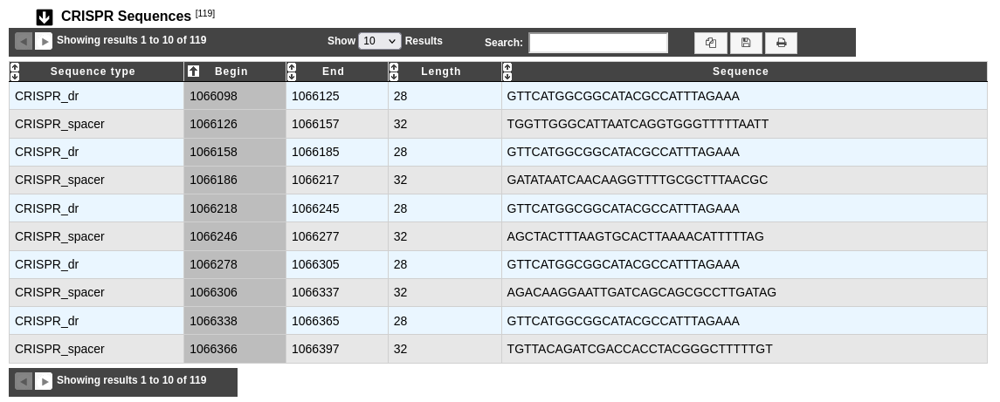
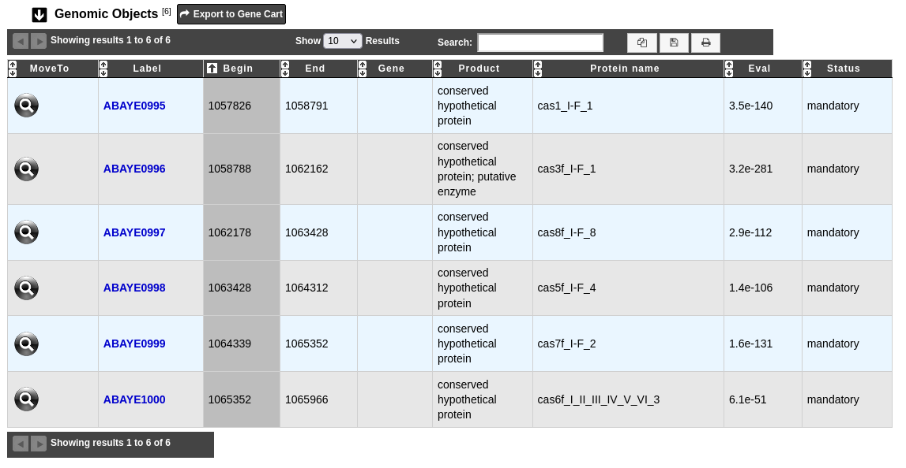

.. _prophages-defense-systems:

###########################
Prophages & Defense Systems
###########################

********
Overview
********

This page displays prophages and defense systems found in the genome.

A prophage is a bacteriophage genome that is integrated within a prokaryote genome.
We use Phigaro to detect such regions.

A defense system is a molecular system used to defend the prokaryote against bacteriophages.
We use DefenseFinder to detect such regions.

To gather more informations about Cas system, we use CRISPRCasFinder to detect CRISPR sequences around a Cas system.

What is Phigaro?
================

Phigaro is a standalone command-line application that is able to detect prophage regions taking raw genome and metagenome assemblies as an input.
It also produces dynamic annotated "prophage genome maps" and marks possible transposon insertion spots inside prophages.
It is applicable for mining prophage regions from large metagenomic datasets.
Phigaro uses the `pVOG HMM profiles <http://dmk-brain.ecn.uiowa.edu/pVOGs/>`_ to detect bacteriophage genes.

Know more about `Phigaro <https://github.com/bobeobibo/phigaro/>`_.

**Reference:**

`Elizaveta V. Starikova, Polina O. Tikhonova, Nikita A. Prianichnikov, Chris M. Rands, Evgeny M. Zdobnov, Vadim M. Govorun Phigaro: high throughput prophage sequence annotation <https://doi.org/10.1093/bioinformatics/btaa250>`_

.. note::
  By default Phigaro predicts genes by using Prodigal.
  However we use the gene calling provided by our own pipeline.

What is DefenseFinder?
======================

**DefenseFinder** is a program to systematically detect known anti-phage systems based on :ref:`MacSyFinder<macsyfinder>`.
The decision rules are typically defined by a list of mandatory, accessory, or forbidden proteins necessary for the detection of a given system.

Know  more about `DefenseFinder <https://github.com/mdmparis/defense-finder/>`_.

**Reference:**

`Tesson, F., Hervé, A., Mordret, E., Touchon, M., d'Humières, C., Cury, J., & Bernheim, A. (2022). Systematic and quantitative view of the antiviral arsenal of prokaryotes. Nature communications, 13(1), 2561. <https://doi.org/10.1038/s41467-022-30269-9>`_

Defense systems detected by DefenseFinder are:

    * a broad range of anti-phage systems (`DefenseFinder models 1.2.4 <https://github.com/mdmparis/defense-finder-models>`_): Avs, Azaca, BREX, DdmDE, Dodola, DRT, RADAR, RM, RosmerTA, SanaTA, Viperin, ...

        **References:**
            * `Tesson, F., Planel, R.,  Egorov, A., Georjon, H., Vaysset, H., Brancotte, B., Néron, B., Mordret, E., Bernheim, A., Atkinson, G., Cury, J. (2024). A Comprehensive Resource for Exploring Antiphage Defense: DefenseFinder Webservice, Wiki and Databases. bioRxiv 2024.01.25.577194. <https://doi.org/10.1101/2024.01.25.577194>`_

            * `Tesson, F., Hervé, A., Mordret, E., Touchon, M., d'Humières, C., Cury, J., & Bernheim, A. (2022). Systematic and quantitative view of the antiviral arsenal of prokaryotes. Nature communications, 13(1), 2561. <https://doi.org/10.1038/s41467-022-30269-9>`_

    * CRISPR-Cas systems (`CasFinder 3.1.0 <https://github.com/macsy-models/CasFinder>`_): CAS_Class1-Type-I, CAS_Class1-Subtype-I, CAS_Class1-Type-III, CAS_Class1-Subtype-III, CAS_Class1-Type-IV, CAS_Class1-Subtype-IV, CAS_Class2-Type-II, CAS_Class2-Subtype-II, CAS_Class2-Type-V, CAS_Class2-Subtype-V, CAS_Class2-Type-VI, CAS_Class2-Subtype-VI.

        **References:**
            * `Couvin, D., Bernheim, A., Toffano-Nioche, C., Touchon, M., Michalik, J., Néron, B., Rocha, E. P. C., Vergnaud, G., Gautheret, D., & Pourcel, C. (2018). CRISPRCasFinder, an update of CRISRFinder, includes a portable version, enhanced performance and integrates search for Cas proteins. Nucleic acids research, 46(W1), W246–W251. <https://doi.org/10.1093/nar/gky425>`_
            * `Abby, S. S., Néron, B., Ménager, H., Touchon, M., & Rocha, E. P. (2014). MacSyFinder: a program to mine genomes for molecular systems with an application to CRISPR-Cas systems. PloS one, 9(10), e110726. <https://doi.org/10.1371/journal.pone.0110726>`_

What is CRISPRCasFinder?
========================

**CRISPRCasFinder** is a tool that allows to identify CRISPR arrays and Cas proteins.
The CRISPR detection is based on `Vmatch <http://www.vmatch.de/>`_ (a software for large scale sequence analysis) which identifies all regularly-interspaced repeated sequences.
CRISPRCasFinder associates an evidence level with each CRISPR detected using 3 criteria:

* An entropy-based conservation index of repeats (EBcon);
* The number of spacers ;
* The overall percentage identity of spacers.

.. image:: img/CRISPR_confidence_lvl.PNG

More information about CRISPRCasFinder `here <https://crisprcas.i2bc.paris-saclay.fr/>`_. 

.. Note::
    In MicroScope, CRISPRCasFinder is used only to detect CRISPR systems.
    Cas systems are detected by DefenseFinder.

**Reference:** 

`D. Couvin et al. 2018. CRISPRCasFinder, an update of CRISPRFinder, includes a portable version, enhanced performance and integrates search for Cas proteins, Nucleic Acids Research <https://doi.org/10.1093/nar/gky425>`_.

****************************************************
How to access Prophage & Defense System predictions?
****************************************************

Prophage & Defense System predictions are available through the **Comparative Genomics** section, in the main navigation menu.
This page presents the prophages and the defense systems found in the current genome and allows to explore their content.

What is the Prophages table?
============================

This table enumerates all prophages predicted for the selected genome:

* **MoveTo**: allows to display the region in the :ref:`viewer`
* **Prophage Id**: identifier of the prophage in the genome;
  clicking on this element will open an interface to explore the content of this region (see :ref:`below <how-to-explore-a-prophage>`)
* **Replicon name**: identification of the replicon
* **Replicon type**: chromosome, plasmid or WGS
* **Begin / End**: position of the prophage on the replicon
* **Length**: length of the prophage
* **Prophage Family**: family of the bacteriophage

.. _how-to-explore-a-prophage:

How to explore a prophage?
==========================

The prophage visualization interface can be accessed by clicking on the **Prophage Id** field of the Prophages table.
This interface displays the detailed description of a selected prophage.

The table **Genomic objects** provides information regarding the genomic objects composing the prophage such as :

* **Label**, **Begin**, **End**, **Gene**, **Product**: correspond to the annotation of the object in MicroScope
* **pVOG**: the pVOG corresponding to the genomic object (if any);
  clicking on this will open the detailed description of the pVOG
* **Eval**: E-value of the match between the genomic object and the pVOG

You can export the genes by clicking on **Export to Gene Cart**.

What is the Defense Systems table?
==================================

This table enumerates all defense systems predicted for the selected genome

* **MoveTo**: Allows to display the region in the :ref:`viewer`.
* **System name**: Name of the defense system; clicking on it will open a detailled description of this system (see :ref:`below <how-to-explore-a-defense-system>`).
* **System type**: Type of the defense system; clicking on it will open a description of this type of system on the DefenseFinder Wiki website.
* **Replicon name**: Name of the replicon.
* **Replicon type**: Type of the replicon (chromosome, plasmid, WGS).
* **Begin** and **End**: Location of the defense system on the replicon.
* **Length**: Length of the defense system.
* **Mandatory proteins in system**: List of mandatory proteins of the system identified in the genome.
* **Nb of mandatory present**: Number of mandatory proteins of the system identified in the genome.
* **Accessory proteins in system**: List of accessory proteins of the system identified in the genome.
* **Nb of accessory present**: Number of accessory proteins of the system identified in the genome.
* **Neutral proteins in system**: List of neutral proteins of the system identified in the genome.
* **Nb of neutral present**: Number of neutral proteins of the system identified in the genome.

.. _how-to-explore-a-defense-system:

How to explore a defense system?
================================

The defense system visualization interface can be accessed by clicking on the **System name** field of the Defense Systems table.
This interface displays the detailed description of a selected defense system.

The table **Genomic Objects** provides information regarding the genomic objects composing the defense system such as:

* **Label**: Label of the genomic object. Click on it allow to access to its annotation page.
* **Begin** and **End**: Location of the genomic object on the sequence.
* **Gene**: Gene name if any.
* **Product**: Description of the gene product of the genomic object.
* **Protein name**: Name of the protein detected by DefenseFinder.
* **Eval**: e-value of the match with MacSyFinder models.
* **Status**: Status of the protein in the system, as defined by MacSyFinder (mandatory, accessory, neutral).

You can export the genes by clicking on **Export to Gene Cart**.

What is the CRISPR table?
=========================

This table displays all CRISPR detected by CRISPRCasFinder and all Cas detected by DefenseFinder for the selected genome. 

* **System label**: Identifier of the system in the organism. Click on it will open a page which presents a detailled description of a CRISPR or a detailled description of a Cas system (see :ref:`below <how-to-explore-a-crisprcas-system>`).
* **Replicon name**: Name of the replicon.
* **Replicon type**: Type of the replicon (chromosome, plasmid, WGS).
* **Begin** and **End**: Location of the system on the replicon.
* **Length**: Length of the system.
* **Nb spacers / genes**: Number of CRISPR spacers or Number of Cas genes.
* **Consensus repeat / Present gene**: Consensus repeat sequence predicted by CRISPRCasFinder or List of mandatory Cas genes predicted by DefenseFinder.
* **Evidence level**: Evidence level as computed by CRISPRCasFinder.

.. _how-to-explore-a-crisprcas-system:

How to explore a CRISPR-Cas system?
===================================

The table **CRISPR Sequences** provides all repeats and spacers contained in the selected CRISPR.

* **Sequence type**: ``CRISPR_dr`` if the sequence is a direct repeat or ``CRISPR_spacer`` if the sequence is a spacer.
* **Begin** / **End**: Location of the sequence on the replicon.
* **Length**: Length of the sequence.
* **Sequence**: Nucleic acid sequence.

The table **Genomic objects** provides information regarding the genomic objects composing the Cas system. You can export the genes by clicking on **Export to Gene Cart**.

* **Label**: Label of the genomic object. Click on it allow to access to its annotation page.
* **Begin** and **End**: Location of the genomic object on the sequence.
* **Gene**: Gene name if any.
* **Product**: Description of the gene product of the genomic object.
* **Protein name**: Name of the protein detected by MacSyFinder.
* **Eval**: E-value of the match with DefenseFinder models.
* **Status**: Status of the gene in the system, as defined by MacSyFinder (mandatory, accessory, neutral).

