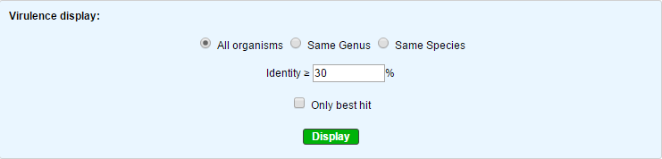
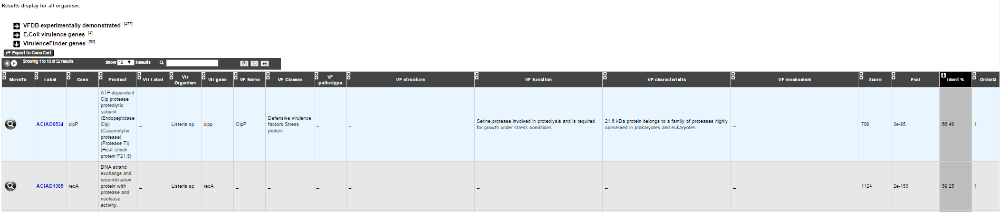

######################
Virulence
######################

What is VirulenceDB?
-------------------------------------------------------

VirulenceDB is a virulence genes database build using three sets of data:

•	The core dataset from VFDB (setA), which is composed of genes associated with experimentally verified virulence factors (VFs) for 53 bacterial species
•	The VirulenceFinder dataset which includes virulence genes for Listeria, Staphylococcus aureus, Escherichia coli/Shigella and Enterococcus
•	A manually curated dataset of reference virulence genes for Escherichia coli (Coli ref).

The original virulence factors classification from VFDB has been hierarchically attributed to each gene as frequently as possible, in order to provide a functional interpretation of your results.
New virulence factors have also been added to VirulenceFinder and Coli ref database to describe as best as possible the gene functions.

|

Know more about `VFDB <http://www.mgc.ac.cn/VFs/>`_

Know more about `VirulenceFinder <https://cge.cbs.dtu.dk/services/VirulenceFinder/>`_

|

**References:**

|

`Chen LH, Zheng DD, Liu B, Yang J and Jin Q, 2016. VFDB 2016: hierarchical and refined dataset for big data analysis-10 years on. Nucleic Acids Res. 44(Database issue):D694-D697. <https://academic.oup.com/nar/article-lookup/doi/10.1093/nar/gkv1239>`_

`Joensen KG, Scheutz F, Lund O, Hasman H, Kaas RS, Nielsen EM, Aarestrup FM.
J. Clin. Real-time whole-genome sequencing for routine typing, surveillance, and outbreak detection of verotoxigenic Escherichia coli.  Micobiol. 2014. 52(5): 1501-1510. <http://jcm.asm.org/content/52/5/1501.full>`_

How to access to Virulence data ?
-------------------------------------------------------

VirulenceDB predictions are available through the Comparative Genomics section, in the main navigation menu.

How virulence predictions are made ?
-------------------------------------------------------

Genomic objects predicted by the Microscope platform are blasted against the three virulence databases using blastp.
Blast results are filtered using **e-value** lower than 1e :sup:`-2`, **identities** upper than 30% and **minlrap** upper than 0.8 .

How to use this tool ?
-------------------------------------------------------

You can access your virulence predictions according to the taxonomy of your strain (minimal identity threshold = 30 %)

•	All organism will display results regardless of the tax_id of your strain (identity filter: default=30%)

•	Same genus will display results of virulence genes belonging to bacteria from the same genus (identity filter: default=50%)

•	Same species will display results of virulence genes belonging to bacteria from the same species (identity filter: default=80%)

Note : As Shigella and Escherichia coli could genotypically be considered the same species, the results are merged for both genus and species in that case.

The "Only best hit" button will display result for the best hit only, meanning that you get results from OrderQ=1 only.

How to read the table of results?
-------------------------------------------------------

•	Label / Gene / Product : Label, name of the gene and its product predicted by the Microscope platform
•	Virulence gene description : Vir Organism, Vir Gene, VF name, VF classes, VF pathotypes, VF structure, VF function, VF characteristic, VF mechanism
•	Result interpretation: Score from Blast, E-value, orderQ (rank of the BLAST hit for the protein of the query genome) and orderB (rank of the BLAST hit for the protein of the virulence database).

|

**Additionnal information on VF classes:**

|

They are divided into 4 main classes as proposed by VFDB:

•	Offensive virulence factors
•	Defensive virulence factors
•	Nonspecific virulence factors
•	Regulation of virulence-associated genes

A gene can be involved in many classes. For exemple, the gene kpsE (Capsule polysaccharide export inner-membrane protein KpsE) from E. coli can act both as an offensive virulence factor and a defensive virulence factor.

So the VF classes corresponding is “Offensive virulence factors, Invasion, Defensive virulence factors, Antiphagocytosis“ which correspond to :

1. Offensive virulence factors

  1.1 Invasion

2. Defensive virulence factors

  2.1 Antiphagocytosis
