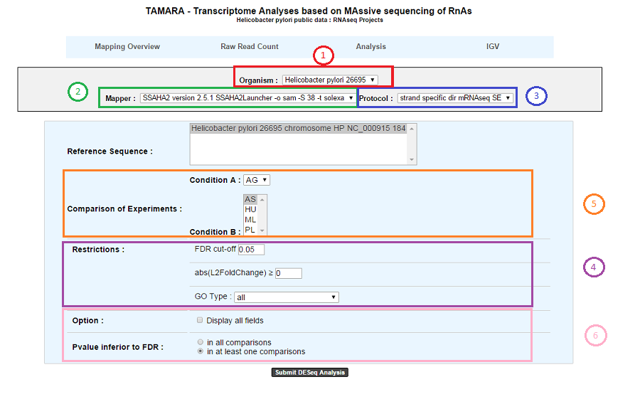
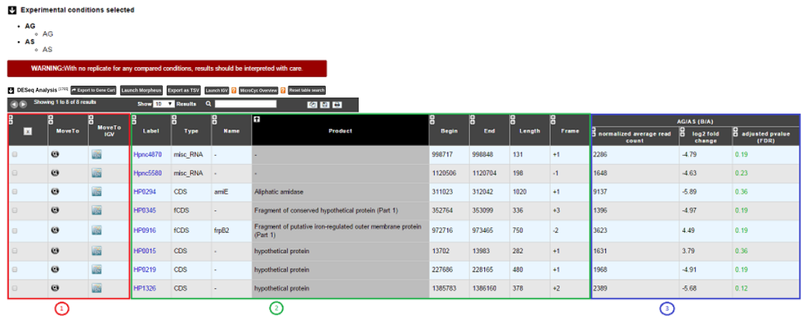
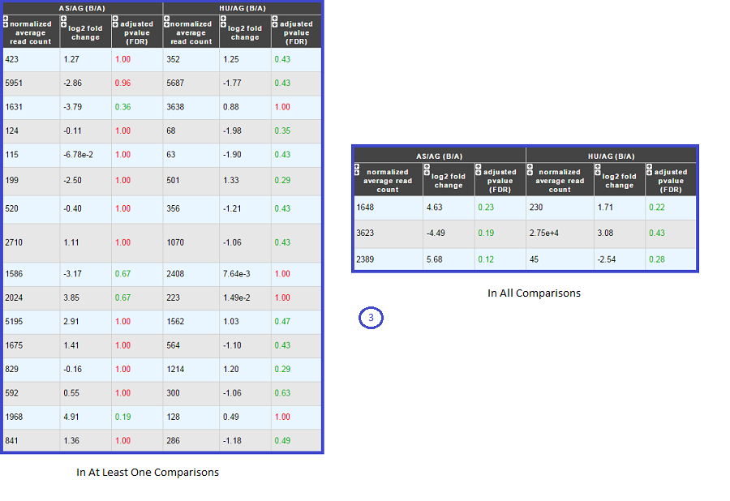
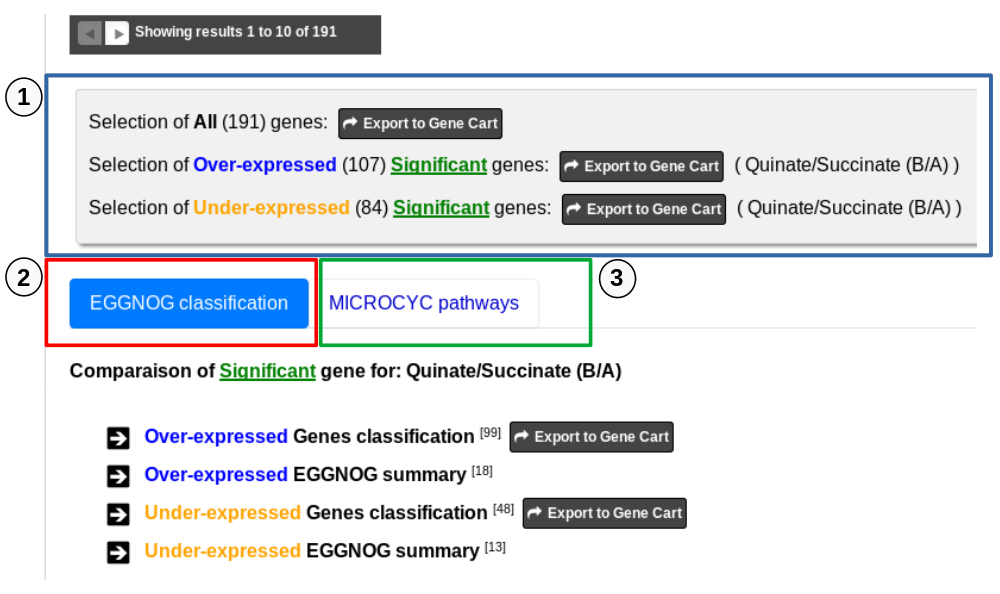

.. _NGSDiffExprAnalysis:

##########################################
Differential Expression Analysis (RNA-Seq)
##########################################

How to use Differential Expression Analysis interface?
------------------------------------------------------

This page allows to display the difference in expression level of genes for two (or more) experimental conditions, highlights those for which this difference is statistically significant and it offers tools to interpret the results.

.. warning::
  The differential analysis is computed by DESeq.
  Before 5th November 2019 DESeq v1.4.1 was used.
  Since this date DESeq2 v1.22.2 is used.

Results can be obtained by following 6 steps, described below:

* **1**. Choose an organism and one or several reference sequences.
* **2**. If several choices are available, you can choose the mapping strategy.
* **3**. If several choices are available, you can choose the experimental protocol.
* **4**. The *p-value adjusted* (padj) column contains the p-values, adjusted for multiple testing with the Benjamini-Hochberg procedure (see the standard R function p.adjust), which controls false *discovery rate* (FDR) . It’s possible to restrict the result for the ones which are under a fixed FDR cut-off. *Example : A FDR adjusted p-value (or q-value) of 0.05 implies that 5% of significant tests will result in false positives.*
* **5**. Select at least one B condition to compare to A condition (which will be used as reference).
* **6**. Graphical Options :

	* Choose to have all the fields of the result table or a light version. The fields will be fully described in the next section.
	* If several B conditions are chosen, the fixed FDR cut-off can be fixed in all comparisons or in at least one comparison for each gene.

How to read the Results ?
-------------------------

The differential analysis results are divided in 3 sections:

* **A**. The first section shows summary statistics and plots for the selected comparison(s).
* **B**. The second section is the table of the filtered Differentially Expressed Genes.
* **C**. The last section displays information for analysing and interpreting the results.

.. image:: img/rd7.png

More in detail:

**A - The first part of the summary section lists the experiments and experimental conditions involved in the selected comparisons(s).**
	
	
	Below, an horizontal bar chart display global statistics for the selected comparison(s).

		* **Total number of Genomic Objects (GO type)** = number of Genomic Objects from the analysis according to the GO type restriction of the analysis form.
		* **Total number of significant DEG (FDR cut-off)** = number of significant Differentially Expressed Genes according to the FDR cut-off restriction of the analysis form.	
		* **Number of filtered significant DEG (abs(L2FoldChange))** = number of significant Differentially Expressed Genes according to the abs(L2FoldChange) cut off of the analysis form.
			(Note that these genes are those displayed in the result table below).
		* **Number of over-expressed genes** = Number of over-expressed genes from the third point.
		* **Number of under-expressed genes** = Number from under-expressed genes from the third point.
			
		The **Export bar chart to SVG** button allows to save the plot in the SVG format.	

	**Note that when several comparisons are selected, a list allows the user to choose for each one the corresponding bar chart.**

	The third part displays summary plots:

		The MA-plot is a plot of log2 Fold Change (~expression level ratio between conditions) against the log2 of mean normalized count (~expression level).
		It provides a global and useful overview of the Differentially Expressed Genes for a comparison.

			In orange, significant differentially expressed genes according to the FDR cut-off constraint of the selection form.
			In blue, non significant genes according to the FDR cut-off constraint of the selection form.

			In clear colour (orange or blue), the filtered genes according to abs(L2FoldChange) constraint of the selection form.
			Note that significant genes could be filtered out.
		
			Mouse over a gene in the MA-plot magnifies the point representing it and displays additional information about the gene.
				* **Label** = Label of the gene.
				* **Name** = Gene name (if any).
				* **Mean of normalized counts** = Mean of read after normalisation on all conditions.
				* **Log2 fold change** = Log in base 2 of the gene expression ratio between the two conditions.
		
			Mouse over genes of the the MA-plot also displays a second plot, the Counts plot which gives information about the genes reads count.
			The gene Counts plot shows for all the experiments involved in a comparison, the normalize reads (y-axis) by experimental conditions (x-axis).
		
			It can be useful to directly view the reads count variation between replicates and thus help to visually check the accuracy of the statistical model.

		The MA-plot, Counts plot, and the main differentially expressed genes table (see below) are dynamically linked to each other. 
		
		Click on a gene of the MA-plot locks the gene and allows to display additional information about it in the Counts plot for each experiment when mouse over.
			* **Label** = Label of the selected gene.
			* **Replicate** = Name of the experiment (replicate of the corresponding experimental condition).
			* **Normalized count** = Gene count after normalization.
			* **Raw count** = Raw read counts of the gene.
			
		Click on a gene of the MA-plot also fill the Differential Expressed Genes table search field with the label of the gene and displays its information row. 
		
		**Reset table search** button allows to quickly clear the table search field.
		
		Click on the MA-plot outside a gene unlocks the gene.
		
		Click on row in the differential expressed genes table highlight its information row, selects and locks the corresponding point in the MA-plot then displays its Counts plot.
		
		You can also download the two plots (MA-plot and Counts plot) in the SVG format.
		
		Note that when several comparisons are selected, a list allows the user to choose the plots to display.

	
**B - The second part of the results is the table of the significant Differentially Expressed Genes.**

This table is the central part of the result page and displays information about the significant Differentially Expressed Genes after filtering by the constraints of the selection form.

**Case 1 : One B condition selected.**

* **1**. Export functions. This section allows users to make all genes (or subsets of genes) available for other analysis tools. 3 main operations are possible here:

	* Select subsets of genes (by selecting checkboxes on the first column) and export them into a :ref:`Gene Cart <genecarts>` by using the “Export To Gene Cart” button.
	* See one selected gene into the :ref:`MaGe Genome Browser <viewer>` by clicking on the magnifying glass.
	* Direct link to the selected gene in Integrative Genome Viewer.
	* Direct link to :ref:`Morpheus <morpheus>`.
	* Direct link to MicroCyC.
	
* **2**. The second part reports the main genomic object features : Label (Link to more Genomic Object information), Type, Name, Product, Begin, End, Length, Frame.
* **3**.

	* **Light Result** part: Normalized average read count, log2foldchange, adjusted p-value, FDR (all the result are under the chosen value)
	* **DESeq Module Result** part:

.. image:: img/rd5.png

* baseMean = normalized average read count.
* baseMeanA = normalized average read count for condition A.
* baseMeanB = normalized average read count for condition B.
* foldChange .
* log2foldchange.
* p-value = non adjusted pvalue.
* padj = adjusted p-value, FDR (all the result are under the chosen value).
* rawFoldChange.
* rawLog2FoldChange.

All these results are fully described in : 
http://bioconductor.org/packages/2.6/bioc/vignettes/DESeq/inst/doc/DESeq.pdf

***Note that if the service was handled after the 5th November 2019, the foldChange and the log2foldChange displays here are the Shrunken ones computed by DESeq2***
To generate more accurate log2 foldchange estimates, DESeq2 allows for the shrinkage of the logFoldChange estimates toward zero when the information for a gene is low (Low counts and/or High dispersion values).

The initial log2FoldChanges computed by DESeq2 are also available (if available) with **rawFoldChange** and **rawLog2FoldChange** .

**Case 2 : Two B conditions or more selected.**

Users can choose to see the union or intersection result.

**C - The last part the results page gathers information helping the iser to interpret the Differential Analysis results.**

These information are useful for highlights biological processes, metabolic pathways or results of any other methods available in MicroScope (datasets) associated with the list of Differentially Expressed Genes and trying to characterize the underlying studied phenotype(s).

This section consists of **three parts** , the first one is dedicated to Gene Cart and two tabs displays information from two useful sources (eggNOG Orthologs Groups and Microcyc Metabolic Pathways). 

**1** - First part allows to export Differentially Expressed Genes in Gene Carts which can be explored using the **Keywords Search tool** on several dataset from other methods available in MicroScope.
It possible to export all the significant differentially expressed genes of the analysis to a Gene Cart.
It is also possible to export only the Over-expressed or/and only the Under-expressed genes.
Note that if several comparisons are selected, only the first one can be save in a Gene Cart.

**2** - the tab "EGGNOG classification" includes functional information from the eggNOG orthologous groups matching Differentialy Expressed Genes of the analysis.

	
	**Over-expressed Genes classification** and **Under-expressed Genes classification** lists show detailed eggNOG functional information for each differentially expressed genes matching them.
		* **MoveTo** = View the gene in the MaGe viewer.
		* **Label** = Gene label.
		* **Gene** = Gene name if any.
		* **Product** = Gene function.
		* **Process** = eggNOG group process.
		* **Class ID** = eggNOG group functional category letter.
		* **Description** = eggNOG group functional category.
		* **OG ID** = eggNOG group id.
		* **OG function** = eggNOG group functional description.
		* **KEGG map** = Associated KEGG metabolic pathway map.
		* **log2 fold change** = Log in base 2 of the Differential Expression ratio.

	**Over-expressed EGGNOG summary** and **Under-expressed EGGNOG summary** lists display eggNOG functional classification summary based on the differentially expressed genes matching them. 
		* **Process** = eggNOG group process.
		* **Class ID** = eggNOG group functional category letter.
		* **Description** = eggNOG group functional category.
		* **gene fraction in comparison** = Fraction of genes associated with an eggNOG functional category from all the Differentially Expressed Gene of the analysis.
		* **% of genes in comparison** = Percentage of the previous result.
		* **gene fraction in class** = Fraction of genes associated with an eggNOG functional category from all the current Genomic Object in the genome with the same functional category. 
		* **% of genes in class** = Percentage of the previous result.

.. tip:: the eggNOG functional categories:
  
  | INFORMATION STORAGE AND PROCESSING
  |	[J] Translation, ribosomal structure and biogenesis
  |	[A] RNA processing and modification
  |	[K] Transcription
  |	[L] Replication, recombination and repair
  |	[B] Chromatin structure and dynamics
  
  | CELLULAR PROCESSES AND SIGNALING
  |	[D] Cell cycle control, cell division, chromosome partitioning
  |	[Y] Nuclear structure
  |	[V] Defense mechanisms
  |	[T] Signal transduction mechanisms
  |	[M] Cell wall/membrane/envelope biogenesis
  |	[N] Cell motility
  |	[Z] Cytoskeleton
  |	[W] Extracellular structures
  |	[U] Intracellular trafficking, secretion, and vesicular transport
  |	[O] Posttranslational modification, protein turnover, chaperones
  
  | METABOLISM
  |	[C] Energy production and conversion
  |	[G] Carbohydrate transport and metabolism
  |	[E] Amino acid transport and metabolism
  |	[F] Nucleotide transport and metabolism
  |	[H] Coenzyme transport and metabolism
  |	[I] Lipid transport and metabolism
  |	[P] Inorganic ion transport and metabolism
  |	[Q] Secondary metabolites biosynthesis, transport and catabolism
  
  | POORLY CHARACTERIZED
  |	[R] General function prediction only
  |	[S] Function unknown

**3** - The tab **MicroCyc Pathways** shows information about the metabolic pathway matching the differential expressed genes of the analysis.
See :ref:`here <microcyc>` for more information.

* **MoveTo** = view the gene in the MaGe viewer.
* **Label** = gene label.
* **Gene** = gene name if any.
* **Product** = gene function.
* **EC number** = specify enzyme-catalyzed reactions.
* **MetaCyc Reaction** = Metacyc Reaction name.
* **Reaction Status** = annotation status of the Metacyc Reaction. 
* **Pathway** = Metacyc Metabolic Pathway associated with the Reaction.
* **Pathway Class** = Pathway class name.
* **log2 fold change** = shrinked differential expression ratio in base 2.

