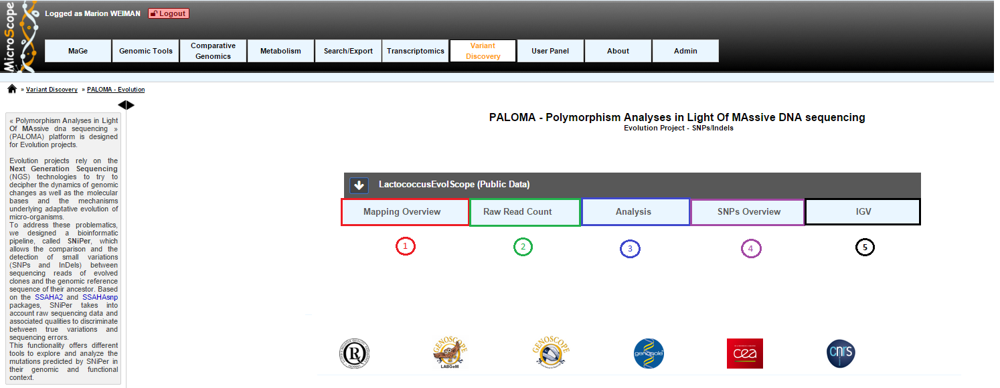
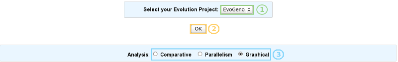
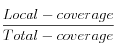
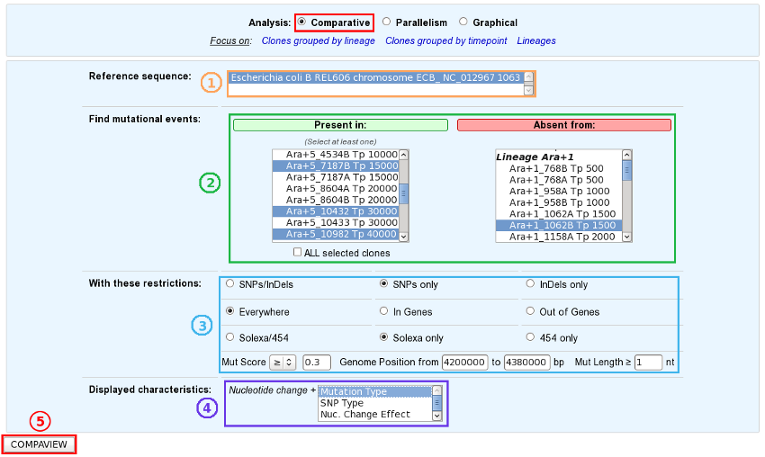
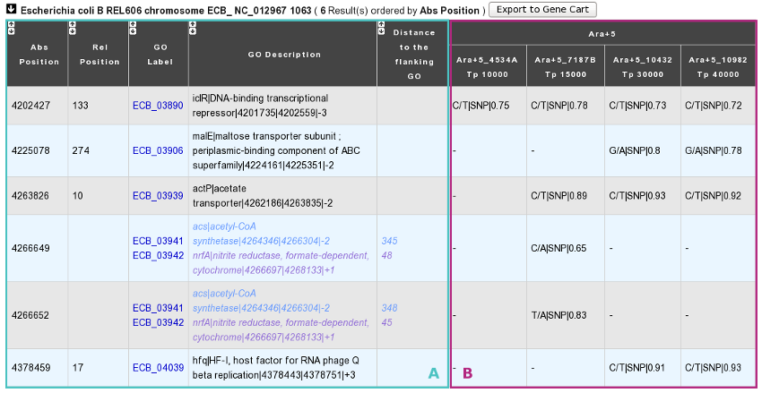
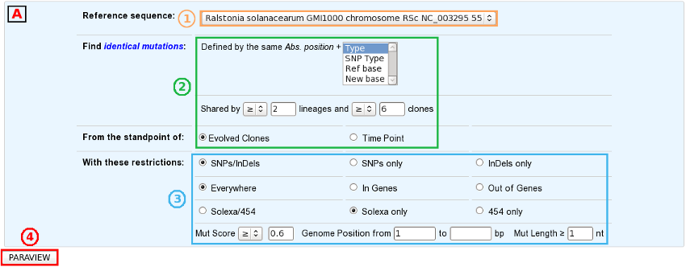
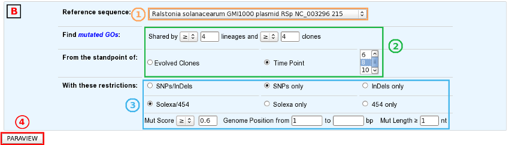
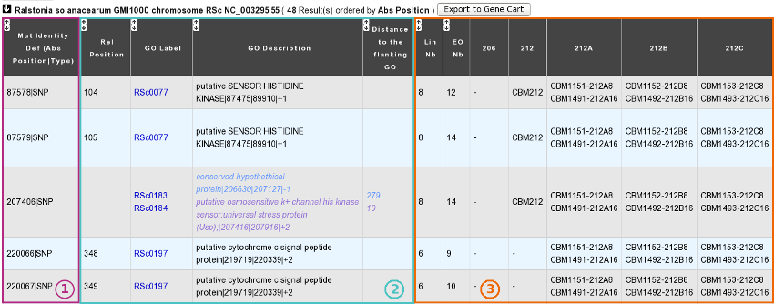
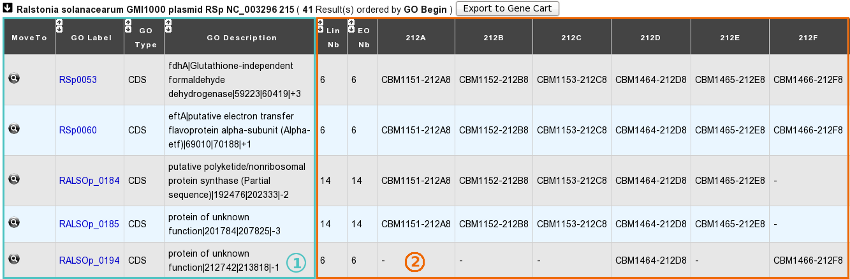
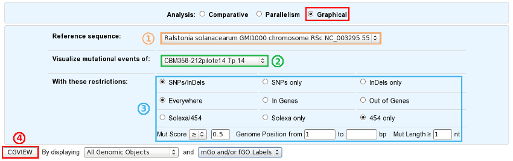

.. _evolution-projects:

.. TODO:
   Replace images with real formulas

##################
Evolution Projects
##################

===========
First steps
===========

How to begin?
-------------

Variant Discovery homepage displays the list of available projects.

By Clicking on the arrow available on the left of each project, user can expand the associated functionalities.

Once your evolution project selected (1 and 2), just click one of the radio buttons to switch between the different exploration modes (3):

* **Comparative analysis** => Click here for more details.
* **Parallelism analysis** => Click here for more details.
* **Graphical analysis** => Click here for more details.

What is the meaning of the score computed by SNiPer for each variation?
-----------------------------------------------------------------------

For each reported mutation, a **score**, which is meant to indicate the confidence one can have in the prediction, is computed:

* SNP_score=

.. image:: img/evo2.png

* Local-coverage : Number of reads containing the new base with a high quality.
* Total-coverage : Total number of reads containing the new base.

indel_score=

* Local-coverage : Number of reads containing the indel.
* Total-coverage : Total number of reads mapping the mutated position.

====================
Comparative Analysis
====================

What is the aim of the Comparative Analysis tool?
-------------------------------------------------

To find a set of mutations present in some organisms and absent from others.

How to use this tool?
---------------------

1. Choose one or several reference sequences.
2. Select at least one clone or lineage in which you’d like to find mutational events, and optionally one or several clones/lineages from which the selected mutations are absent.
3. If you want, you can play with:

	* the nature of the relevant mutations,
	* their location on the reference genome,
	* the sequencing technology used to produce the data from which the mutations have been predicted,
	* the mutation score,
	* the portion of the reference sequence which must be screened, and
	* the length of the mutations.
	
4. Finally, choose the additional characteristics you want to appear in the table of results, knowing that the nucleotide changes are displayed by default.
5. And submit your query.

.. tip:: The content of the two main selection lists can be customized thanks to the links of the "**Focus on**" sub-section.

.. tip:: The "**ALL selected clones/lineages**" option allows to select only mutational events that are present in EVERY SELECTED clones or in EVERY CLONES of the selected lineage(s).

How to read the table of results?
---------------------------------

You have one table of results for each reference sequence selected. Each result table is composed of 2 main parts : A and B.

**A**. In the left part of the table, **mutations are localized on the reference sequence and replaced in a genomic and functional context**:

	* **Abs(olute)** Position: Position on the reference sequence.
	* **Rel(ative)** Position: Position on the Genomic Object affected according to the first base of the latter, for genic events only [1].
	* **GO Label**: Each label encompasses a link to the information form of the Genomic Object considered.
	* **GO Description**: [GO_gene_name] | GO_product | GO_begin | GO_end | GO_frame
	
		* *Genic events*: description of the Genomic Object affected
		* *Intergenic events*: description of the flanking Genomic Objects, i.e. the nearest upstream (blue) and the nearest downstream (purple) GOs.
		
	* **Distance to the flanking GO**: Distance between the intergenic events and the end of their nearest upstream gene (blue) or the begin of their nearest downstream gene (purple), whatever the reading frame of the laters.

**B**. In the right part of the table, **mutations are described according to the displayed characteristics chosen by you and allocated to the clones they belong to**.

	* Whatever the displayed characteristics chosen, you will have access to a full mutation description if you mouseover a mutation: Mutation type | [SNP type] | Nuc. change | [Nuc. change effect] | [Codon change] | [AA change] | [AA change effect] | Numerical score | Fractional score | Sequencing technology | Read type | Source 
	
Fields in brackets are specified for SNP events only.

		* *Mutation type*: ’SNP’, ’insertion’ or ’deletion’.
		* *SNP type*: ’hom’ (homozygous), ’hez’ (heterozygous), ’xyx’ (the variant of heterozygous SNPs like X -> Y/X).
		* *Nuc(leotide) change*: ref_base/new_base.
		* *Nuc(leotide) change effect*: ’ts’ (transition) or ’tv’ (transversion).
		* *Codon change*: ref_codon/new_codon.
		* *AA change*: ref_AA pos_AA new_AA.
		* *AA change effect*: ’syn’ (synonymous), ’missense’ or ’nonsense’.
		* *Numerical score*.
		* *Fractional score*: local_coverage/total_coverage.
		* *Sequencing technology*: ’solexa’ or ’454’.
		* *Read type*: ’se’ (single-end) or ’pe’ (paired-end).
		* *Source*: ’automatic’ (SNiPer’s prediction) or ’validated’ (experimental validation).

	* If you look carefully, evolved clones are grouped by lineage and ordered according to their timepoint in each lineage. As a consequence, the dynamics of genomic changes can easily be drawn during the studied evolutionary time.

.. tip:: You can export the Genomic Objects reported in the result table to a private Gene Cart thanks to the "Export to Gene Cart" button.

Is it possible to have a synthetic view of the results?
-------------------------------------------------------

Yes, of course! Below the table of results, you have another section, called "**Summary**" which lists and classifies all the mutational events reported for each selected clones.

====================
Parallelism Analysis
====================

What is the aim of the Parallelism Analysis tool?
-------------------------------------------------

To identify genetic variations OR mutated Genomic Objects (GO) SHARED BY several clones in different lineages.

How to use this tool?
---------------------

First of all, choose the subject of your analysis ("**Shared Mutations**" or "**Shared Mutated GOs**") in the "Focus on" sub-section.

.. image:: img/evo6.png
	:width: 100%

**The "Shared Mutations" mode**:

**The "Shared Mutated GOs" mode**:

Then, the procedure is quite similar in the two analysis modes:

1. Select a reference sequence.
2. Specify:

	* the way you define identical mutations, knowing that, by default, they must have the same position on the reference sequence (in the "Shared Mutations" mode only).
	* the numbers of lineages and clones in which you’d like to retrieve the same mutations or mutated GOs.
	* the standpoint of your analysis: inclusion of all the evolved clones or selection of clones sampled at a specific timepoint.

3. If you want, you can play with:

	* the nature of the relevant mutations,
	* their location on the reference genome (in the "Shared Mutations" mode only),
	* the sequencing technology used to produce the data from which the mutations have been predicted,
	* the mutation score,
	* the portion of the reference sequence which must be screened, and
	* the length of the mutations.

4. Submit your query.
	
	
How to read the table of results?
---------------------------------

**A. In the "Shared Mutations" mode:**

**1) Description of common mutations**: It depends on your definition criteria. 

**2) Genomic context**:

	* **Rel(ative) Position**: Position on the Genomic Object affected according to the first base of the latter, for genic events only [1].
	* **GO Label**: Each label encompasses a link to the information form of the Genomic Object considered.
	* **GO Description**: [GO_gene_name] | GO_product | GO_begin | GO_end | GO_frame
	
		* *Genic events*: description of the Genomic Object affected
		* *Intergenic events*: description of the flanking Genomic Objects, i.e. the nearest upstream (blue) and the nearest downstream (purple) GOs.

	* **Distance to the flanking GO**: Distance between the intergenic events and the end of their nearest upstream gene (blue) or the begin of their nearest downstream gene (purple), whatever the reading frame of the laters.
	
**3) Distribution of the clones sharing the same mutations according to the lineage they belong to:**

	* **Lin Nb**: Number of lineages where the same mutations are detected.
	* **EO Nb**: Number of evolved organisms sharing the same mutations.

.. note:: **Be careful**: The result number may change depending on how *identical* mutations are defined! 

**B. In the "Shared Mutated GOs" mode:**

**1) Description of common mutated GOs**:

	* **MoveTo**: Click on the icon glass to access to the genomic map of the reference sequence centered around the mutated GO.
	* **GO Label**: Each label encompasses a link to the information form of the Genomic Object considered.
	* **GO Type**: ’CDS’, ’fCDS’, ’rRNA’, ’tRNA’ or ’misc_RNA’.
	* **GO Description**: [GO_gene_name] | GO_product | GO_begin | GO_end | GO_frame 

**2) Distribution of the clones sharing the same mutated GOs according to the lineage they belong to:**

	* **Lin Nb**: Number of lineages where the same mutated GOs are detected.
	* **EO Nb**: Number of evolved organisms sharing the same mutated GOs.

.. tip:: In both cases, you can export the Genomic Objects reported in the result table to a private Gene Cart thanks to the "Export to Gene Cart" button.

==================
Graphical Analysis
==================

What is the aim of the Graphical Analysis tool?
-----------------------------------------------

To visualize the distribution of a specific clone’s mutations along the circular representation of a reference genome.

And to detect potential hot spots of mutations.

How to use this tool?
---------------------

This tool is based on the CGView (see :ref:`cgview`).

1. Choose a reference sequence.
2. Select the clone for which you want to visualize the mutations.
3. If you want, you can specify:

	* the nature of the relevant mutations,
	* their location on the reference genome,
	* the sequencing technology used to produce the data from which the mutations have been predicted,
	* the mutation score,
	* the portion of the reference sequence which must be screened, and
	* the length of the mutations.

4. Launch CGView.

.. image:: img/NGS_CGViewer.png
	:width: 100%

.. tip:: You can decide which Genomic Objects (GOs) and corresponding labels will be displayed on the circular map thanks to the two selection lists situated next to the CGView button.

What can you see on the graphical representation?
-------------------------------------------------

Tracks (from the outside):

1. Predicted CDSs transcribed in the negative strand
   (automatic annotations in **purple**, automatic annotations transfered from reference genome in **orange**, validated annotations in **red**).
2. Predicted CDSs transcribed in the positive strand (same colors as above).
3. Transposases (**green**) and pseudogenes (**yellow**).
4. Predicted mutational events (SNPs in **brown**, insertions in **blue**, deletions in **green**).

