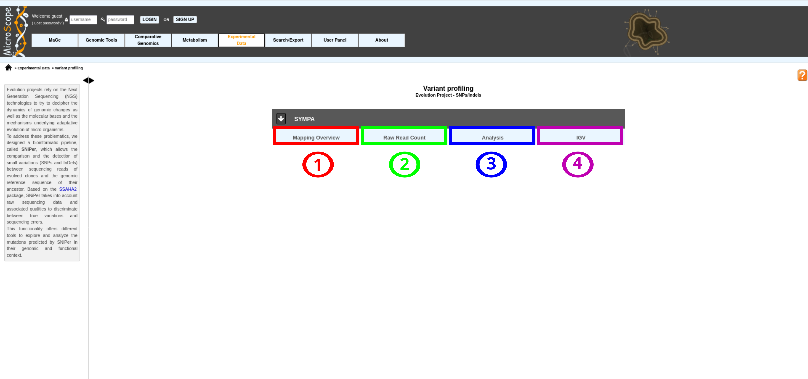

.. _NGSProjectEvo:

##########################
Variant profiling projects
##########################

Evolution projects rely on the Next Generation Sequencing (NGS) technologies to try to decipher the dynamics of genomic changes as well as the molecular bases and the mechanisms underlying adaptative evolution of micro-organisms.
This functionality offers different tools to explore and analyze the mutations predicted in their genomic and functional context. 

Variant profiling homepage displays the list of available projects.

By Clicking on the arrow available on the left of each project, user can expand the associated functionalities.

Selecting a project will allow the user to use :

* :ref:`Overview tool <NGSOverview>` (**Item #1**)
* :ref:`Read Count Analysis <NGSReadCountAnalysis>` (**Item #2**)
* :ref:`NGSEvoAnalysis` (**Item #3**)
* :ref:`Integrative Genomics Viewer <igv>` (**Item #4**)
