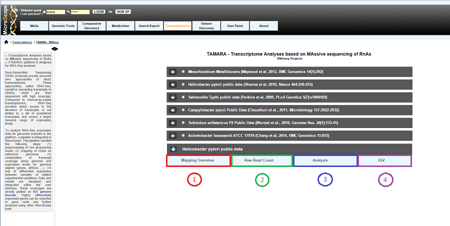

.. TODO:
   Update screen shots (old names, old projects)
   First sentence is weird

.. _NGSProjectRNAseq:

#########################
RNA-Seq analysis projects
#########################

RNA-Seq homepage displays the list of available projects.

By Clicking on the arrow available on the left of each project, user can expand the associated functionalities.

Selecting a project will allow the user to use :

* :ref:`Overview tool <NGSOverview>` (**Item #1**)
* :ref:`Read Count Analysis <NGSReadCountAnalysis>` (**Item #2**)
* :ref:`Differential Expression Analysis <NGSDiffExprAnalysis>` (**Item #3**)
* :ref:`Integrative Genomics Viewer <igv>` (**Item #4**)
