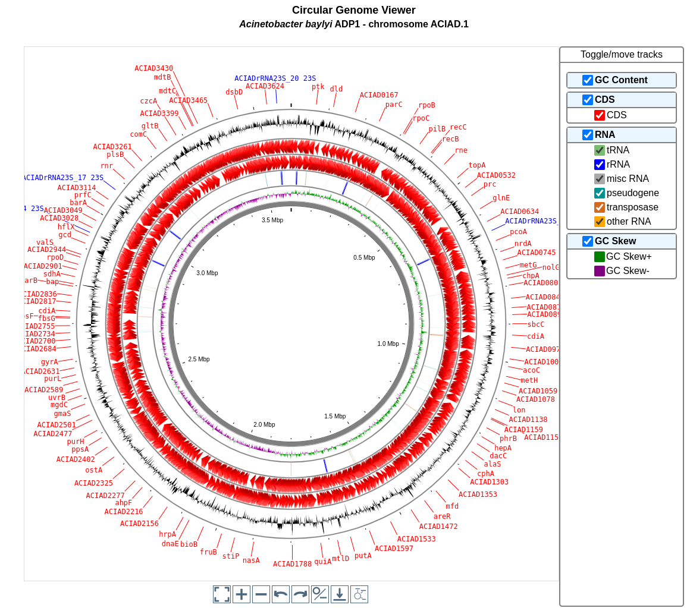

.. This file should be named circulargenomeviewer.rst to avoid confusion
   with the presentation of CGView

######################
Circular Genome Viewer
######################

How to use the Circular Genome Viewer?
--------------------------------------

The **Circular Genome View** functionality displays a circular map of the selected sequence.
This tool is based on **CGView** (see :ref:`cgview`).

.. Trick: we use the (base) image used to present CGView

Tracks (from the outside):

1. GC content (GC% - genome mean GC%).
2. Predicted CDSs on the negative strand.
3. Predicted CDSs on the positive strand.
4. tRNAs (**green**), rRNAs (**blue**), misc RNAs (**grey**), pseudogenes (**sea green**), transposases (**chocolate**) and others (**orange**).
5. GC skew (G-C/G+C).
