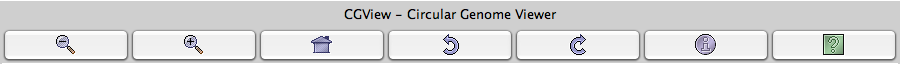

####################
Circular Genome View
####################

What is Circular Genome View?
-----------------------------

**CGView** is a Java package which allows to produce high quality, zoomable maps of circular genomes. Its primary purpose is to serve as a component of sequence annotation pipelines, as a mean of generating visual output suitable for the web. Starting with information of one genome and the features to visualize, CGView converts the input into a graphical map (PNG, JPG, or Scalable Vector Graphics format) and completes it with labels, a title, legends, and footnotes.

**More**: http://wishart.biology.ualberta.ca/cgview/index.html

**Reference**: `Stothard P, Wishart DS. Circular genome visualization and exploration using CGView. Bioinformatics. 2005 Feb 15;21(4):537-9 <http://www.ncbi.nlm.nih.gov/pubmed/15479716>`_

How to use the Circular Genome View?
------------------------------------

When you select the **Circular Genome View** functionality you obtain a global circular map of the selected sequence. Circles display (from the outside):

* (1) GC percent deviation (GC window - mean GC) in a 1000-bp window.
* (2) Predicted CDSs transcribed in the clockwise direction.
* (3) Predicted CDSs transcribed in the counterclockwise direction.
* (4) GC skew (G+C/G-C) in a 1000-bp window.
* (5) rRNA (blue), tRNA (green), misc_RNA (orange), Transposable elements (pink) and pseudogenes (grey).

Genes displayed in (2) and (3) are color-coded according different categories:

* red and blue, MaGe validated annotations ;
* orange: MicroScope automatic annotation with a reference genome ;
* purple: Primary / Automatic annotations.

In addition to the default full view map, the program can generate a series of hyperlinked maps showing expanded views. You can use the CG View toolbar to navigate into the circular map.

Only the 5 first buttons are active on the toolbar:

* Zoom out
* Zoom in
* View entire map
* Move counterclockwise
* Move clockwise

If you click on a gene name/label it open the corresponding Gene window giving you access the full annotation of the gene.

