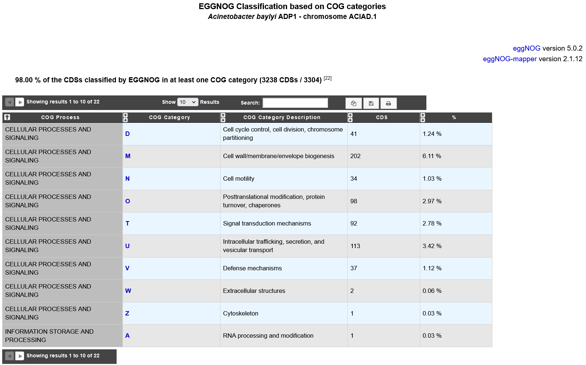
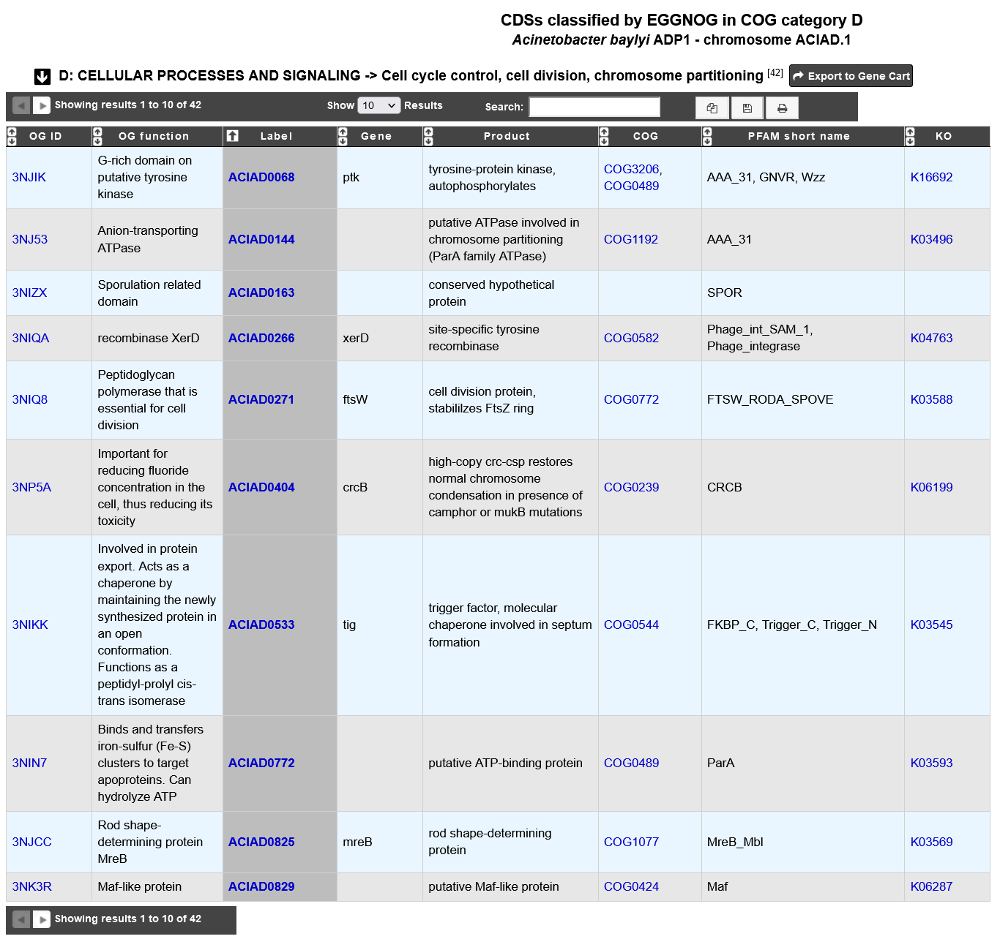

.. _eggnog:

###############################
EGGNOG Automatic Classification based on COG categories
###############################

eggNOG database (version 5.0.2)
-----------------------------

eggNOG (evolutionary genealogy of genes: Non-supervised Orthologous Groups) is a public resource in which thousands of genomes are analyzed at once 
to establish orthology relationships between all their genes. 

eggNOG focuses on providing: (i) comprehensive functional annotations for the inferred orthologs, 
(ii) predictions across thousands of genomes covering the three domains of life and viruses, and 
iii) hierarchical resolution of orthology assignments and fine-grained relationships (i.e. in-paralogies) based on phylogenetic analysis.

An Orthologous Group (OG) is defined as a cluster of three or more homologous sequences that diverge from the same speciation event.

Orthologous Groups were functionally annotated using updated versions of Gene Ontology, KEGG pathways, SMART/PFAM domains and expanded to CAZy and KEGG modules. 
Moreover, general free text descriptions and COG functional categories were updated for each OG.

**More information about the method**: http://eggnogdb.embl.de/#/app/methods

**Reference**: `eggNOG 5.0: a hierarchical, functionally and phylogenetically annotated orthology resource based on 5090 organisms and 2502 viruses. Jaime Huerta-Cepas, Damian Szklarczyk & al. Nucleic Acids Research, Volume 47, Issue D1, 08 January 2019, Pages D309–D314. <https://doi.org/10.1093/nar/gky1085>`_

eggNOG-mapper (version 2.1.12)
-----------------------------

eggNOG-mapper is a tool for fast functional annotation of novel sequences. 
It uses precomputed orthologous groups and phylogenies from the eggNOG database to transfer functional information
from fine-grained orthologs only. Common uses of eggNOG-mapper include the annotation of novel genomes, 
transcriptomes or even metagenomic gene catalogs.

The use of orthology predictions for functional annotation permits a higher precision than traditional homology searches 
(i.e. BLAST searches), as it avoids transferring annotations from close paralogs 
(duplicate genes with a higher chance of being involved in functional divergence).

We run eggnog-mapper using EGGNOGDB and diamond for the alignement.

**More information about eggNOG-mapper**: http://eggnog-mapper.embl.de/

**Reference**: `Fast genome-wide functional annotation through orthology assignment by eggNOG-mapper. Jaime Huerta-Cepas, Damian Szklarczyk, Lars Juhl Jensen, Christian von Mering and Peer Bork. Submitted (2016). <https://doi.org/10.1093/molbev/msx148>`_

EGGNOG Automatic Classification page
-----------------------------

This page presents statistics on reference genome genes classified by eggNOG in Orthologous Groups (OG) by COG functional categories.

* **COG Process**: COG functional process name.
* **COG Category**: COG functional category ID.
* **COG Category Description**: COG functional category description.
* **CDS**: Number of the CDSs classified by eggNOG in at least one COG category.
* **%**: Percentage of the CDSs classified by eggNOG in at least one COG category.

Clicking on a COG category displays all genes assigned to OG in that COG functional category.

* **OG ID**: eggNOG Orthologous Group id.
* **OG function**: eggNOG Orthologous Group functional description.
* **Label**: Label of the protein. If you click on the label, you access to the Gene annotation window.
* **Gene**: Gene name of the protein if any.
* **Product**: Product description of the protein.
* **COG**: Clusters of Orthologous Group name (COG).
* **PFAM short name**: InterPro PFAM entry name.
* **KO**: KEGG Ortholog entry ID.

