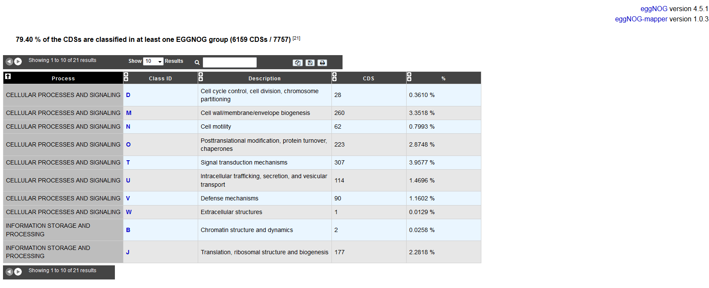

############################
EGGNOG Automatic Classification
############################

EGGNOGDB
-----------------------------

The initial step in the EggNOG pipeline is the clustering of the 9.6 million proteins from 2031 genomes. 
Homology comparisons are executed by the SIMAP initiative and processed by the EggNOG orthology prediction pipeline.

Orthologous groups are automatically generated by dividing species space into ‘core’ species, 
which are central for defining orthologous groups using the strict triangular criterion, and ‘periphery’ species. 

**More**: http://eggnogdb.embl.de/#/app/methods

**Reference**: `eggNOG 4.5: a hierarchical orthology framework with improved functionalannotations for eukaryotic, prokaryotic and viral sequences. Jaime Huerta-Cepas, Damian Szklarczyk & al. Nucl. Acids Res. (04 January 2016) 44 (D1): D286-D293. <https://doi.org/10.1093/nar/gkv1248>`_

eggNOG-mapper
-----------------------------

Eggnog-mapper is a tool for fast functional annotation of novel sequences. 
It uses precomputed orthologous groups and phylogenies from the eggNOG database to transfer functional information
from fine-grained orthologs only. Common uses of eggNOG-mapper include the annotation of novel genomes, 
transcriptomes or even metagenomic gene catalogs.

The use of orthology predictions for functional annotation permits a higher precision than traditional homology searches 
(i.e. BLAST searches), as it avoids transferring annotations from close paralogs 
(duplicate genes with a higher chance of being involved in functional divergence).

**More**: https://github.com/jhcepas/eggnog-mapper/wiki

**Reference**: `Fast genome-wide functional annotation through orthology assignment by eggNOG-mapper. Jaime Huerta-Cepas, Damian Szklarczyk, Lars Juhl Jensen, Christian von Mering and Peer Bork. Submitted (2016). <https://doi.org/10.1093/molbev/msx148>`_
