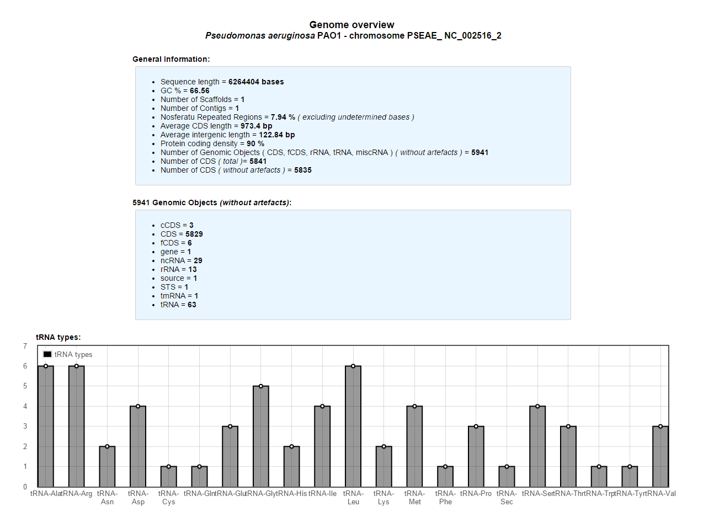
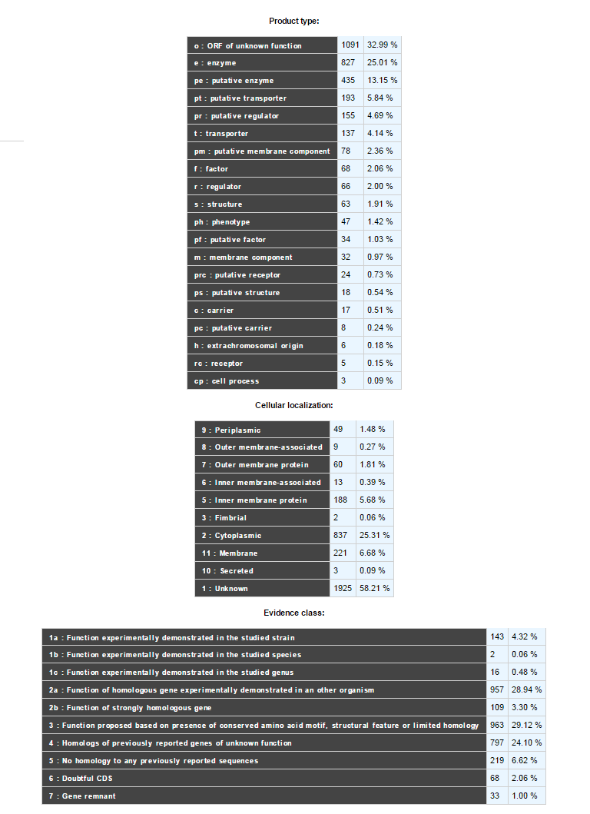

###############
Genome Overview 
###############

Provides general statistical data about a replicon, such as: Length, GC%, Ribosomal RNAs, tRNAs types, Annotations Status, Average CDS length, Repeated regions, Average intergenic length , Protein coding density, Scaffolds/Contigs numbers, etc.

