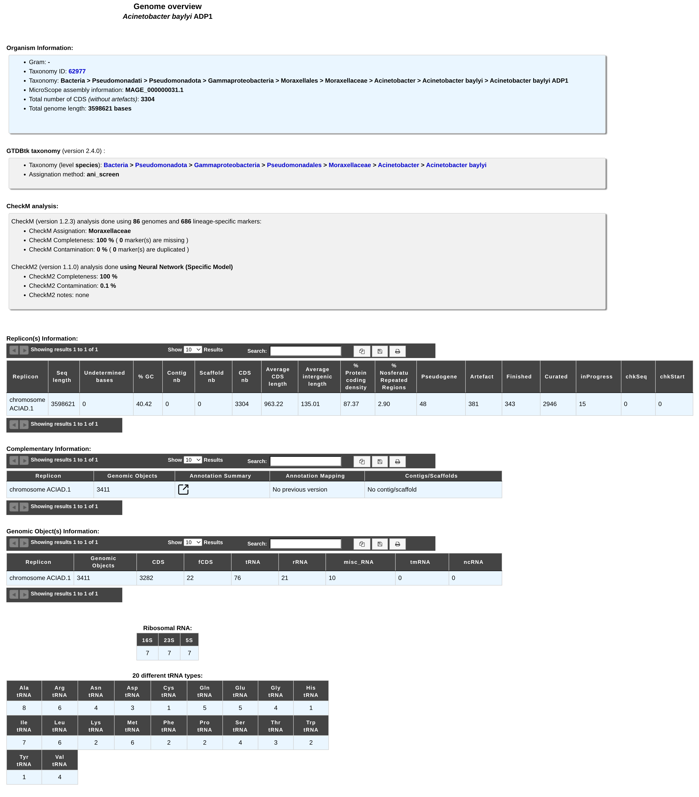

.. _genome-overview:

###############
Genome Overview 
###############

This page provide multiple data about your organism:

* Starting with general data (Gram, Taxonomy, genome length ...).
* Then, the `GTDB-tk <https://github.com/Ecogenomics/GTDBTk>`_ taxonomic classification is shown, along with the method used [1]_.
* `CheckM <https://github.com/Ecogenomics/CheckM/wiki>`_ and `CheckM2 <https://github.com/chklovski/CheckM2>`_ analysis results are presented, to assess the quality of microbial genomes in terms of completeness and contamination [2]_ [3]_.
* And some general statistical data about a replicon, such as: Length, GC%, Ribosomal RNAs, tRNAs types, Annotations Status, Average CDS length, Repeated regions, Average intergenic length , Protein coding density, Scaffolds/Contigs numbers, etc.

.. [1] `Pierre-Alain Chaumeil, Aaron J Mussig, Philip Hugenholtz, Donovan H Parks, GTDB-Tk v2: memory friendly classification with the genome taxonomy database, Bioinformatics, Volume 38, Issue 23, 1 December 2022, Pages 5315–5316, <https://doi.org/10.1093/bioinformatics/btac672>`_
.. [2] `Parks DH, Imelfort M, Skennerton CT, Hugenholtz P, Tyson GW. 2015. *CheckM: assessing the quality of microbial genomes recovered from isolates, single cells, and metagenomes*. Genome Research, 25: 1043–1055. <https://genome.cshlp.org/content/25/7/1043.short>`_
.. [3] `Chklovski, A., Parks, D.H., Woodcroft, B.J. et al. CheckM2: a rapid, scalable and accurate tool for assessing microbial genome quality using machine learning. Nat Methods 20, 1203–1212 (2023). <https://doi.org/10.1038/s41592-023-01940-w>`_