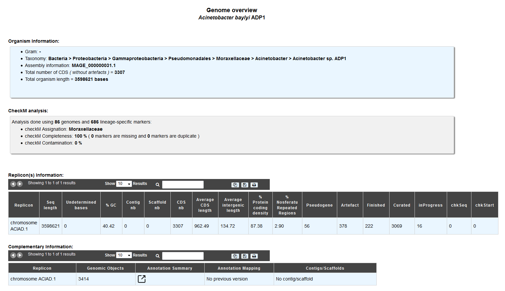
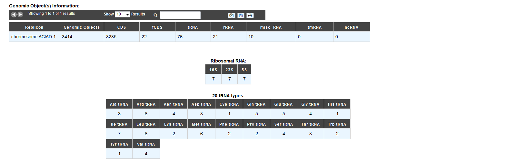

.. _genome-overview:

###############
Genome Overview 
###############

This page provide multiple data about your organism:

* Starting with general data (Gram, Taxonomy, genome length ...).
* Then some `CheckM <https://github.com/Ecogenomics/CheckM/wiki>`_ analysis results are displayed, to assess the quality of microbial genomes regarding contamination/completion.

`Parks DH, Imelfort M, Skennerton CT, Hugenholtz P, Tyson GW. 2015. CheckM: assessing the quality of microbial genomes recovered from isolates, single cells, and metagenomes. Genome Research, 25: 1043–1055. <https://genome.cshlp.org/content/25/7/1043.short>`_ 

* And some general statistical data about a replicon, such as: Length, GC%, Ribosomal RNAs, tRNAs types, Annotations Status, Average CDS length, Repeated regions, Average intergenic length , Protein coding density, Scaffolds/Contigs numbers, etc.

