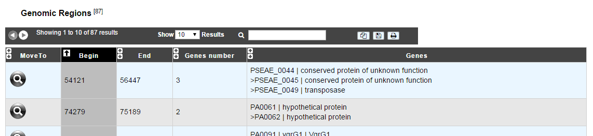

###################
Tandem Duplications
###################

This functionality provides the list of Genomic regions containing tandem duplications of protein coding genes. Tandem duplicated genes have an identity >= 35% with a minLRap>=0.8 and are separated by a maximum of 5 consecutive genes.

How to read the result table?
-----------------------------

* **Move to**: Centers the genomic map on the selected genomic region
* **Begin**: begin position of the genomic region
* **End**: end position of the genomic region
* **Gene number**: number of tandem duplicated genes contained in the genomic region
* **Genes**: description of the tandem duplicated genes with their label, gene name and product description

