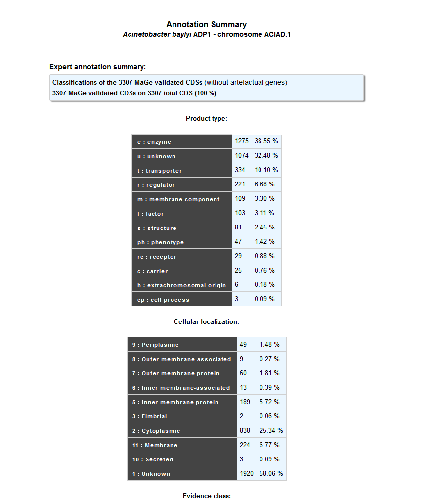
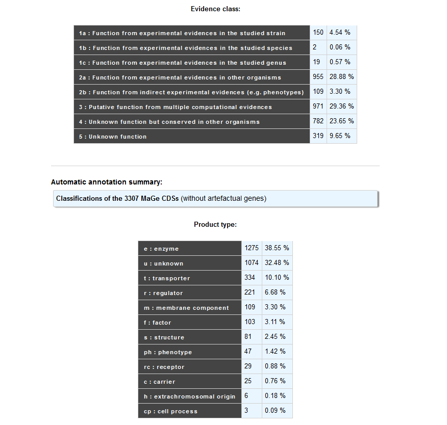
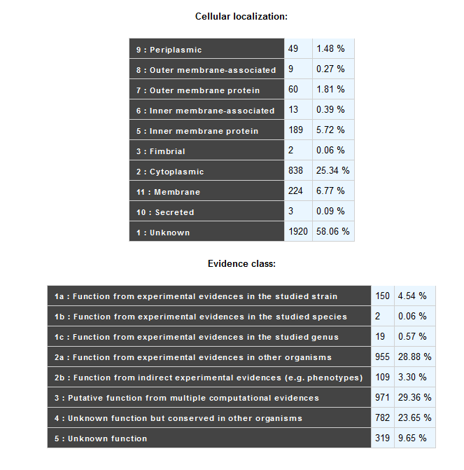

#########################
Annotation Summary 
#########################

Provides a general statistical overview of genes annotations through a distribution between Product Types, Cellular Localizations or Evidence Classes in a same replicon.

