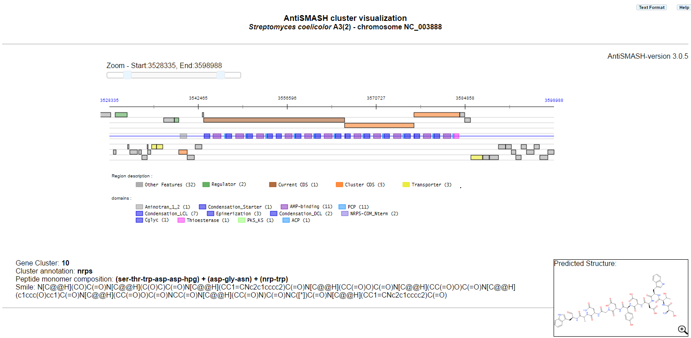
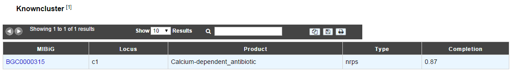
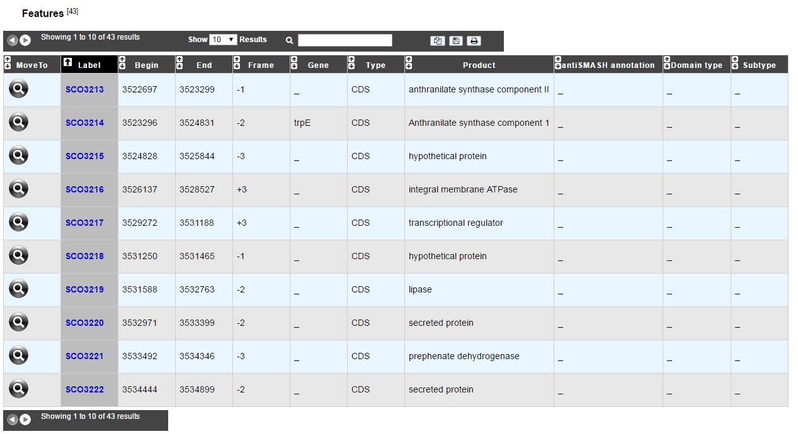
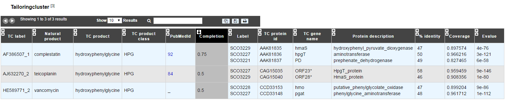

######################
AntiSMASH cluster visualization
######################

What is antiSMASH?
------------------

Know  `more <https://microscope.readthedocs.io/en/latest/content/mage/info.html#antismash>`_ about antiSMASH

How can I visualize the clusters predicted by antiSMASH?
--------------------------------------------------------

You can access to the AntiSMASH cluster visualization window from the Cluster column of the antiSMASH annotation table.
This window allows you to visualize the full antiSMASH cluster prediction and its genomic context.
In case of NRPS/PKS cluster type, the predicted peptide monomer composition may be indicated as well, if this composition is specific enough, the smile prediction is displayed.

|
|

Thanks to `https://cdkdepict-openchem.rhcloud.com/depict.html <https://cdkdepict-openchem.rhcloud.com/depict.html>`_ for Picture's displays 

|
|

The **Knowncluster** table provide information about similar cluster in MIBiG database. The Minimum Information about a Biosynthetic Gene cluster (MIBiG) can help to know more on biosynthetic gene clusters and their molecular products.

`Medema M.H., et al. (2015) Minimum Information about a Biosynthetic Gene cluster. Nat Chem Biol. Sep;11(9):625-31. <http://www.ncbi.nlm.nih.gov/pubmed/26284661>`_

|
|

All informations regarding the CDS present in the graphical representation are available in the **Features** table below the graphical representation of the cluster.

|
|

The **Tailoringcluster** table provide information about gene which may be involve in tailoring reaction. By clicking on the number, you can access to the Pubmed related article.

|
|

What is the meaning of the color code in the AntiSMASH cluster visualisation window?
-------------------------------------------------------------------------------------------

.. image:: img/antiSMASH3_domain_color_code.PNG
.. image:: img/antiSMASH3_Feature_color_code.PNG
