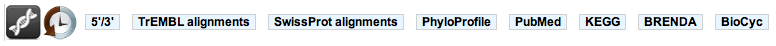
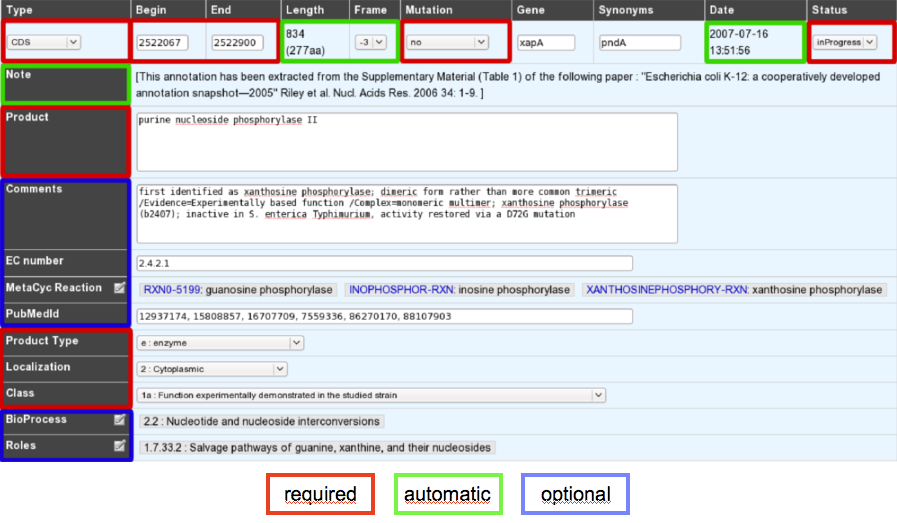

######################
Gene annotation editor
######################

=================================
Overview of the annotation editor  
=================================

How to access to the Gene Annotation Editor ?
---------------------------------------------

There are two ways of accessing the Gene Annotation Editor:

* 1- click on a genomic object on the genomic map
* 2- click on a label in the table of genomic objects which is below the genomic map

NB : requesting information via the GetInfo button only calls up a read-only Gene Annotation Editor window.

Overview of the Gene Annotation Editor
--------------------------------------

The Gene Annotation Editor window is made of 4 sections:

* a **toolbar** that allows access to different functionalities
* the **current annotation** of the genomic object. This section can be modified by the annotator (with sufficient rights).
* the **primary annotation** of the genomic object. It correspond to the MicroScope pipeline automatic annotation (if it is a first annotation) or to the databank annotation (if it is a reannotation project).
* the **Method results** section. This section gives an access to the results obtained by the different tools used for the syntactic and functional annotation process.

How to use the Gene Annotation Editor toolbar ?
-----------------------------------------------

It contains several buttons allowing access to different functionalities:

* the sequence (nucleic and protein) of the genomic object
* the annotation history of the genomic object
* **5’/3’**: the sequence (nucleic and protein) of the genomic object
* **TrEMBL alignments**: visualisation of the alignments with TrEMBL best hits
* **SwissProt alignments**: visualisation of the alignments with SwissProt best hits
* **Phyloprofile**: this tool provides a list of all CDSs (from all replicons) that have the same phylogenetic profile (presence/absence of homologue in others species) than the current genomic object. Note: query can be slow.
* **PubMed**: this functionality opens a new window that shows the references that have been linked to this genomic object on PubMed
* **KEGG**: this functionality opens the KEGG description corresponding to the annotated EC number(s)
* **Brenda**: this functionality opens the Brenda entry corresponding to the annotated EC number(s)
* **BioCyc**: this functionality opens a new window showing information related to the genomic object in the BioCyc database

How to fill the Gene Annotation form ?
--------------------------------------

As shown in the figure below, not all fields can be modified by the annotator. Furthermore, some of them are required and other are optional. These fields have to be filled after the careful analysis of the different methods results. 

.. tip:: If one of the required field is missing or wrongly filled a warning will appear in the window.

What are the different annotation "Status"es ?
----------------------------------------------

* **inProgress** : the annotator has not finished the expert annotation
* **finished** : the annotator has finished the expert annotation
* **Curated** : the expert annotation has been reviewed by a specialist of the functional process in which the CDS product is involved
* **Artefact** : An artefactual CDS corresponds to a false prediction by the gene detection program. An artefactual CDS should never be similar to any proteins from the databanks (except if the same erroneous annotation has been made in another genomes)
* **chkSeq** : this status is used by the annotator to flag potential sequencing errors in the sequence. When the sequencing is performed at Genoscope, these chkSeq sequences will be sent to the people working in the finishing team. They will then check the assembly to see if the sequence quality is good or not. If needed they can perform some additional PCRs to enhance the data.
* **chkStart** : the annotator suspects that a start position readjustment might be needed for the CDS, but hasn’t done it yet.

What are the different "Type" categories ?
------------------------------------------

* CDS
* fCDS
* tRNA
* rRNA
* misc_RNA
* intron
* exon
* IS
* misc_feature
* promoter

How to fill the "Mutation" field ?
----------------------------------

* **no** => Normal CDS
* **frameshift** => CDS for which a true frame-shift has been biologically demonstrated
* **pseudo** => the CDS is part of a pseudogene
* **partial** => the CDS is a gene fragment
* **gene remnant** => the CDS is a highly degraded gene fragment
* **selenocysteine** => the CDS contains a Selenocysteine in its sequence

How to use the "Comments" field ?
---------------------------------

The **Comments** field is dedicated to the annotators who want to leave some notes for themselves or for others annotators from the project. This field is not exported to the Genbank file at the end of the annotation process.

How to use the "PubmedID" field ?
---------------------------------

The PubMedID or PMID correspond to the index of a publication on the PubMed section of the NCBI website. You can fill this field when you want to link a publication to your annotation. If you want to enter several publications, you simply have to write the PMIDs separated by commas.

You will find the PMID of a publication directly on Pubmed as shown on the figure below. You can also find PMIDs in the "References" section of the UniProt entries. 

.. image:: img/editor3.png

If this field is filled you will have a direct access to the publications on PubMed by clicking on the **Pubmed** button on top of the Gene annotation editor window.

How to use the "MetaCyc reaction" field ?
-----------------------------------------

This field allows user to link one ore more metabolic reactions from MetaCyc (BioCyc) to the current edited gene.

.. image:: img/editor4.png

* a - Reactions presented at the top of the field have been manually curated by an annotator.
* b - A multiple selection list gives quick access to all predicted (unselected) or curated (selected) reactions linked to this gene.
* c - A search box allows one to quickly access MetaCyc reactions corresponding to either EC numbers from previous EC number field or a given keyword.

**Search box :**

Clicking on the “EC” button will search all MetaCyc reactions corresponding to the EC number from the “EC number” field.

The keyword search will look for all MetaCyc reactions having an identifier, a name or involving a compound similar to the given keyword.

**Search result :**

.. image:: img/editor5.png

The search returns a list of MetaCyc reactions, with :

* the reaction identifier and name. Identifier is clickable and open the BioCyc reaction card.

And in some cases :

*Genes of the organism already linked to this reaction (eg. first row of the example). Genes are flagged with :
	* “validated” : reaction has been manually linked to this gene by users.
	* “annotated” : reaction has been linked to homologous gene and transferred here from a close genome.
	* “predicted” : reaction has been linked to this gene by the pathway-tools algorithm.

* If the reaction has no known coding genes but belongs to a pathway predicted to exist in the current organism, a clickable link to the MetaCyc pathway description is given (eg. fourth row of the example).

The “Reset” button deletes all results

How to use the "Rhea reaction" field ?
--------------------------------------

This field allows user to link one ore more metabolic reactions from **Rhea** to the current edited gene.

.. image:: img/editor6.png

* a - Reactions presented at the top of the field have been manually curated by an annotator.
* b - A multiple selection list gives quick access to all curated reactions linked to this gene.
* c - A search box allows one to quickly access Rhea reactions corresponding to either EC numbers from previous EC number field or a given keyword.

**Search box :**

Clicking on the “EC” button will search all Rhea reactions corresponding to the EC number from the “EC number” field.

The keyword search will look for all Rhea reactions having an identifier, a name, involving a compound name or Chebi identifier similar to the given keyword.

**Search result :**

Rhea reactions are present in 4 exemplary according to the direction :

* bidirectionnal : <=>
* left to right : =>
* right to left : <=
* unknown (master reaction) : <?>

.. image:: img/editor7.png

The search returns a list of Rhea reactions, with :

* the reaction identifier and name. Identifier is clickable and open the Rhea reaction card. By default, the master reaction is presented. Select the direction wanted in the "direction-select".

And in some cases :

* Genes of the organism already linked to this reaction (eg. first row of the example). Genes are flagged with :
	* “validated” : reaction has been manually linked to this gene by users.
	
The “Reset” button deletes all results

**How to link a new reaction :**

For each reaction in the result set, check-box allows to add a reaction from the result set to the select element. All reactions selected in the multiple selection list will be saved as validated and linked to this gene. Unselecting a reaction in this list will remove this link from the curated data.

What are the different "Product type" categories ?
--------------------------------------------------

* c : carrier
* cp : cell process
* e : enzyme
* f : factor
* h : extrachromosomal origin
* l : leader peptide
* lp : lipoprotein
* m : membrane component
* n : RNA
* o : ORF of unknown function
* pc : putative carrier
* pcp : putative cell process
* pe : putative enzyme
* pf : putative factor
* ph : phenotype
* pm : putative membrane component
* pr : putative regulator
* prc : putative receptor
* ps : putative structure
* pt : putative transporter
* r : regulator
* rc : receptor
* s : structure
* t : transporter

What are the different "Localization" categories ?
-------------------------------------------------- 
 
* 1 : Unknown
* 2 : Cytoplasmic
* 3 : Fimbrial
* 4 : Flagellar
* 5 : Inner membrane protein
* 6 : Inner membrane-associated
* 7 : Outer membrane protein
* 8 : Outer membrane-associated
* 9 : Periplasmic
* 10 : Secreted
* 11 : Membrane

How to use the "Class" field ?
------------------------------

The **Class** annotation categories are useful for assigning a "confidence level" to each gene annotation. It has been inspired by the "protein name confidence" defined in **PseudoCAP** (Pseudomonas aeruginosa community annotation project).

This information is not given by the automatic functional annotation procedure, except in case of functional annotation transfer from a genome being annotated with MaGe.

The different classes are:

* **1a : Function experimentally demonstrated in the studied strain**
* **1b : Function experimentally demonstrated in the studied species**
* **1c : Function experimentally demonstrated in the studied genus**
* **2a : Function of homologous gene experimentally demonstrated in an other organism**
* **2b : Function of strongly homologous gene**
* **3 : Function proposed based on presence of conserved amino acid motif, structural feature or limited homology**
* **4 : Homologs of previously reported genes of unknown function**
* **5 : No homology to any previously reported sequences**
* **6 : Doubtful CDS**. A doubtful CDS is a CDS for which the annotator is not sure that it codes for a protein. If this CDS really seems like a false prediction, he will then choose the **Artefact** status.
* **7 : Gene remnant**

What is the "BioProcess" classification ?
-----------------------------------------

This functional classification is based on the **CMR JCVI Role IDs.**

This field is optionally filled in during the expert annotation process.

What is the "Roles" classification ?
------------------------------------

This functional classification corresponds to the MultiFun classification which has been developed by Monica Riley for E. coli (http://genprotec.mbl.edu/).

**Reference**:`Serres MH, Riley M. MultiFun, a multifunctional classification scheme for Escherichia coli K-12 gene products. Microb Comp Genomics. 2000;5(4):205-22. <http://www.ncbi.nlm.nih.gov/pubmed/11471834>`_ 

This field is optionally filled in during the expert annotation process.

How to choose the "Class" annotation category ?
-----------------------------------------------

.. image:: img/editor8.png

.. image:: img/editor9.png

How to identify artefacts ?
---------------------------

.. image:: img/editor10.png
