.. _mage:

######################
Gene annotation editor
######################

=================================
Overview of the annotation editor
=================================

How to access to the Gene Annotation Editor?
--------------------------------------------

There are two ways of accessing the Gene Annotation Editor:

1. click on a genomic object on the genomic map
2. click on a label in the table of genomic objects which is below the genomic map

.. important:: requesting information via the GetInfo button only calls up a read-only Gene Annotation Editor window.

Overview of the Gene Annotation Editor
--------------------------------------

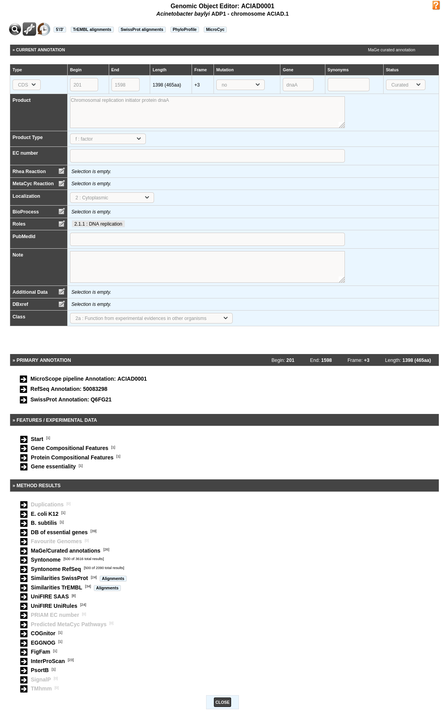

The Gene Annotation Editor window is made of 5 sections:

* a **toolbar** that allows access to different functionalities
* the **current annotation** of the genomic object. This section can be modified by the annotator (with sufficient rights).
* the **primary annotation** of the genomic object. It corresponds to the MicroScope pipeline automatic annotation (if it is a first annotation) or to the databank annotation (if it is a reannotation project).
* the **Feature / Experimental data** section. This section provides access to some features of the gene (i.e. star codon prediction, nucleic or amino-acid composition) and to experimental data if any (e.g. gene essentiality, transposon mutants, SNPs/InDels).
* the **Method results** section. This section gives an access to the results obtained by the different tools for comparative and functional analyses.

How to use the Gene Annotation Editor toolbar?
----------------------------------------------

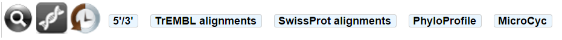

It contains several buttons allowing access to different functionalities:

* the first button allows to open the genomic object in the viewer
* the second button allows to access the sequence (nucleic and protein) of the genomic object
* the third button allows to access the annotation history of the genomic object
* **5’/3’**: the nucleic sequence of the genomic object + the nucleic context
* **TrEMBL alignments**: visualisation of the alignments with TrEMBL best hits
* **SwissProt alignments**: visualisation of the alignments with SwissProt best hits
* **Phyloprofile**: this tool provides a list of all CDSs (from all replicons) that have the same phylogenetic profile (presence/absence of homologue in others species) than the current genomic object. Note: query can be slow.
* **PubMed**: this functionality opens a new window that shows the references that have been linked to this genomic object on PubMed (this button is not displayed if no reference are linked to this Genomic Object)
* **KEGG**: this functionality opens the KEGG description corresponding to the annotated EC number(s)
* **Brenda**: this functionality opens the Brenda entry corresponding to the annotated EC number(s)
* **MicroCyc**: this functionality opens a new window showing information related to the genomic object in the MicroCyc database

==================================
Expert annotation of gene function
==================================

How to fill the Gene Annotation form?
-------------------------------------

As shown in the figure below, not all fields can be modified by the annotator. Furthermore, some of them are required and other are optional. These fields have to be filled after the careful analysis of the different methods results. If your are working on other object than CDS, you may have a different form, if a required field for CDS appear in your form, it's still required.

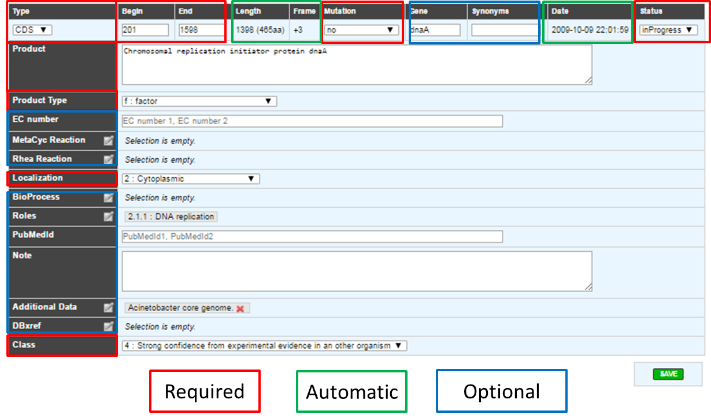

.. tip:: If one of the required field is missing or wrongly filled a warning will appear in the window.

.. _mage_status:

What are the different annotation "Status"?
---------------------------------------------

* **inProgress** : the annotator has not finished the expert annotation
* **finished** : the annotator has finished the expert annotation
* **Curated** : the expert annotation has been reviewed by a specialist of the functional process in which the CDS product is involved
* **Artefact** : An artefactual CDS corresponds to a false prediction by the gene detection program. An artefactual CDS should never be similar to any proteins from the databanks (except if the same erroneous annotation has been made in another genomes)
* **chkSeq** : this status is used by the annotator to flag potential sequencing errors in the sequence. When the sequencing is performed at Genoscope, these chkSeq sequences will be sent to the people working in the finishing team. They will then check the assembly to see if the sequence quality is good or not. If needed they can perform some additional PCRs to enhance the data.
* **chkStart** : the annotator suspects that a start position readjustment might be needed for the CDS, but hasn’t done it yet.

How to identify artefacts?
--------------------------

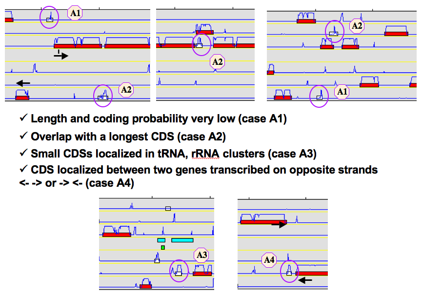

What are the different "Type" categories?
-----------------------------------------

* CDS
* fCDS
* tRNA
* rRNA
* misc_RNA
* tmRNA
* ncRNA
* IS
* misc_feature
* promoter

How to fill the "Mutation" field?
---------------------------------

* **no** => Normal CDS
* **frameshift** => CDS for which a true frame-shift has been biologically demonstrated
* **pseudo** => the CDS is part of a pseudogene
* **partial** => the CDS is a gene fragment
* **gene remnant** => the CDS is a highly degraded gene fragment
* **selenocysteine** => the CDS contains a Selenocysteine in its sequence
* **pyrrolysine** => the CDS contains a pyrrolysine in its sequence

What are the different "Product type" categories?
-------------------------------------------------

* **u :** unknown
* **n :** RNA
* **e :** enzyme
* **f :** factor
* **r :** regulator
* **c :** carrier
* **t :** transporter
* **rc :** receptor
* **s :** structure
* **l :** leader peptide
* **m :** membrane component
* **lp :** lipoprotein
* **cp :** cell process
* **ph :** phenotype
* **h :** extrachromosomal origin

How to use the "MetaCyc reaction" field?
----------------------------------------

This field allows user to link one ore more metabolic reactions from MetaCyc (BioCyc) to the current edited gene.

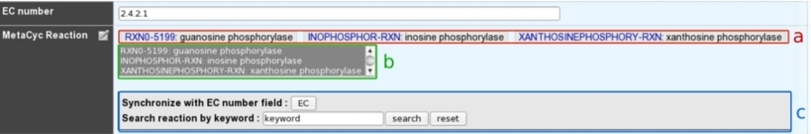

* **a:** Reactions presented at the top of the field have been manually curated by an annotator.
* **b:** A multiple selection list gives quick access to all predicted (unselected) or curated (selected) reactions linked to this gene.
* **c:** A search box allows one to quickly access MetaCyc reactions corresponding to either EC numbers from previous EC number field or a given keyword.

**Search box :**

Clicking on the “EC” button will search all MetaCyc reactions corresponding to the EC number from the “EC number” field.

The keyword search will look for all MetaCyc reactions having an identifier, a name or involving a compound similar to the given keyword.

**Search result :**

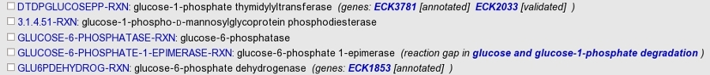

The search returns a list of MetaCyc reactions, with :

* the reaction identifier and name. Identifier is clickable and open the BioCyc reaction card.

And in some cases :

* Genes of the organism already linked to this reaction (eg. first row of the example). Genes are flagged with :

	* “validated” : reaction has been manually linked to this gene by users.
	* “annotated” : reaction has been linked to homologous gene and transferred here from a close genome.
	* “predicted” : reaction has been linked to this gene by the pathway-tools algorithm.

* If the reaction has no known coding genes but belongs to a pathway predicted to exist in the current organism, a clickable link to the MetaCyc pathway description is given (eg. fourth row of the example).

The “Reset” button deletes all results.

How to use the "Rhea reaction" field?
-------------------------------------

This field allows user to link one ore more metabolic reactions from **Rhea** to the current edited gene.

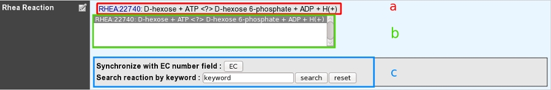

* **a:** Reactions presented at the top of the field have been manually curated by an annotator.
* **b:** A multiple selection list gives quick access to all curated reactions linked to this gene.
* **c:** A search box allows one to quickly access Rhea reactions corresponding to either EC numbers from previous EC number field or a given keyword.

**Search box :**

Clicking on the “EC” button will search all Rhea reactions corresponding to the EC number from the “EC number” field.

The keyword search will look for all Rhea reactions having an identifier, a name, involving a compound name or Chebi identifier similar to the given keyword.

**Search result :**

Rhea reactions are present in 4 exemplary according to the direction :

* **bidirectional :** <=>
* **left to right :** =>
* **right to left :** <=
* ***unknown (master reaction) :** <?>

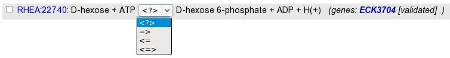

The search returns a list of Rhea reactions, with :

* the reaction identifier and name. Identifier is clickable and open the Rhea reaction card. By default, the master reaction is presented. Select the direction wanted in the "direction-select".

And in some cases :

* Genes of the organism already linked to this reaction (eg. first row of the example). Genes are flagged with :

	* “validated” : reaction has been manually linked to this gene by users.

The “Reset” button deletes all results

**How to link a new reaction :**

For each reaction in the result set, check-box allows to add a reaction from the result set to the selected element. All reactions selected in the multiple selection list will be saved as validated and linked to this gene. Unselecting a reaction in this list will remove this link from the curated data.

What are the different "Localization" categories?
-------------------------------------------------

* **1 :** Unknown
* **2 :** Cytoplasmic
* **3 :** Fimbrial
* **4 :** Flagellar
* **5 :** Inner membrane protein
* **6 :** Inner membrane-associated
* **7 :** Outer membrane protein
* **8 :** Outer membrane-associated
* **9 :** Periplasmic
* **10 :** Secreted
* **11 :** Membrane

.. _mage-bioprocess:

What is the "BioProcess" classification?
----------------------------------------

This functional classification is based on the CMR JCVI Role IDs.

This field is optionally filled in during the expert annotation process.

.. _mage-roles:

What is the "Roles" classification?
-----------------------------------

This functional classification corresponds to the MultiFun classification which has been developed by Monica Riley for E. coli.

**Reference**:`Serres MH, Riley M. MultiFun, a multifunctional classification scheme for Escherichia coli K-12 gene products. Microb Comp Genomics. 2000;5(4):205-22. <http://www.ncbi.nlm.nih.gov/pubmed/11471834>`_

This field is optionally filled in during the expert annotation process.

How to use the "PubMedID" field?
--------------------------------

The PubMedID or PMID correspond to the index of a publication on the PubMed section of the NCBI website. You can fill this field when you want to link a publication to your annotation. If you want to enter several publications, you simply have to write the PMIDs separated by commas.

You will find the PMID of a publication directly on Pubmed as shown on the figure below. You can also find PMIDs in the "References" section of the UniProt entries.

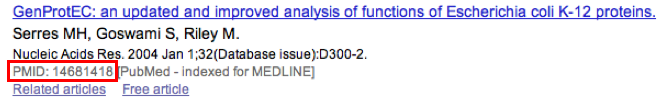

If this field is filled you will have a direct access to the publications on PubMed by clicking on the **PubMed** button on top of the Gene annotation editor window.

How to use the "Additional data" field?
---------------------------------------

The **Comments** field is dedicated to the annotators who want to leave some notes for themselves or for others annotators from the project.

.. _mage_class_field:

How to use the "Class" field?
-----------------------------

The **Class** annotation categories are useful for assigning a "confidence level" to each gene annotation. It has been inspired by the "protein name confidence" defined in `PseudoCAP <http://www.pseudomonas.com/>`_ (Pseudomonas aeruginosa community annotation project).

This information is not given by the automatic functional annotation procedure, except in case of functional annotation transfer from a genome being annotated with MaGe.

The different classes are:

* **1a :** Function from experimental evidences in the studied strain
* **1b :** Function from experimental evidences in the studied species
* **1c :** Function from experimental evidences in the studied genus
* **2a :** Function from experimental evidences in other organisms
* **2b :** Function from indirect experimental evidences (e.g. phenotypes)
* **3 :** Putative function from multiple computational evidences
* **4 :** Unknown function but conserved in other organisms
* **5 :** Unknown function

How to choose the "Class" annotation category?
----------------------------------------------

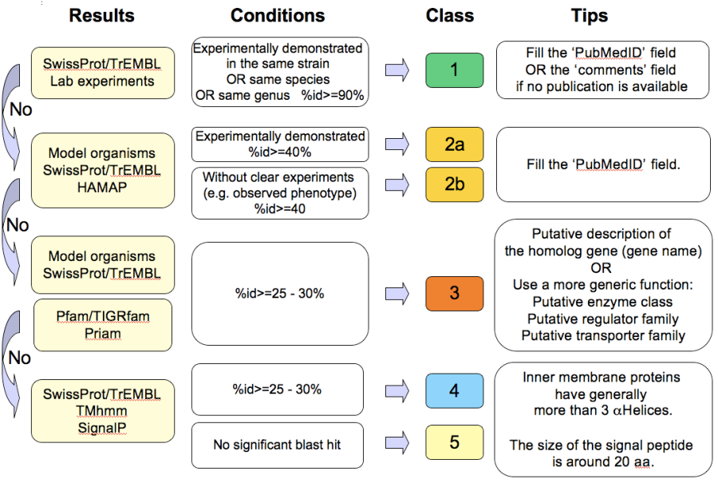

================
Annotation Rules
================

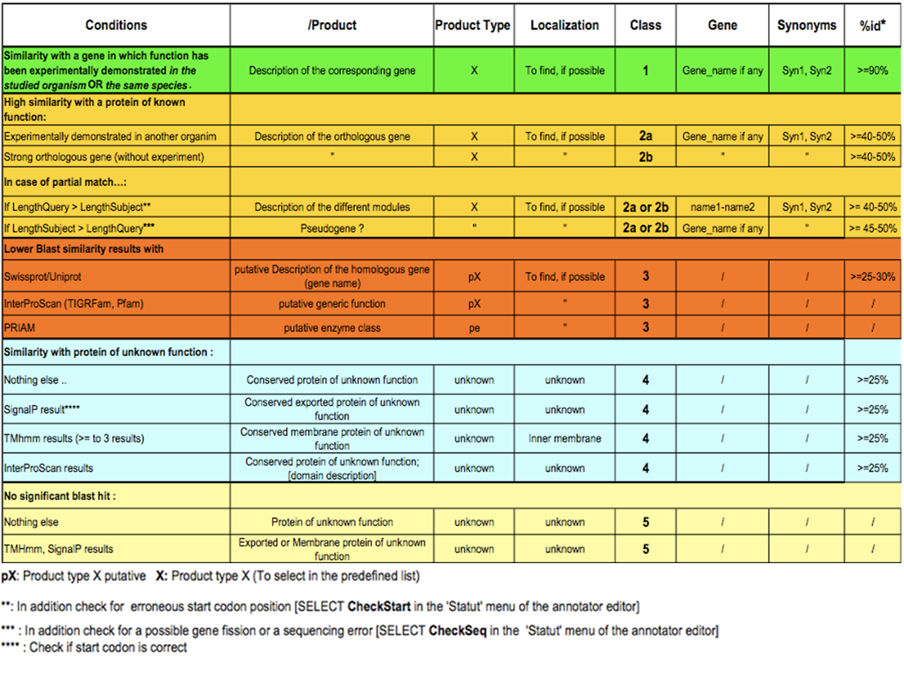

Considering the Class field, here are some basic annotation rules:

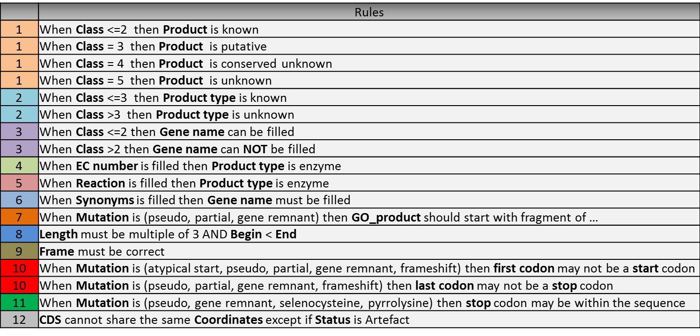

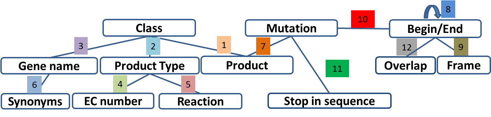

1 a/b/c: Function from experimental evidences in the studied organism/species/genus
-----------------------------------------------------------------------------------

* Gene [optional]
* Synonyms [optional]
* Product **[known]**
* EC number [optional]
* MetaCyc Reaction [optional]
* PubMedId **[known]**
* ProductType **[known]**
* Localization [optional]
* BioProcess [optional]
* Roles [optional]

2a : Function from experimental evidences in other organism
---------------------------------------------------------------------------------

* Gene [optional]
* Synomyms [optional]
* Product **[known]**
* EC number [optional]
* MetaCyc Reaction [optional]
* PubMedId **[known]**
* ProductType **[known]**
* Localization [optional]
* BioProcess [optional]
* Roles [optional]

2b : Function from indirect experimental evidences (e.g. phenotypes)
----------------------------------------------------------------------------------

* Gene [optional]
* Synonyms [optional]
* Product **[known]**
* EC number [optional]
* MetaCyc Reaction [optional]
* PubMedId [optional]
* ProductType **[known]**
* Localization [optional]
* BioProcess [optional]
* Roles [optional]

3 : Putative function from multiple computational evidences
-------------------------------------------------------------------------------------------------------------

* Gene [not allowed]
* Synonyms [not allowed]
* Product **[putative function]**:
* EC number [optional]
* MetaCyc Reaction [optional]
* PubMedId [optional]
* ProductType **[known]**
* Localization [optional]
* BioProcess [optional]
* Roles [optional]

4 : Unknown function but conserved in other organisms
-------------------------------------------------------------

* Gene [not allowed]
* Synonyms [not allowed]
* Product **[conserved ... protein of unknown function ... ]**
* EC number [not allowed]
* MetaCyc Reaction [optional]
* PubMedId [optional]
* ProductType **[u : unknown]**
* Localization [optional]
* BioProcess [optional]
* Roles [optional]

5 : Unknown function
--------------------

* Gene [not allowed]
* Synonyms [not allowed]
* Product **[protein of unknown function]**
* EC number [not allowed]
* MetaCyc Reaction [optional]
* PubMedId [optional]
* ProductType **[u : unknown]**
* Localization [optional]
* BioProcess [optional]
* Roles [optional]

=====
Start
=====

*In progress*

This menu gives the beginning and the end of the gene sequence according to different softwares. If the indicated start and stops seems to be wrong when compared to those given by the softwares, you can correct them by using Artemis (see :ref:`Artemis <viewer-artemis>`).

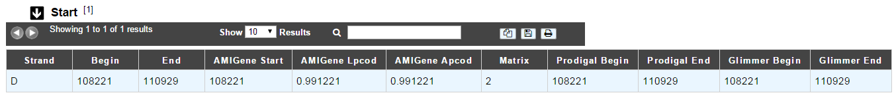

* **Strand**: indicates if the CDS is on the direct strand (D) or on the reverse strand (R)
* **Begin**: give the leftmost beginning of the CDS according to the expert or automatic annotations
* **End**: give the ending of the CDS according to the expert or automatic annotations
* **AMIGene Start**: gives the start according to AMIGene
* **AMIGene Lpcod**: gives the coding probability on the length End-Begin +1 according to AMIGene
* **AMIGene Apcod**: gives the length End-AMstart +1 according to AMIGene
* **Matrix**: gives the matrix number (see :ref:`here <viewer_matrix>`)
* **SHOW Begin**: gives the position of the first nucelic acid of the CDS according to SHOW
* **SHOW End**: gives the position of the last nucelic acid of the CDS according to SHOW
* **SHOW Proba** : gives the coding probability on the lenght End-SHOW begin +1 according to SHOW
* **Prodigal Begin**: give the beginning of the CDS according to the expert or automatic annotation
* **Prodigal End**:  give the ending of the CDS according to the expert or automatic annotation

======================
Compositional features
======================

Gene compositional features
---------------------------

This section gives the different compositional features of the studied gene, determined by GenProtFeat.

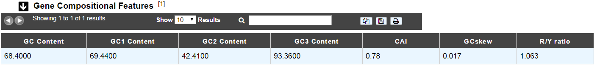

* **GC Content**:
* **GC1 Content**:
* **GC2 Content**:
* **GC3 Content**:
* **CAI**:
* **GCskew**:
* **R/Y ratio**:

Protein compositional features
------------------------------

This section gives the different compositional features of the studied gene, determined by GenProtFeat.

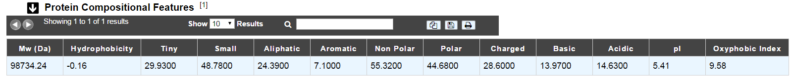

* **Mw (Da)**: gives the molecular weight of the protein (Da)
* **Hydrophobicity**:
* **Tiny**:
* **Small**:
* **Aliphatic**:
* **Aromatic**:
* **NonPolar**:
* **Polar**:
* **Charged**:
* **Basic**:
* **Acidic**:
* **PI**: gives the value of the protein isoelectric point
* **Oxyphobic Index**:

============
Duplications
============

This dataset contains the list of genes of the genome that have an identity > 25% with a minLRap > 0.75 to the selected gene.

How to read the result table?
-----------------------------

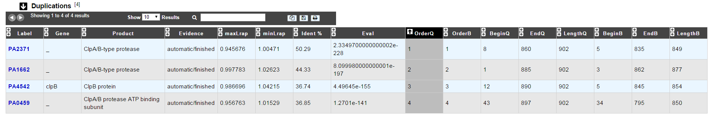

* **Label**: Label of the protein. If you click on the label, you access to the Gene annotation window
* **Gene**: Gene name of the protein
* **Product**: Product description of the protein
* **maxLrap**: see :ref:`BLAST results <expert_blast_results>`
* **minLrap**: see :ref:`BLAST results <expert_blast_results>`
* **Ident%**: Percentage of identity between the studied protein and the database protein
* **Eval**: E value of the BLAST result
* **OrderQ**: see :ref:`BLAST results <expert_blast_results>`
* **OrderB**: see :ref:`BLAST results <expert_blast_results>`
* **BeginQ**: Start of the alignment for the studied protein
* **EndQ**: End of the alignment for the studied protein
* **LengthQ**: Length of the studied protein
* **BeginB**: Start of the alignment for the database protein
* **EndB**: End of the alignment for the database protein
* **LengthB**: Length of the database protein

===========
E. coli K12
===========

*In progress*

This menu indicates the best BLAST hit for the current Genomic Object against the genome of *Escherichia coli* K12, if any.

This dataset is a useful reference since *E. coli* is a very well known bacteria, with a carefully annotated genome and large quantities of experimental data and publications are available.

.. tip:: This dataset can help you to complete your expert annotation.

How to read the result table?
-----------------------------

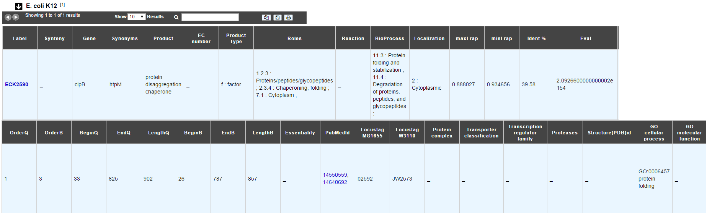

* **Label**: Label of the protein. If you click on the label, you access to the Gene annotation window
* **Synteny**: If you click on the magnifying glass, it opens a synton visualisation window (if any)
* **Gene**: Gene name of the protein
* **Synonyms**: Alternative name for the gene (if any)
* **Product**: Product description of the protein
* **ECnumber**: EC number associated with the protein, if any
* **Product type**: Description of the product type of the protein
* **Roles**: Functional categories associated with the protein using the **Roles** functional classification
* **Reaction**: If any, gives the reactions implying the database protein (reactions given by Rhea and MetaCyc)
* **BioProcess**: Functional categories associated with the protein using the **BioProcess** functional classification
* **Localization**: Cellular localisation of the protein
* **maxLrap**: see :ref:`BLAST results <expert_blast_results>`
* **minLrap**: see :ref:`BLAST results <expert_blast_results>`
* **Ident%**: Percentage of identity between the studied protein and the database protein
* **Eval**: E value of the BLAST result
* **OrderQ**: see :ref:`BLAST results <expert_blast_results>`
* **OrderB**: see :ref:`BLAST results <expert_blast_results>`
* **BeginQ**: Start of the alignment for the studied protein
* **EndQ**: End of the alignment for the studied protein
* **LengthQ**: Length of the studied protein
* **BeginB**: Start of the alignment for the database protein
* **EndB**: End of the alignment for the database protein
* **LengthB**: Length of the database protein
* **PubMedId**: PubMed references linked to the annotation of the protein
* **Locustag MG1655**: locus tag of the gene in the regulon of LeuO in E coli K12 **(??)**
* **Locustag W3110**: locus tag of the gene in the NarP regulon of E coli K12 **(??)**
* **Protein complex**: Indicates if the database protein is part of a protein complex
* **Transporter classification**: If the database protein is a transporter, indicates the family this transporter is part of
* **Transcription regulator family**: If the database protein is a transcription regulator, indicates the family this transcription regulator is part of
* **Proteases**: If the database protein is a protease, indicates the family this protease is part of
* **Structure(PDB)id**: Gives the Id number which correspond to the database protein's structure on `Protein Data Bank <http://www.rcsb.org/pdb/home/home.do>`_
* **GO cellular process**: Gives the cellular process according to `Gene Ontology <http://geneontology.org/page/documentation>`_
* **GO molecular function**: Gives the molecular process according to `Gene Ontology <http://geneontology.org/page/documentation>`_

===========
B. subtilis
===========

This menu indicates the best BLAST hit for the current Genomic Object against the genome of *Bacillus subtilis*, if any.

This dataset is a useful reference since *B. subtilis* is a very well known bacteria, with a carefully annotated genome and large quantities of experimental data and publications are available.

.. tip:: This dataset can help you to complete your expert annotation.

How to read the result table?
-----------------------------

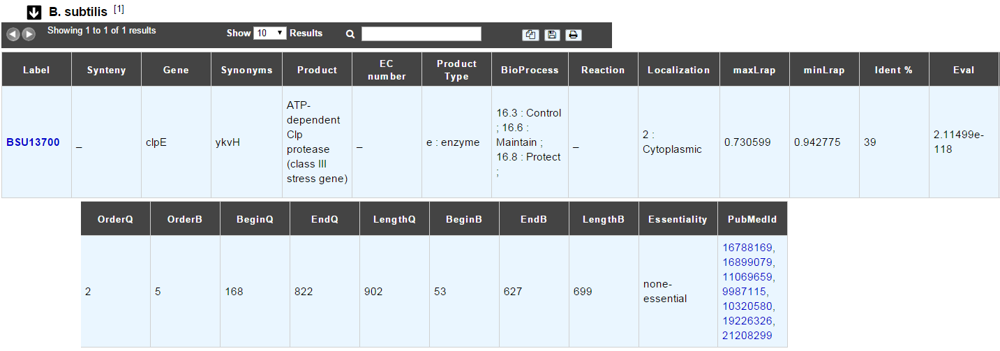

* **Label**: Label of the protein. If you click on the label, you access to the Gene annotation window
* **Synteny**: If you click on the magnifying glass, it opens a synton visualisation window (if any)
* **Gene**: Gene name of the protein
* **Synonyms**: Alternative name of the gene (if any)
* **Product**: Product description of the protein
* **ECnumber**: EC number associated with the protein, if any
* **Product type**: Description of the product type of the protein
* **BioProcess**: Functional categories associated with the protein using the **BioProcess** Functional classification
* **Reaction**: If any, gives the reactions implying the database protein (reactions given by Rhea and MetaCyc)
* **Localization**: Cellular localization of the protein
* **maxLrap**: see :ref:`BLAST results <expert_blast_results>`
* **minLrap**: see :ref:`BLAST results <expert_blast_results>`
* **Ident%**: Percentage of identity between the studied protein and the database protein
* **Eval**: E value of the BLAST result
* **OrderQ**: see :ref:`BLAST results <expert_blast_results>`
* **OrderB**: see :ref:`BLAST results <expert_blast_results>`
* **BeginQ**: Start of the alignment for the studied protein
* **EndQ**: End of the alignment for the studied protein
* **LengthQ**: Length of the studied protein
* **BeginB**: Start of the alignment for the database protein
* **EndB**: End of the alignment for the database protein
* **LengthB**: Length of the database protein
* **PubMedId**: PubMed references linked to the annotation of the protein

=====================
DB of essential genes
=====================

This menu gives BLAST hits for the current Genomic Object against the essential gene database for genes with "essential" status.

This dataset comes from `Database of Essential Genes (DEG) <http://www.essentialgene.org/>`_ .
DEG hosts records of currently available essential genomic elements, such as protein-coding genes and non-coding RNAs, among bacteria, archaea and eukaryotes. Essential genes in a bacterium constitute a minimal genome, forming a set of functional modules, which play key roles in the emerging field, synthetic biology.
DEG database has been improved with data from Acinetobacter baylyi ADP1 and Neisseria meningitidis 8013, two highly curated genome in MicroScope.

**Reference**: `Hao Luo, Yan Lin, Feng Gao, Chun-Ting Zhang and Ren Zhang, (2014) DEG 10, an update of the Database of Essential Genes that includes both protein-coding genes and non-coding genomic elements. Nucleic Acids Research 42, D574-D580. <https://dx.doi.org/10.1093%2Fnar%2Fgkt1131>`_

How to read the result table?
-----------------------------

* **Label**: Label of the protein in DEG
* **Organism**: reference organism in DEG
* **Gene**: Gene name of the protein in DEG
* **PB id**: Uniprot ID of the database protein. If you click on this Id, you can access the Uniprot profile of the protein, giving you various informations about it
* **Product**: Product description of the protein in DEG
* **maxLrap**: see :ref:`BLAST results <expert_blast_results>`
* **minLrap**: see :ref:`BLAST results <expert_blast_results>`
* **Ident%**: Percentage of identity between the studied protein and the database protein
* **Eval**: E value of the BLAST result
* **OrderQ**: see :ref:`BLAST results <expert_blast_results>`
* **OrderB**: see :ref:`BLAST results <expert_blast_results>`
* **Exp condition**: Experimental condition for essential characterization 
* **PubMedId**: PubMed references linked to the annotation of the protein
* **Source**: Source of the reference data (DEG or MicroScope)
* **BeginQ**: Start of the alignment for the studied protein
* **EndQ**: End of the alignment for the studied protein
* **LengthQ**: Length of the studied protein
* **BeginB**: Start of the alignment for the database protein
* **EndB**: End of the alignment for the database protein
* **LengthB**: Length of the database protein

===============
Genomes/Project
===============

This section indicates the best BLAST hits for the current Genomic Object with Genomic Objects from other PkGDB genomes that are linked to the current annotation Project.

These other Genomic Objects having been automatically (re-)annotated using the MaGe platform, and maybe even been manually annotated/curated by MaGe users, can serve as informative references for your own annotations.

How to read the result table?
-----------------------------

* **Label**: Label of the protein. If you click on the label, you access the Gene annotation window for that Genomic Object.
* **Organism**: Organism name. If you click on the name, you access the organism’s sequences on the NCBI website
* **Gene**: Gene name of the protein
* **Evidence**: Status of the annotation.
* **Gene**: Gene name of the genomic object
* **Product**: Product description of the protein
* **maxLrap**: see :ref:`BLAST results <expert_blast_results>`
* **minLrap**: see :ref:`BLAST results <expert_blast_results>`
* **Ident%**: Percentage of identity between the studied protein and the database protein
* **Eval**: E value of the BLAST result
* **OrderQ**: see :ref:`BLAST results <expert_blast_results>`
* **OrderB** : see :ref:`BLAST results <expert_blast_results>`
* **BeginQ**: Start of the alignment for the studied protein
* **EndQ**: End of the alignment for the studied protein
* **LengthQ**: Length of the studied protein
* **BeginB**: Start of the alignment for the database protein
* **EndB**: End of the alignment for the database protein
* **LengthB**: Length of the database protein

========================
MaGe/Curated annotations
========================

This section indicates the best BLAST hits obtained with other Genomic Objects from PkGDB which have been manually annotated/curated by other MaGe users.

How to read the result table?
-----------------------------

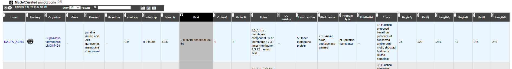

* **Label**: Label of the protein. If you click on the label, you access to the Gene annotation window
* **Synteny**: If you click on the magnifying glass, it opens a synton visualisation window
* **Organism**: Organism name. If you click on the name, you access to the sequences on the NCBI website
* **Gene**: Gene name of the protein
* **Product**: Product description of the protein
* **maxLrap**: see :ref:`BLAST results <expert_blast_results>`
* **minLrap**: see :ref:`BLAST results <expert_blast_results>`
* **Ident%**: Percentage of identity between the studied protein and the database protein
* **Eval**: E value of the BLAST result
* **OrderQ**: see :ref:`BLAST results <expert_blast_results>`
* **OrderB**: see :ref:`BLAST results <expert_blast_results>`
* **Roles**: Functional categories associated with the protein using the **Roles** functional classification
* **ECnumber**: EC number associated with the protein, if any
* **Localization**: Cellular localization of the protein
* **BioProcess**: Functional categories associated with the protein using the **BioProcess** functional classification
* **Product type**: Description of the product type of the protein
* **PubMedId**: PubMed references linked to the annotation of the protein
* **Class**: Confidence class of the annotation
* **BeginQ**: Start of the alignment for the studied protein
* **EndQ**: End of the alignment for the studied protein
* **LengthQ**: Length of the studied protein
* **BeginB**: Start of the alignment for the database protein
* **EndB**: End of the alignment for the database protein
* **LengthB**: Length of the database protein

============================
Syntonome / Syntonome RefSeq
============================

How to use the Syntonome / Syntonome RefSeq results?
----------------------------------------------------

These sections give access to the list of syntons which contain homologs to the studied gene in other organisms:

* from PkGDB for the **Syntonome** section
* from RefSeq for the **Syntonome RefSeq** section

How to read Syntonome results?
------------------------------

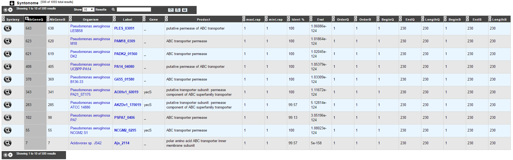

* **Synteny**: If you click on the magnifying glass, it opens a synton visualisation window
* **NbGeneQ**: Number of genes involved in the synton in the studied genome
* **NbGeneB**: Number of genes involved in the synton in the database genome
* **Organism**: Organism name. If you click on the name, you can access the associated genome sequence on the NCBI website.
* **Label**: Label of the database protein. If you click on the label, you can access the Gene annotation window (Syntonome) or to the corresponding NCBI entry (Syntonome RefSeq)
* **Gene**: Gene name of the database protein
* **Product**: Product description of the database protein
* **maxLrap**: see :ref:`BLAST results <expert_blast_results>`
* **minLrap**: see :ref:`BLAST results <expert_blast_results>`
* **ident%**: Percentage of identity between the studied protein and the database protein
* **Eval**: E value of the BLAST result
* **OrderQ**: see :ref:`BLAST results <expert_blast_results>`
* **OrderB**: see :ref:`BLAST results <expert_blast_results>`
* **BeginQ**: Start of the alignment for the studied protein
* **EndQ**: End of the alignment for the studied protein
* **LengthQ**: Length of the studied protein
* **BeginB**: Start of the alignment for the protein of the database
* **EndB**: End of the alignment for the protein of the database
* **LengthB**: Length of the protein of the database

===============================
Similarities SwissProt / TrEMBL
===============================

What is UniProt?
----------------

The Universal Protein Resource (UniProt) is a comprehensive resource for protein sequence and annotation data. The mission of UniProt is to provide the scientific community with a comprehensive, high-quality and freely accessible ressource of protein sequence and functional information.

The UniProt Knowledgebase consists of two sections:

* **Swiss-Prot** which contains high quality manually annotated and non-redundant protein sequences. This database brings together experimental results, computed features and scientific conclusions.
* **TrEMBL** which contains protein sequences associated with computationally generated annotation and large-scale functional characterization that await full manual annotation.

More than 99% of the protein sequences provided by UniProtKB are derived from the translation of the coding sequences (CDS) which have been submitted to the public nucleic acid databases, the EMBL-Bank/GenBank/DDBJ databases. All these sequences, as well as the related data submitted by the authors, are automatically integrated into UniProtKB/TrEMBL.

**More**: http://www.uniprot.org/

**Reference**: `UniProt Consortium. The Universal Protein Resource (UniProt) in 2010. Nucleic Acids Res. 2010 Jan;38(Database issue):D142-8 <http://www.ncbi.nlm.nih.gov/pubmed/19843607>`_

How to read SwissProt and TrEMBL results?
-----------------------------------------

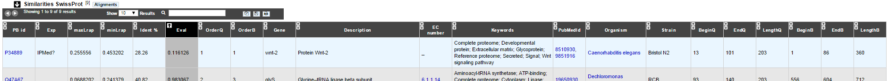

* **PB id**: Uniprot ID of the database protein. If you click on this Id, you can access the Uniprot profile of the protein, giving you various informations about it.
* **Exp**: Indicates if there is PubMed references for the database protein. If there is at least one article, the mention "IPMed?" is written in this column.
* **maxLrap**: see :ref:`BLAST results <expert_blast_results>`
* **minLrap**: see :ref:`BLAST results <expert_blast_results>`
* **ident%**: Percentage of identity between the studied protein and the database protein
* **Eval**: E value of the BLAST result
* **OrderQ**: see :ref:`BLAST results <expert_blast_results>`
* **OrderB**: see :ref:`BLAST results <expert_blast_results>`
* **Gene**: Gene name of the database protein
* **Description**: Product description of the database protein
* **EC Number**: gives the EC number (if any)
* **Keywords**: Keywords associated to the protein function and roles
* **PubMedId**: References linked to the annotation of the protein
* **Organism**: Organism name. If you click on the name, you can access the associated genome sequence on the NCBI website.
* **Strain**: Strain where the gene of the database is localized
* **BeginQ**: Start of the alignment for the studied protein
* **EndQ**: End of the alignment for the studied protein
* **LengthQ**: Length of the studied protein
* **BeginB**: Start of the alignment for the protein of the database
* **EndB**: End of the alignment for the protein of the database
* **LengthB**: Length of the protein of the database

========
UniFIRE
========

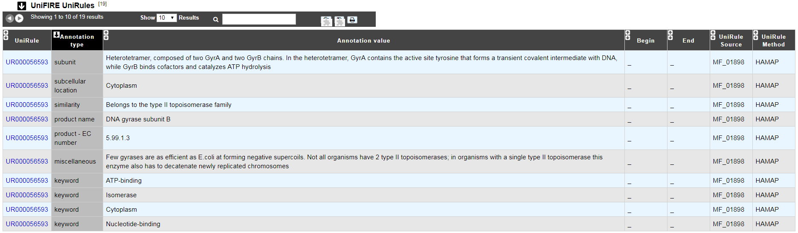

What is the UniFIRE?
--------------------

**UniFire** (the UNIprot Functional annotation Inference Rule Engine) is a tool to apply the UniProt annotation rules. Two set of rule are applied : 

* The **SAAS** rules (Statistical Automatic Annotation System). This rules is generated automatic from expertly annotated entries in UniProtKB/Swiss-Prot.(https://www.uniprot.org/help/saas)
* The **UniRules** (The Unified Rule) are devised and tested by experienced curators using experimental data from manually annotated entries.(https://www.uniprot.org/help/unirule)

How to read UniFIRE results?
-----------------------------

* **UniRule** : Rule id
* **Annotation type** : Prediction type inferred 
* **Annotation value** : Annotation inferred
* **Begin** :  Start position of the predicted features 
* **End** : Enf position of the predicted features
* **UniRule Source** : Source rule id
* **UniRule Method** : Source rule

========================
Predited KEGG Orthologs
========================

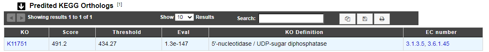

What is KOfamScan?
-------------------
The KO **KEGG Orthology** is a database of molecular functions represented in terms of functional orthologs. The KO assignment of a gene allows to identify a function and define a molecular networks. 

For KO assignement, we use **KOfamScan**, a tool to homology search against a database of profile hidden Markov models (**KOfam**) with pre-computed adaptive score thresholds. In MicroScope, only the results that match with a score exceeding the pre-computed threshold and a E-value lower than or equal to 0.01 are shown.
 
**Reference**: 

* `Takuya Aramaki et al. KofamKOALA: KEGG Ortholog assignment based on profile HMM and adaptive score threshold, Bioinformatics, btz859, 2019 <https://pubmed.ncbi.nlm.nih.gov/31742321>`_

* `Minoru Kanehisa et al. KEGG as a reference resource for gene and protein annotation. Nucleic Acids Res, 44:D457–D462, 2020 <https://pubmed.ncbi.nlm.nih.gov/26476454>`_

How to read KOfamScan results ?
-------------------------------

* **KO** : ID number of KEGG Ortholog entry
* **Score** :  Score of the match
* **Threshold** : Pre-computed adaptive score for each KOfam
* **Eval** :  E-value of the match 
* **KO Definition** : Functional description KO
* **EC number** :  EC number associated with the KO

=====
PRIAM
=====

What is PRIAM?
--------------

PRIAM is a method for automated enzyme detection in a fully sequenced genome, based on all sequences available in the ENZYME database (http://www.expasy.ch/enzyme/). PRIAM relies on sets of position-specific score matrices (PSSMs) automatically tailored for each ENZYME entry. The whole Swiss-Prot database has been used to parametrise and to assess the method.

**More**: http://priam.prabi.fr/

**Reference**: `Clotilde Claudel-Renard, Claude Chevalet, Thomas Faraut and Daniel Kahn / Enzyme-specific profiles for genome annotation: PRIAM Nucleic Acids Research, 2003, Vol. 31, No. 22 6633-6639 <http://www.ncbi.nlm.nih.gov/pubmed/19843607>`_

How to read PRIAM EC number results?
------------------------------------

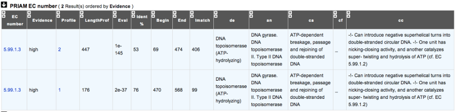

* **EC_id**: EC number
* **Evidence**: gives the confidence level associated to the match. It can be:
	* **high**: the match between the PRIAM profile and the sequence is very good (low E value and full alignment).
	* **medium**: there is only a partial alignment between the PRIAM profile and the sequence
	* **low**: there are better results with other PRIAM profiles matching to the sequence
* **profil**: reference number of the PRIAM profile that matches to the sequence.
* **lengthprof**: Length of the PRIAM profile
* **Eval**: E value of the match
* **Ident**: Identity of the match
* **begin**: first position of the alignment
* **end**: last position of the alignment
* **lmatch**: length of the alignment between the sequence and the profile
* **de**: enzyme description
* **an**: alternative name
* **ca**: description of the reaction catalysed
* **cf**: cofactor needed for the reaction, if any
* **cc**: some comments about the enzymatic activity

==========================
Predicted MetaCyc Pathways
==========================

What are MetaCyc Pathways?
--------------------------

MetaCyc pathways are metabolic networks as define in the MetaCyc Database.

`Caspi et al., 2010, "The MetaCyc Database of metabolic pathways and enzymes and the BioCyc collection of Pathway/Genome Databases", Nucleic Acids Research <http://www.ncbi.nlm.nih.gov/pubmed/19850718>`_

The presence or absence of a MetaCyc metabolic pathway is predicted by the  `Pathway-tools <http://bioinformatics.ai.sri.com/ptools/>`_ algorithm in this organism.

`P. Karp, S. Paley, and P. Romero "The Pathway Tools Software," Bioinformatics 18:S225-32 2002 <http://www.ncbi.nlm.nih.gov/pubmed/12169551>`_

How to read MetaCyc results?
----------------------------

All pathways listed in this table are those predicted as present in this organism. Clicking on the name of a pathway opens its table of reactions content.

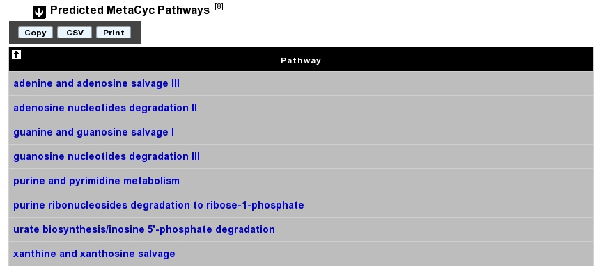

========
COGnitor
========

What is COGnitor?
-----------------

COGnitor compares a sequence to the COG database by using BLASTP. Clusters of Orthologous Groups of proteins (COGs) were established by comparing protein sequences encoded in complete genomes, representing major phylogenetic lineages. Each COG consists of individual proteins or groups of paralogs from at least 3 lineages and thus corresponds to an ancient conserved domain.

**More**: http://www.ncbi.nlm.nih.gov/COG/

**Reference**:

`Tatusov RL, Koonin EV, Lipman DJ. A genomic perspective on protein families. Science. 1997 Oct 24;278(5338):631-7. <http://www.ncbi.nlm.nih.gov/pubmed/9381173>`_

How to read COGnitor results?
-----------------------------

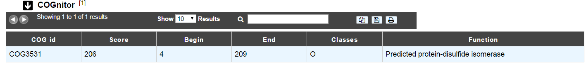

The first column indicates the identifier of the COG family the protein is similar to. If you click on the identifier, a new window will pop-up, presenting the COG’s description page on the NCBI website. The second column gives the similarity score and the third and fourth columns give the amino acid positions between which the proteins align. The last 2 columns indicate the general class to which the COG belongs and the function describing the COG family

.. tip:: A protein is classified in a COG if it has at least 3 Best Hits with proteins classified in the same COG and being members of 3 different clades. A protein can thus be classified in more than one COG.

========
EGGNOG
========

What is EGGNOG?
-----------------

It uses precomputed orthologous groups and phylogenies from the eggNOG database to transfer functional information from fine-grained orthologs only.

**More**: http://eggnogdb.embl.de/#/app/methods

**Reference**: `eggNOG 4.5: a hierarchical orthology framework with improved functionalannotations for eukaryotic, prokaryotic and viral sequences. Jaime Huerta-Cepas, Damian Szklarczyk & al. Nucl. Acids Res. (04 January 2016) 44 (D1): D286-D293. <https://doi.org/10.1093/nar/gkv1248>`_

======
FigFam
======

*In progress*

What is FigFam?
---------------

"FIGfams, a new collection of over 100 000 protein families that are the product of manual curation and close strain comparison. Using the Subsystem approach the manual curation is carried out, ensuring a previously unattained degree of throughput and consistency. FIGfams are based on over 950 000 manually annotated proteins and across many hundred Bacteria and Archaea. Associated with each FIGfam is a two-tiered, rapid, accurate decision procedure to determine family membership for new proteins. FIGfams are freely available under an open source license." (quote from http://www.ncbi.nlm.nih.gov/pmc/articles/PMC2777423/ )

How to read FigFam results?
---------------------------

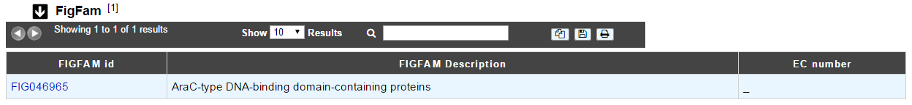

* **FIGFAM id**: ID number of the FigFam family the protein is part of
* **FIGFAM Description**: gives the description of the product of the family
* **EC number**: gives the EC number

======
PsortB
======

What is PsortB?
---------------

PsortB is an open-source tool for protein sub-cellular localization prediction in bacteria.

**More**: http://www.psort.org/

**Reference**: `Gardy JL et al (2005) PSORTb v.2.0: expanded prediction of bacterial protein subcellular localization and insights gained from comparative proteome analysis. Bioinformatics. Mar1;21(5):617-23. Epub 2004 Oct 22. <http://www.ncbi.nlm.nih.gov/pubmed/15501914>`_

How to read PsortB results?
---------------------------

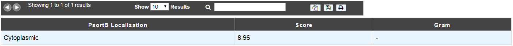

* The first column indicates the Localization predicted by PsortB.
* The second column gives the score. The score typically varies between 2 and 10.
* The third column indicates which option has been used for the genome: Gram positive (+) or Gram negative(-) bacteria.

============
InterProScan
============

What is InterPro?
-----------------

InterPro is an integrated database of predictive protein "signatures" used for the classification and automatic annotation of proteins and genomes. InterPro classifies sequences at superfamily, family and subfamily levels, predicting the occurrence of functional domains, repeats and important sites. InterPro adds in-depth annotation, including GO terms, to the protein signatures.

More: http://www.ebi.ac.uk/interpro/

Reference: `Hunter S, et al. InterPro: the integrative protein signature database. Nucleic Acids Res. 2009 Jan;37(Database issue):D211-5. Epub 2008 Oct 21. <http://www.ncbi.nlm.nih.gov/pubmed/18940856>`_

Which databases are used in InterPro?
-------------------------------------

InterPro combines a number of databases (referred to as member databases) that use different methodologies and a varying degree of biological information on well-characterised proteins to derive protein signatures. By uniting the member databases, InterPro capitalises on their individual strengths, producing a powerful integrated database and diagnostic tool (InterProScan).

The member databases use a number of approaches:

* `PRODOM <http://prodom.prabi.fr/prodom/current/html/home.php>`_: provider of sequence-clusters built from UniProtKB using PSI-BLAST.
* `PROSITE <http://prosite.expasy.org/>`_ (PROSITE patterns): provider of simple regular expressions.
* `PROSITE <http://prosite.expasy.org/>`_ and `HAMAP <http://hamap.expasy.org/cgi-bin/unirule/unirule_browse.cgi?browse=description&context=HAMAP>`_: provide sequence matrices.
* `PRINTS <http://130.88.97.239/dbbrowser/sprint/>`_ provider of fingerprints, which are groups of aligned, un-weighted Position Specific Sequence Matrices (PSSMs).
* `PANTHER <http://www.pantherdb.org/>`_, `PIRSF <http://pir.georgetown.edu/>`_,  `PFAM <http://pfam.xfam.org/>`_, `SMART <http://smart.embl-heidelberg.de/>`_, `TIGRFAMs <http://www.jcvi.org/cgi-bin/tigrfams/index.cgi>`_, `GENE3D <http://www.cathdb.info/>`_ and `SSF <http://supfam.org/SUPERFAMILY/>`_ (SUPERFAMILY): providers of hidden Markov models (HMMs). 
* `CDD <https://www.ncbi.nlm.nih.gov/Structure/cdd/cdd.shtml>`_ Conserved Domains and Protein Classification
* `SFLD <http://sfld.rbvi.ucsf.edu/django/>`_ A hierarchical classification of enzymes that relates specific sequence-structure features to specific chemical capabilities

Diagnostically, these resources have different areas of optimum application owing to the different underlying analysis methods. In terms of family coverage, the protein signature databases are similar in size but differ in content. While all of the methods share a common interest in protein sequence classification, some focus on divergent domains (e.g., Pfam), some focus on functional sites (e.g., PROSITE), and others focus on families, specialising in hierarchical definitions from superfamily down to subfamily levels in order to pin-point specific functions (e.g., PRINTS). TIGRFAMs focus on building HMMs for functionally equivalent proteins and PIRSF always produces HMMs over the full length of a protein and have protein length restrictions to gather family members. `HAMAP`_ profiles are manually created by expert curators they identify proteins that are part of well-conserved bacterial, archaeal and plastid-encoded proteins families or subfamilies. PANTHER build HMMs based on the divergence of function within families. SUPERFAMILY and Gene3D are based on structure using the SCOP and CATH superfamilies, respectively, as a basis for building HMMs.

How to read InterProScan results?
---------------------------------

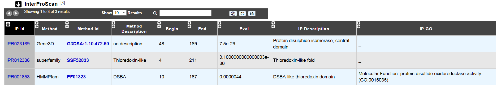

* **IP id**: Identifier of the InterPro entry. Click on it to access the full description of the InterPro entry.
* **Method**: Method used to obtain the result. It corresponds to one of the member database methods of InterPro.
* **Method id**: Identifier of the method entry that generated the result. Click on it to access the full description of the method entry.
* **Method Name**: Name of the method entry.
* **Begin**: Beginning of the match on the query sequence.
* **End**: End of the match on the query sequence.
* **maxLrap**: Alignment coverage on the query sequence. See :ref:`BLAST results <expert_blast_results>`.
* **Eval/Score**: E-value or score of the match (if applicable).
* **IP name**: Name of the InterPro entry.
* **IP type**: Type of the InterPro entry.
* **IP description**: Description of the InterPro entry.
* **Gene Ontology**: Gene Ontology terms associated with the InterPro entry.

=======
SignalP
=======

What is SignalP?
----------------

SignalP (version 4.1) predicts the presence and location of signal peptide cleavage sites in amino acid sequences from different organisms: Gram-positive prokaryotes, Gram-negative prokaryotes, and eukaryotes. The method incorporates a prediction of cleavage sites and a signal peptide/non-signal peptide prediction based on a combination of several artificial neural networks and hidden Markov models.

Reference:

`SignalP 4.0: discriminating signal peptides from transmembrane regions. Thomas Nordahl Petersen, Søren Brunak, Gunnar von Heijne & Henrik Nielsen. Nature Methods, 8:785-786, 2011. <http://www.ncbi.nlm.nih.gov/pubmed/21959131>`_

How to read SignalP results?
----------------------------

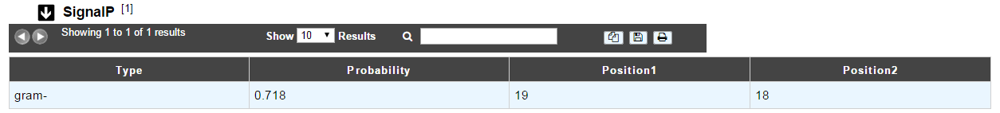

* The first column indicates the type of bacteria (Gram positive or Gram negative).
* The second column gives the estimated probability (number between 0 and 1) that the sequence contains a signal peptide.
* The last 2 columns indicate the positions between which the cleavage is supposed to occur.

.. tip:: A signal peptide has an average size of 30 aa.

=====
TMHMM
=====

What is TMHMM?
--------------

TMHMM (version 2.0c) is a program for the prediction of transmembrane helices based on a hidden Markov model. The program reads a fasta-formatted protein sequence and predicts locations of transmembrane, intracellular and extracellular regions.

**More**: http://www.cbs.dtu.dk/services/TMHMM/

**References**:

`Sonnhammer, E., et al. (1998) A hidden Markov model for predicting transmembrane helices in protein sequences. Proc. ISMB, 6, 175-182. <http://www.ncbi.nlm.nih.gov/pubmed/9783223>`_

`Krogh, A., et al. (2001) Prediction transmembrane protein topology with a hidden markov model: application to complete genomes. J. Mol. Biol., 305, 567-580 <http://www.ncbi.nlm.nih.gov/pubmed/11152613>`_

How to read TMHMM results?
--------------------------

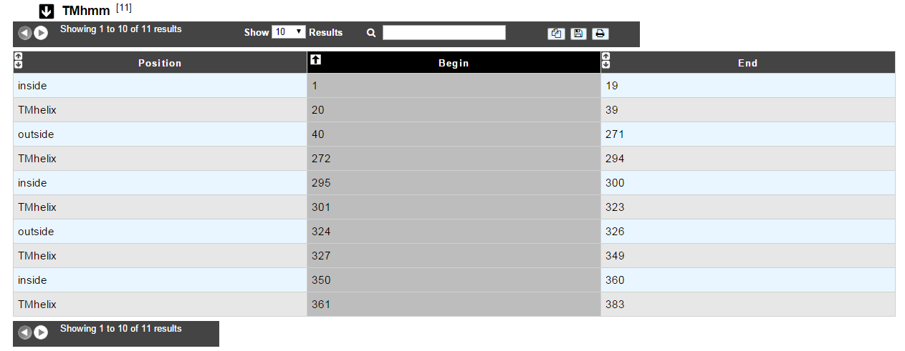

The table of results indicates the begin and end positions of detected alpha-helices for the protein sequence. It also gives the location (inside/outside) of the fragments in between the helices.

.. tip:: A protein can be called « membranar » if it contains more than 3 alpha-helices.

.. _mage_antiSMASH:

=========
AntiSMASH
=========

What is antiSMASH?
------------------

antiSMASH allows the rapid genome-wide identification, annotation and analysis of secondary metabolite biosynthesis gene clusters in bacterial and fungal genomes. It integrates and cross-links with a large number of in silico secondary metabolite analysis tools that have been published earlier.

**More:** http://antismash.secondarymetabolites.org/

**References:**

`Blin, K. et al. (2019) antiSMASH 5.0: updates to the secondary metabolite genome mining pipeline. Nucleic Acids Research, 47, W81–W87. <https://doi.org/10.1093/nar/gkz310>`_

What type of secondary metabolites can antiSMASH 5.0.0 predict?
---------------------------------------------------------------

* **NRPS/PKS type metabolites:** Polyketide synthases (Type I PKS, Trans-AT type I PKS, Type II PKS, Type III PKS, other PKS), Non-ribosomal peptide synthetase

* **Ribosomal encoded metabolite:** Terpene, Lantipeptides, Bacteriocin (bacteriocin or other unspecified ribosomally synthesised and post-translationally modified peptide product (RiPP) cluster), Beta-lactams, Aminoglycosides, Aminocoumarins, Siderophores, Ectoines, Butyrolactones, Indoles, Nucleosides, Phosphoglycolipids, Melanins, Oligosaccharide, Furan, Homoserine lactone, Thiopeptide, Phenazine, Phosphonate, arylpolyene, resorcinol, ladderane, PUFA, linaridin, cyanobactin, glycocin, lassopeptide, sactipeptide, bottromycin, microcin, microviridin, proteusin, blactam, amglyccycl ...

* **Other:** Cluster containing a secondary metabolite-related protein that does not fit into any other category

How to read antiSMASH 5.0.0 results?
------------------------------------

AntiSMASH results are presented into 2 separate datasets: antiSMASH annotation and antiSMASH domains.

**The antiSMASH annotation dataset:**

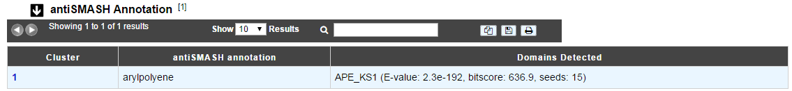

* **cluster**: antiSMASH cluster number. By clicking on the number, you can access to the :ref:`AntiSMASH cluster visualisation window <domainviewer>`.
* **antiSMASH annotation**: gene annotation proposed by the tool
* **domains detected**: predicted domains, if any.

**The antiSMASH domains dataset:**

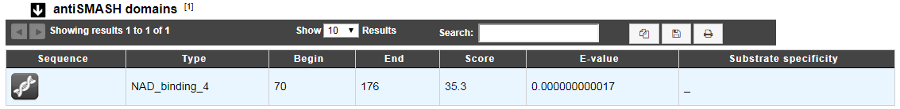

* **Type**: domain type
* **Begin**: begin of the match on the sequence
* **End**: end of the match on the sequence
* **Score**: BLAST score
* **E-value**: BLAST E-value

How can I visualize the clusters predicted by antiSMASH?
--------------------------------------------------------

You can access to the :ref:`AntiSMASH cluster visualisation window <domainviewer>` by clicking on the number indicated in the **Cluster** field of the antiSMASH annotation table.
This window allows you to visualize the full antiSMASH cluster prediction and its genomic context.

=====
LipoP
=====

What is LipoP?
--------------

`LipoP <http://www.cbs.dtu.dk/services/LipoP/>`_ is a method to predict lipoprotein signal peptide. It is based on Hidden Markov Model (HMM) which discriminate lipoproteins (SPaseII-cleaved proteins), SPaseI-cleaved proteins, cytoplasmic proteins and transmembrane proteins. Although LipoP1.0 has been trained on sequences from Gram-negative bacteria only, the following paper (Methods for the bioinformatic identification of bacterial lipoproteins encoded in the genomes of Gram-positive bacteria; O. Rahman, S. P. Cummings, D. J. Harrington and I. C. Sutcliffe; World Journal of Microbiology and Biotechnology 24(11):2377-2382 (2008)) reports that it has good performance on sequences from Gram-positive bacteria also.

**References:**

`Prediction of lipoprotein signal peptides in Gram-negative bacteria. A. S. Juncker, H. Willenbrock, G. von Heijne, H. Nielsen, S. Brunak and A. Krogh. Protein Sci. 12(8):1652-62, 2003 <http://onlinelibrary.wiley.com/doi/10.1110/ps.0303703/abstract>`_

How to read LipoP results?
--------------------------

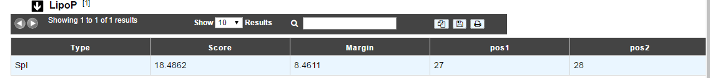

* **Type:** type of the signal peptide (SPI or SPII)
* **Score:** detection score
* **Margin:** difference between the best and the second best score.
* **Pos1** and **Pos2** indicate the positions between which the cleavage is supposed to occur

=====
dbCAN
=====

What is dbCAN?
--------------

`dbCAN <http://csbl.bmb.uga.edu/dbCAN/index.php>`_ is a method for the automated detection of carbohydrate active enzyme classified in the `CAZy database <http://www.cazy.org/>`_ which describes the families of structurally-related catalytic and carbohydrate-binding modules (or functional domains) of enzymes that degrade, modify, or create glycosidic bonds. dbCAN proposes an Hidden Markov Model (HMM) for each CAZy family.

**References:**

`Yin Y, Mao X, Yang JC, Chen X, Mao F and Xu Y, dbCAN: a web resource for automated carbohydrate-active enzyme annotation, Nucleic Acids Res. 2012  <http://nar.oxfordjournals.org/content/40/W1/W445.long>`_

How to read dbCAN results?
--------------------------

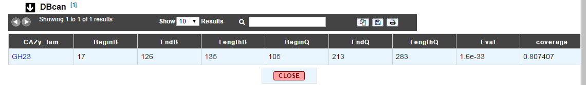

* **CAZy_fam:** name of the CAZy family (linked to the corresponding CAZy’s family web page).
* **BeginB:** position, on the HMM, of the beginning of the alignment between the sequence and the HMM.
* **EndB:** position, on the HMM, of the end of the alignment between the sequence and the HMM.
* **LengthB:** Length of the HMM.
* **BeginQ:** position, on the sequence, of the beginning of the alignment between the sequence and the HMM
* **EndQ:** position, on the sequence, of the end of the alignment between the sequence and the HMM
* **LengthQ:** length of the sequence
* **Eval:** Evalues of the alignment
* **Coverage:** Coverage of the HMM coverage= (endB-beginB)/lengthB. It gives an indication about how complete the module is.

=========
Resistome
=========

What is CARD?
-------------

The `CARD <https://card.mcmaster.ca/home>`_   is a rigorously curated collection of known resistance determinants and associated antibiotics, organized by the Antibiotic Resistance Ontology (ARO) and AntiMicrobial Resistance (AMR) gene detection models.

We compare MicroScope gene against CARD using `RGI <https://card.mcmaster.ca/analyze/rgi>`_:

Resistance Gene Identifier (RGI) integrates ARO, bioinformatics models and molecular reference sequence data to broadly analyze antibiotic resistance at the genome level. This software use different models (CARD Proteins Homologs, CARD Proteins Variants ...) to detect the AMR.

**References:**

`McArthur et al. 2013. The Comprehensive Antibiotic Resistance Database. Antimicrobial Agents and Chemotherapy, 57, 3348-3357. [PMID 23650175] <http://www.ncbi.nlm.nih.gov/pubmed/23650175>`_

`Jia et al. 2016. CARD 2017: expansion and model-centric curation of the comprehensive antibiotic resistance database. Nucleic Acid Research. [PMID 27789705] <http://www.ncbi.nlm.nih.gov/pubmed/27789705>`_

How to read CARD results ?
--------------------------

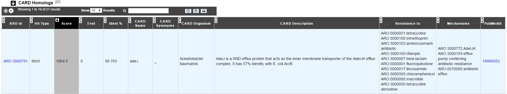

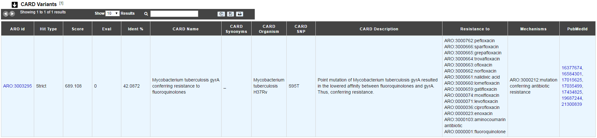

* **ARO id**: ARO number with a link on CARD website
* **Hit Type**: Perfect, Strict or Loose
* **Score**: Blast bitscore
* **Eval**: Blast e-value
* **Ident**: Blast aa identity %
* **CARD Name**: name of the protein/gene in CARD
* **CARD Synonyms**: synonym names
* **CARD family**: family of the protein/gene in CARD
* **CARD Organism**: organism of the reference sequence
* **CARD SNP**: predicted SNPs confering the resistance (mutation is included in the detection model)
* **CARD Description**: description of the protein/gene in CARD
* **Mechanisms class**: class of mechanism involved in Antibiotic Resistance
* **Mechanisms**: mechanism involved in Antibiotic Resistance
* **Resistance to**: antibiotic terms related to the resistance
* **PubMedId**: related publications

You can access to the :ref:`CARD Result page <card>` by clicking on  **Resistome** tab in the Comparative Genomics menu.

========
Virulome
========

What is VirulenceDB?
--------------------

VirulenceDB is a virulence genes database build using three sets of data:

•	The core dataset from VFDB (setA), which is composed of genes associated with experimentally verified virulence factors (VFs) for 53 bacterial species
•	The VirulenceFinder dataset which includes virulence genes for Listeria, Staphylococcus aureus, Escherichia coli/Shigella and Enterococcus
•	A manually curated dataset of reference virulence genes for Escherichia coli (Coli_Ref).

The original virulence factors classification from VFDB has been hierarchically attributed to each gene as frequently as possible, in order to provide a functional interpretation of your results.
New virulence factors have also been added to VirulenceFinder and Coli_Ref database to describe as best as possible the gene functions.

Know more about `VFDB <http://www.mgc.ac.cn/VFs/>`_

Know more about `VirulenceFinder <https://cge.cbs.dtu.dk/services/VirulenceFinder/>`_

**References:**

`Chen LH, Zheng DD, Liu B, Yang J and Jin Q, 2016. VFDB 2016: hierarchical and refined dataset for big data analysis-10 years on. Nucleic Acids Res. 44(Database issue):D694-D697. <https://academic.oup.com/nar/article-lookup/doi/10.1093/nar/gkv1239>`_

`Joensen KG, Scheutz F, Lund O, Hasman H, Kaas RS, Nielsen EM, Aarestrup FM. Real-time whole-genome sequencing for routine typing, surveillance, and outbreak detection of verotoxigenic Escherichia coli. J. Clin. Micobiol. 2014. 52(5): 1501-1510. <http://jcm.asm.org/content/52/5/1501.full>`_

How to read Virulome results?
-----------------------------

•	Label / Gene / Product : Label, name of the gene and its product predicted by the Microscope platform
•	Virulence gene description : Vir Organism, Vir Gene, VF name, VF classes, VF pathotypes, VF structure, VF function, VF characteristic, VF mechanism
•	Result interpretation: Score from Blast, E-value, orderQ (rank of the BLAST hit for the protein of the query genome) and orderB (rank of the BLAST hit for the protein of the virulence database).

**Additional information on VF classes:**

They are divided into 4 main classes as proposed by VFDB:

•	Offensive virulence factors
•	Defensive virulence factors
•	Nonspecific virulence factors
•	Regulation of virulence-associated genes

A gene can be involved in many classes. For example, the gene kpsE (Capsule polysaccharide export inner-membrane protein KpsE) from E. coli can act both as an offensive virulence factor and a defensive virulence factor.

So the VF classes corresponding is “Offensive virulence factors, Invasion, Defensive virulence factors, Antiphagocytosis“ which correspond to :

1. Offensive virulence factors

  1.1 Invasion

2. Defensive virulence factors

  2.1 Antiphagocytosis

You can access to the :ref:`Virulence Result page <virulence>` by clicking on  **Virulome** tab in the Comparative Genomics menu.

==============
IntegronFinder
==============

What is IntegronFinder?
-----------------------

IntegronFinder is a tool that detects integrons in DNA sequences with high accuracy. It is accurate because it combines the use of HMM profiles for the dectection of essential protein, the site-specific integron integrase, and the use of Covariance Models for the detection of the recombination site, the attC site.
This tool also annotates gene casettes however we use our own annotations to make it run.
IntegronFinder distinguishes 3 types of elements:

* Complete integron: integron including an integrase and at least one attC site
* In0 element: integron integrase only, without any attC site nearby
* CALIN element: The clusters of attC sites lacking integron-integrases (CALIN) are composed of at least two attC sites

Know more about `IntegronFinder <http://integronfinder.readthedocs.io/en/latest/>`_

**Reference:**
`Cury J. et al. 2016. Identification and analysis of integrons and cassette arrays in bacterial genomes Nucleic Acids Research ; [PMID 27130947] <http://www.ncbi.nlm.nih.gov/pubmed/27130947>`_

How to read IntegronFinder results?
-----------------------------------

The **IntegronFinder** dataset appears if the genomic object correspond to an integron integrase. The table shows :

* **Integron id**: Id number of the integron to which belongs the integrase
* **Integron begin** / **Integron end**: position of the integron on the replicon
* **Integron type**: complete, CALIN or In0
* **Eval**: Evalue of the match with the HMM integrase

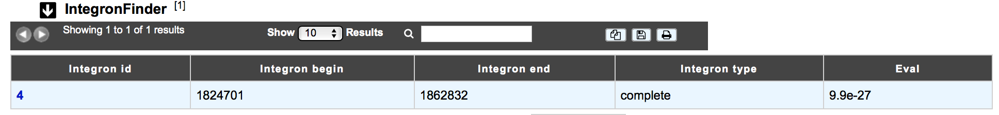

How to explore Integron clusters?
---------------------------------

The :ref:`IntegronFinder cluster visualization <integron-cluster-vizualization>` window can be accessed by clicking on the cluster number in the Integron Id field. This window allows you to access to a detailled description of the integron structure.

===========
MacSyFinder
===========

What is MacSyFinder?
--------------------

Macromolecular System Finder (MacSyFinder) provides a flexible framework to model the properties of molecular systems (cellular machinery or pathway) including their components, evolutionary associations with other systems and genetic architecture. Modelled features also include functional analogs, and the multiple uses of a same component by different systems. Models are used to search for molecular systems in complete genomes or in unstructured data like metagenomes. The components of the systems are searched by sequence similarity using Hidden Markov model (HMM) protein profiles. The assignment of hits to a given system is decided based on compliance with the content and organization of the system model. 

Know  more about `MacSyFinder <https://research.pasteur.fr/fr/software/macsyfinder-macsyview/>`_

**Reference:** 

`Abby SS, et al. 2014. MacSyFinder: a program to mine genomes for molecular systems with an application to CRISPR-Cas systems, PLoS ONE 2014;9(10):e110726 ; [PMID 25330359] <http://www.ncbi.nlm.nih.gov/pubmed/25330359>`_
	

How to read MacSyFinder results?
--------------------------------

The **MacSyfinder** dataset appears if the genomic object correspond to a macromolecular system predicted by MacSyFinder The table shows :

* **System id**: Id number of the macromolecular system to which belongs the gene
* **Mandatory present**:	
* **Begin/End**:	
* **Gene status**:	
* **MacSy label**: label proposed by MacSyFinder
* **Eval**: Evalue of the match
* **Query coverage**: coverage of the match on the query sequence
* **Subject coverage**:	coverage of the match with MacSyfinder model
* **Begin match	/ End match**: position of the match on the query sequence

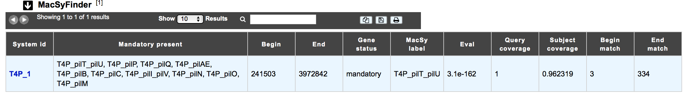

How to explore a Macromolecular System?
---------------------------------------

The :ref:`MacSyFinder System visualization window <macromolecular-system-vizualization>` can be accessed by clicking on any cluster number in the System Id field. This window allows you to access to a detailled description of a selected Macromolecular System.
