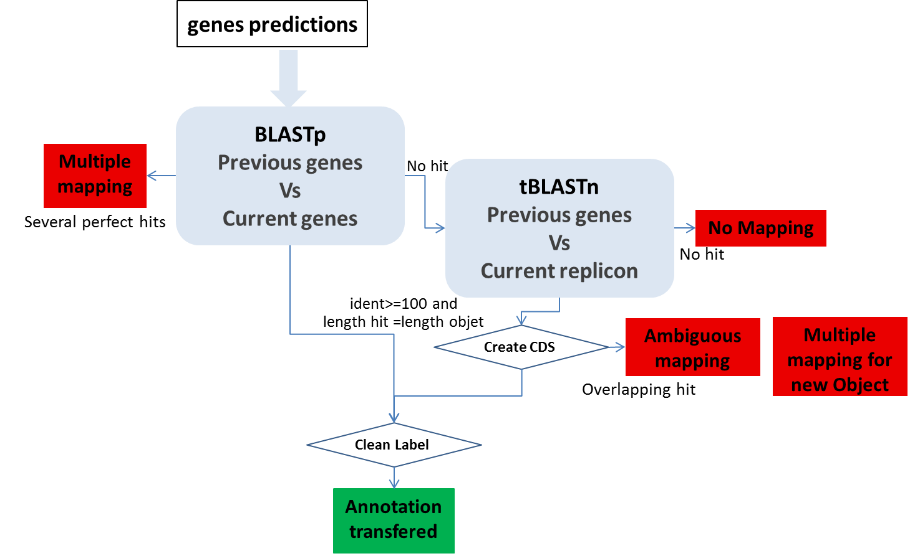
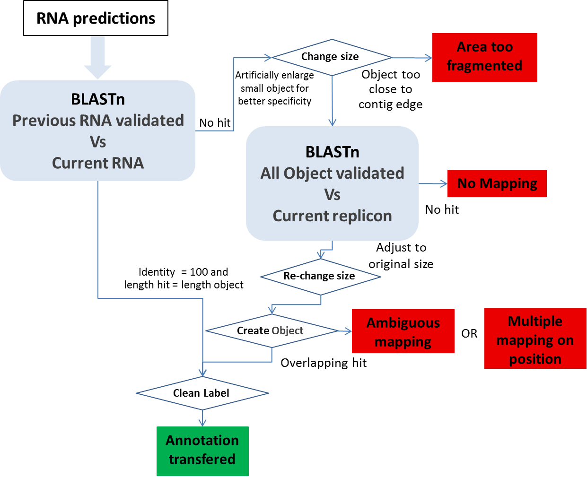

#######################
Annotation Mapping
#######################

Only available for users having an account on MicroScope.

Provides label (i.e, locus_tag) correspondences between a new version of the genome being annotated/analysed (progression of the sequencing step) and the old one(s).

=================================
Report Methods
=================================
At the moment the report is performed with these objects:

* CDS
* fCDS
* tRNA
* rRNA
* misc_RNA
* tmRNA
* ncRNA
* IS
* misc_feature
* promoter

In order to report the annotation from the previous version of the sequence to the updated one, we perform several BLAST analyses:

**CDS mapping**:

* 1- We use BLASTp between all the CDS automatically found in both sequences by the MicroScope annotation pipeline. We make a correspondence using the filter (pos>=100 and lrap=1) for the genes with the same length (AA) with Bidirectional Best Hits.
* 2- We perform a tBLASTn using genes which have been validated (annotated) or manually created by the user on the previous version of the sequence (if these genes have not passed the first BLAST filter) on the new sequence. We make a correspondence using the filter (pos>=100) for the genes with the same length (nucleic).

**Other Object mapping**: All other object types (tRNA, rRNA, misc_RNA, tmRNA, ncRNA, IS, misc_feature, promoter) are computed using BLASTn.

* 1- We use BLASTn between all the validated (annotated) RNAs in the previous version of the sequence and all the MicroScope predicted RNA on the new sequence version. We make a correspondence using the filter (pos>=100 and lrap=1).
* 2- An another BLASTn is performed using the IS, misc_feature, promoter and RNA validated in the previous sequence (the RNA with no hit during the last BLAST) against the current sequence. We artificially increase the object size to have a better specificity, and we make a correspondence using the filter (pos>=100 and lrap=1) on the enlarge version.

=================================
Manually report
=================================

In few cases, the correspondences may not have been established automatically between the previous and the current version.

It can be caused by several types of issues when we try to make the correspondences:

* **Ambiguous mapping**: Two (or more) genes/objects have the same stop codon but the identity between them is not good enough to report the annotation (the start codon is different). You have to check if the genes/objects are the same and decide to report the annotation or not, adjust the start or not ...
* **multiple mapping on object**: Several objects on the old sequence matched the same genomic object on the new sequence. It happens if the objects are identical (same best BLAST possible match), you then have to chose which annotation to transfer to the object on the new sequence (most of the time, it correspond to duplicate genes on the previous sequence ie: transposase).
* **Multiple mapping on position**: Several objects on the old sequence matched the same coordinates on the new sequence (with no object predicted on these coordinates on the new sequence). If needed, you have to  `create <http://microscope.readthedocs.org/en/latest/content/mage/viewer.html#can-i-create-a-new-genomic-object>`_ the object on the new sequence then copy the annotation you wish to transfer...
* **Area too fragmented**: The considered objects are too close to contig edges to perform the BLAST analysis with enough specificity.
* **No mapping**: no significant hit on the new sequence.

In order to solve these cases, you have to manually check these CDS/objects using specific informations given in the different results tables and the gene information window.
