##############
Genome Browser
##############

==============================
Overview of the Genome Browser 
==============================

Organisation of the genomic map
-------------------------------

The MaGe genome browser is organised into 3 parts:

* the upper part of the window details the Coding Sequences (CDSs) that have been predicted for reading frames +1, +2 and +3 in the current region
* the middle part indicates the position of RNA objects (rRNA, tRNA, misc_RNA) as well as repeated regions (as turquoise rectangles) if any have been detected
* the bottom part of the window shows CDSs that have been predicted for reading frames -1, -2 and -3

The predicted CDSs are indicated by rectangles on each frame.

The blue lines symbolize the coding prediction curve. They increase when coding probability is high and drop when the coding probability is low.

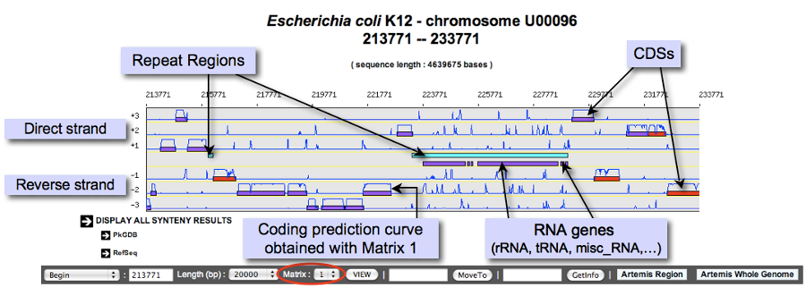

What is the meaning of the Genomic Object color code ?
------------------------------------------------------

The rectangles symbolising each Genomic Object (CDS, RNA...) follow a color code that corresponds to their annotation status, summarized below:

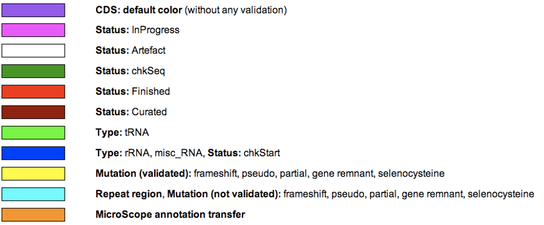

How to move along the sequence ?
--------------------------------

1) You can navigate along the selected sequence by using the grey arrows located on the left and right sides of the genomic map.
2) You can also enter directly a genomic coordinate and then click on **VIEW**.
3) Enter a gene name (e.g. dnaA) or a gene label (e.g., ECK0001) and click on **Move to**. The map is centered on the requested Genomic object.

If several genes have been annotated with the same gene name, the window will move to the first occurrence of these genes on the genome sequence.

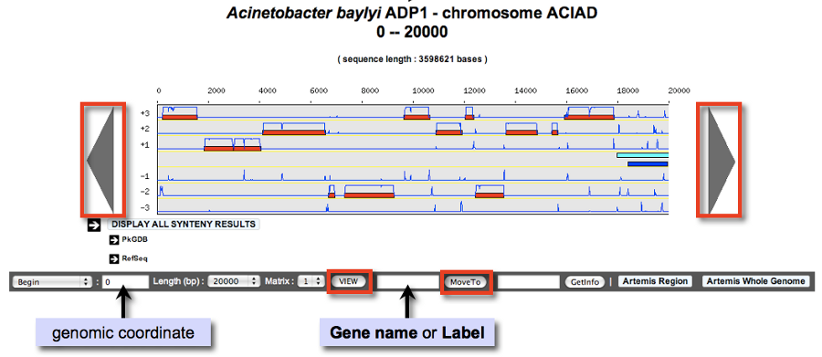

Why sometimes genes are framed with a black line?
-------------------------------------------------

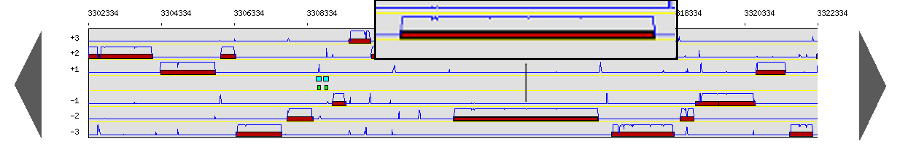

This is a way to quickly identify a specific gene when annotator use the Move To functionalities:
* From result tables: 

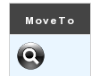

* From the toolbar below the synteny maps:

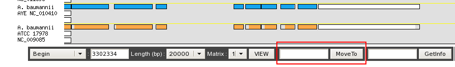

After a *Move To* action, the Genome Browser will be reloaded and centered around the corresponding gene, which will be framed with a black line.

How to read the table of annotated genomic objects ?
----------------------------------------------------

* **Sequence**: if you click on the DNA icon, it opens a new window with the sequences (nucleic and protein) of the genomic object
* **Label**: it gives you the label of the genomic object. If you click on it, the Gene Annotation Editor will popup for this Genomic Object
* **Type**: CDS, fCDS, tRNA, rRNA misc_RNA...
* **Gene**: gene name if any
* **Begin**: begin position of the genomic object on the sequence
* **End**: end position of the genomic object on the sequence
* **Length**: length of the genomic object, in nucleotides
* **Frame**: reading frame of the genomic object
* **Product**: description of the gene product of the genomic object
* **Matrix**: reference number for the matrix which has been used to predict the genomic object (see below)
* **Evidence**: automatic/validated/artefact // inprogress/finished/curated
* **AmiGene Status**: no/Wrong/New
* **GC content**: GC content of the sequence of the genomic object
* **GC3 content**: GC content on the 3rd position of the codons
* **CAI**: Codon Adaptation Index value
* **Mw**: Molecular weight in Daltons
* **Pi**: Isoelectric point
* **History**: Access to the annotation history of the genomic object

What is the Matrix ?
--------------------

For a given genome several gene Matrices can be built for gene detection. You can select a given matrix be using the Matrix menu located below the genomic map. Then click on View: the Coding prediction curves are updated.

How to access a gene’s information ?
------------------------------------

* 1) Enter a specific gene name or gene label into the right-most edit button below the genomic map, then click on Getinfo (opens an editable Genomic Object annotation window)
* 2) Click on a gene label in the table annotation editor (read-only window)
* 3) Click directly on a genomic object in the genomic map (editable annotation window)

How to access the annotation history of a genomic object ?
----------------------------------------------------------

Click on the **History icon** in located the table of genomic objects or in the Gene Annotation Editor window toolbar. 
The history opens in a new window, allowing you to follow the annotation’s evolution as well as the identity of previous annotators. You can send an email to an annotator by clicking on his/her login name.

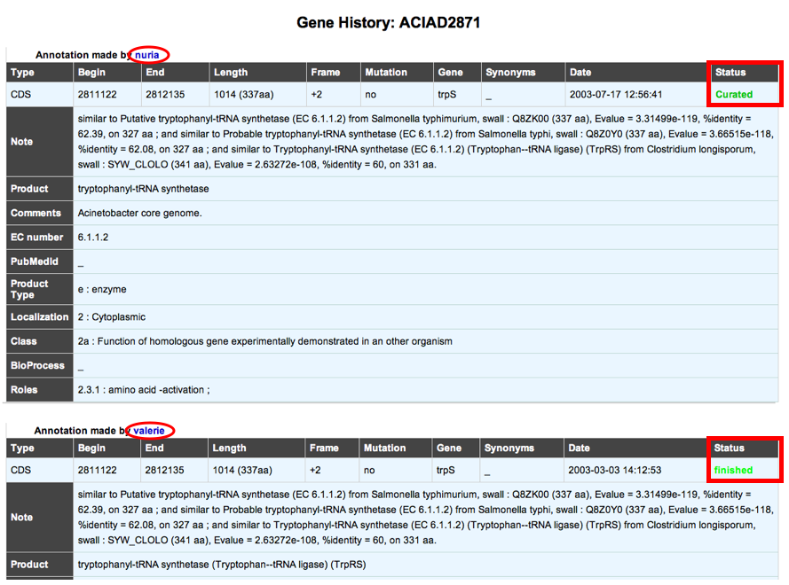

How to use the "Export to Gene Cart" button ?
---------------------------------------------

The **Export to Gene Cart** button allows you to export all genomic objects contained in the genomic map to a Gene Cart. 
If you click on the button, a new window opens, offering the choice of creating a new cart or to selecting a pre-existing cart in which store the data. 
You can access to your gene carts via the Gene Cart Interface.

Can I create a new genomic object ?
-----------------------------------

The **NEW** button located below the genomic map allows you to create a new genomic object. If you click on the button, a Genomic Object Editor window opens. 
You have to manually fill in all fields to create your new object. You have to specify its Type, Begin, End, Frame, Mutation, Product, ... Then click on **SAVE**.

**Tips**:

* If you don’t have any modification rights on a sequence, the **SAVE** button is replaced by a **MAIL** button. In this case your proposition of a new genomic object is emailed to the project leader.
* Please note that you can’t delete a genomic object from the database.

Which program is used to detect the repeats ?
---------------------------------------------

Repeat detection is performed by the Repsek program.

**More**: http://wwwabi.snv.jussieu.fr/ public/RepSeek/

**Reference**: Achaz G, Boyer F, Rocha EP, Viari A, Coissac E. Repseek, a tool to retrieve approximate repeats from large DNA sequences. Bioinformatics. 2007 Jan1;23(1):119-21.

How to read the Repeat Regions table ?
--------------------------------------

* **Sequence**: Access to the nucleic sequence of the repeat region
* **Id**: Label of the repeat region on the replicon
* **Begin**: Begin of the region
* **End**: End of the region
* **Comments**: Number of repeat units contained in the repeat region

If you click on a repeat region label, you obtain the detailed list of the repeat units contained in the repeat region in a new window.

* **Sequence**: Access to the nucleic sequence of the repeat unit
* **Id**: Label of the repeat unit on the replicon
* **Type**: Type of repeat **Direct**, **Tandem** or **Overlap**
* **Strand**: Location of the repeat unit on the reverse **R** or direct **D** strand
* **Begin1**: Begin of the first unit
* **End1**: End of the first unit
* **Length1**: Length of the first unit in bp
* **Begin2**: Begin of the second unit
* **End2**: End of the second unit
* **Length2**: Length of the second unit in bp
* **Ident%**: Identity percentage between the 2 repeat units

=========
Syntenies 
=========

What is a synteny ?
-------------------

**Definitions**

* Synteny: Orthologous gene set having the same local organization in species A and in species B.
* Synton: Maximal set of orthologous gene pairs displaying a conserved organization.
* Conserved Organization: Relative location of orthologous genes on compared genomes : permutations - insertions/deletions.

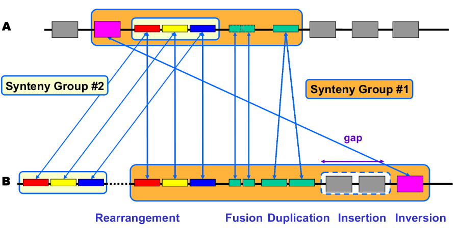

**Synteny computation algorithm is relying on 2 kinds of relations**:

* Inter-genomic : Nature of the relationship (similarity, functional class, etc) and ‘correspondence’ between genes (BBH, 1-n relation)
* Intra-genomic : Gene ‘co-localisation’ (with a ‘gap’ parameter).

**Correspondence relationships are**:

* Sequence similarity : BlastP Bidirectional Best Hit OR at least 30% identity on 80% of the shortest sequence (minLrap 0.8)
* Co-localization: Gap = 5

What are the different display modes for syntenies vizualisation?
-----------------------------------------------------------------

Two modes are available for the representation of the syntenies : 
(1)A representation by pairs of genomes from PkGDB database and from NCBI databank. 
(2)A representation with species grouped by taxonomy.

How to switch from a mode to another one?
-----------------------------------------

The «Switch» button (1), between the genome browser and the synteny maps, allows to change your visualization mode. Also, the «Option» button (2) and «Display preference» interface (3) allow to change:

* the vizualisation mode.
* the taxon choice for the representation with species grouped by taxonomy (Phylum, Class, Order, Family, Species).
* the default organism / taxonomy entries selection, so you can manage your own selections.

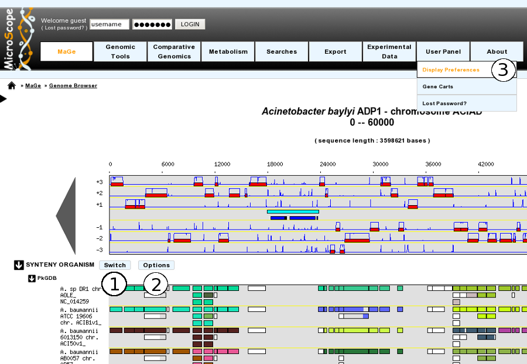

How to read the synteny maps with representation by pairs of genomes?
---------------------------------------------------------------------

The synteny maps are calculated for all pairs of genomes from the PkGDB database (first synteny map) or from the NCBI databank (second map). They represent the distribution of homologs of the current genome in other genomes from these databases. Each row on the map corresponds to one genome replicon (chromosome or plasmid) whose name is indicated on the left. In contrast to the genomic map, there is no scale on the synteny map: a rectangle has the same size as the CDS to which it is homolog.

The color of the rectangles reflect illustrate synteny conservation, to the exception of the white color. Thus, a group of rectangles which share a common color shows that there is a conservation of the synteny between the current genome and the genome of the synteny map. Rectangles filled with white indicate homologs that don’t belong to a synteny group. The synteny maps should be read linearly: the color code has to be interpreted by replicon, i.e. by row. The same color on 2 synteny map rows doesn’t indicate any synteny relationship.

When you hover the mouse pointer over a synteny gene, a short summary appears : it indicates the gene label of the homolog, as well as its gene name and product description. It also gives the identity (Id) conservation between the sequence and its homolog on the studied genome. The minLRap and maxLrap values give some indications about the alignment of the 2 proteins.

The filling of a rectangle reflects the alignment quality between the 2 proteins.

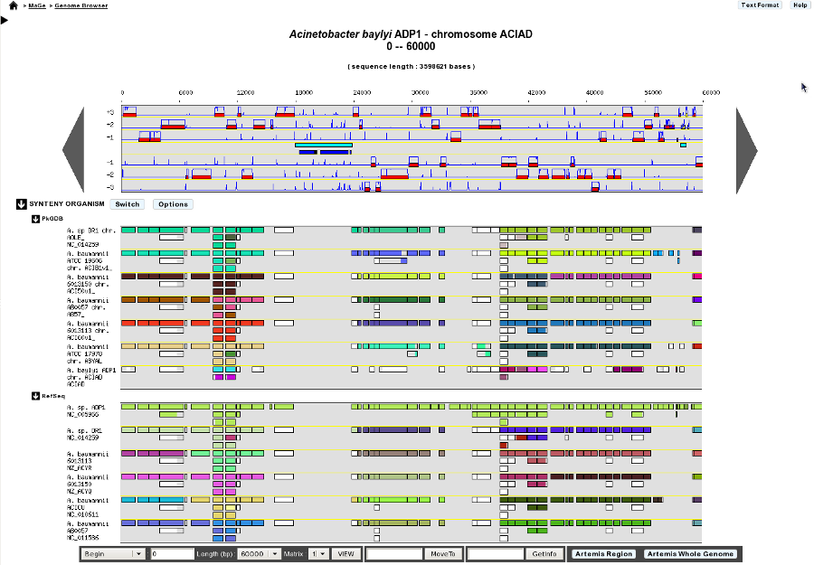

**Exemple**:

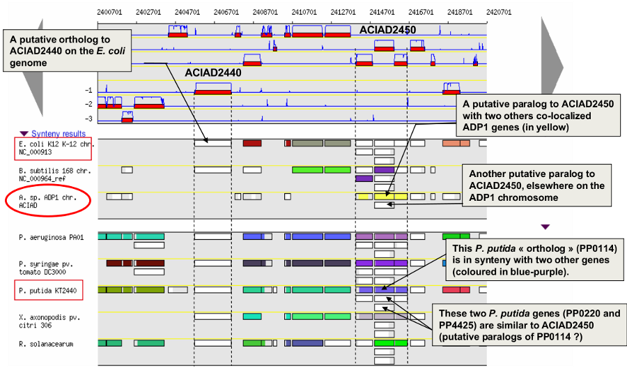

How to read the synteny maps with representation grouped by taxonomy ?
----------------------------------------------------------------------

Syntenies are computed from the PkGDB database for the first map and from the NCBI databank for the second map. Each line refers to a taxon for which the name is displayed on the left side, followed by the number of different species organized in synteny in the observed genomic region. The taxonomic rank can be modified through the «Option» button.

On the maps, a coloured box represents the synteny conservation with the reference gene for at least an organism of taxon of the row. Boxes have the same size that the corresponding reference gene and the synteny map is lined with Genome Browser to ease comparisons.

The color of the block corresponds to species percentage which have a synteny with the reference gene. This percentage is computed by dividing the organisms number of taxon in synteny for the corresponding gene by the total organisms number of the taxon.

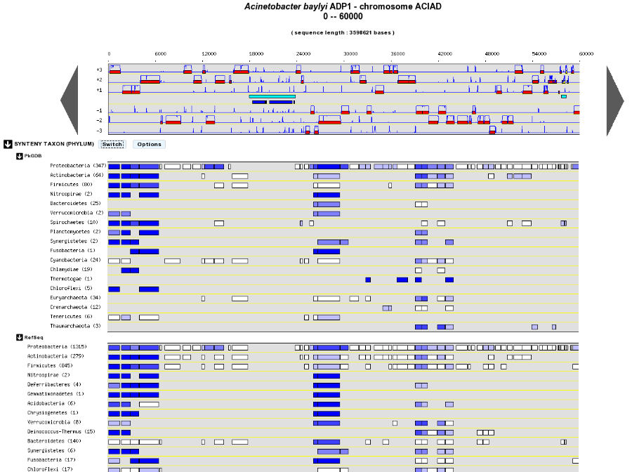

**Percentage of species in synteny**

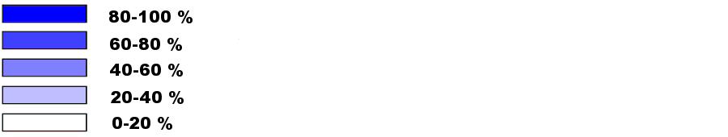

How to zoom in on a synteny group ?
-----------------------------------

If you click on a synteny group, it opens a popup synton visualization window which shows a more detailled view of the syntenies.

* **Representation by pairs of genomes**

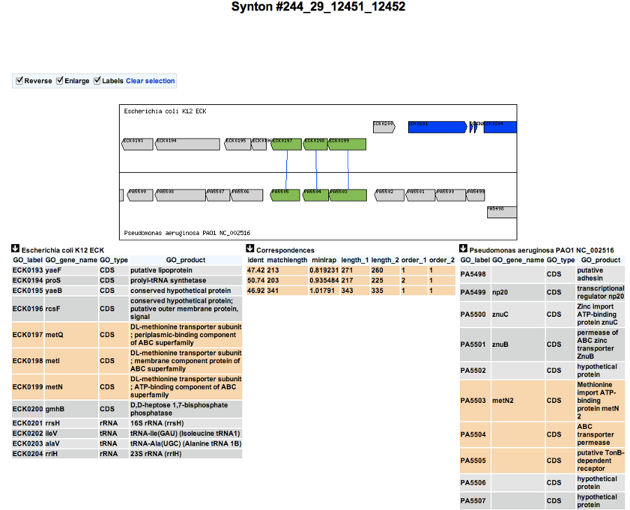

* **Representation with species grouped by taxonomy**

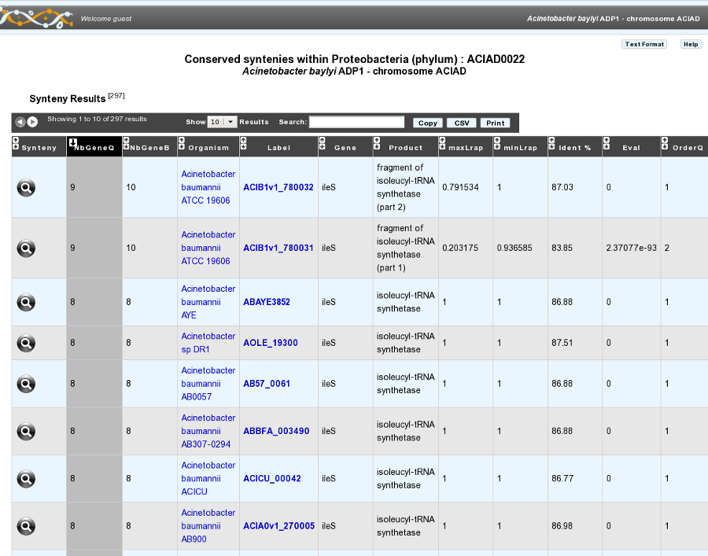
