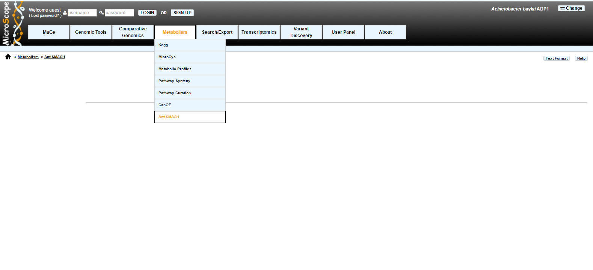
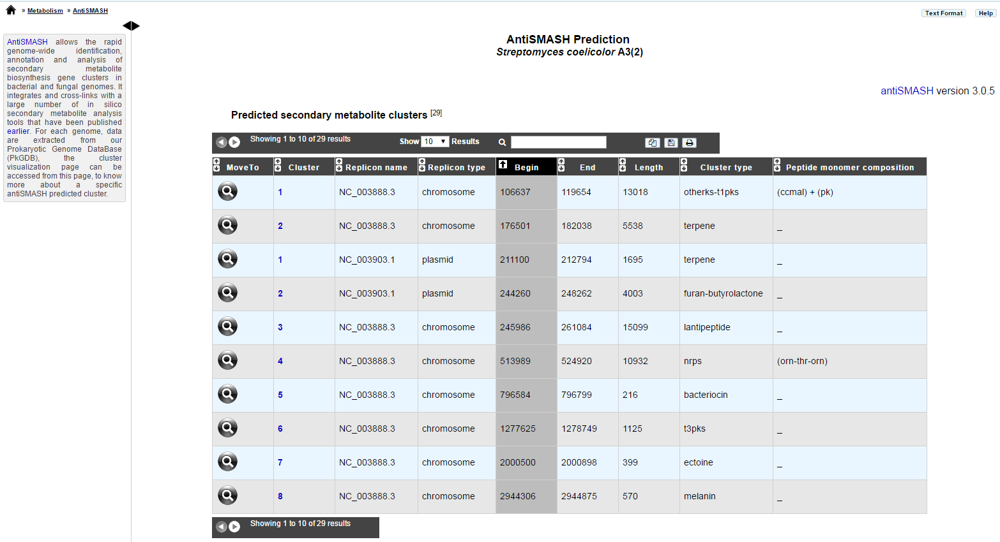

#####################
Secondary metabolites 
#####################

What is antiSMASH?
------------------

Antismash is a tool predicting secondary metabolite cluster

Know  `more <https://microscope.readthedocs.io/en/latest/content/mage/info.html#antismash>`_ about `antiSMASH <http://antismash.secondarymetabolites.org/about.html>`_

How to access to the antiSMASH predictions?
-----------------------------------------------

AntiSMASH predictions are available through the **Metabolism** section, in the main navigation menu.

What is this table?
------------------

This table enumerates all secondary metabolite clusters detected for the selected organism and its replicons.

How to explore this secondary metabolite clusters?
---------------------------------------

The `AntiSMASH cluster visualization window <https://microscope.readthedocs.io/en/latest/content/metabolism/domainviewer.html>`_ 
can be accessed by clicking on any cluster number in the **Cluster** field.
This window allows you to visualize the full antiSMASH cluster prediction and its genomic context.
