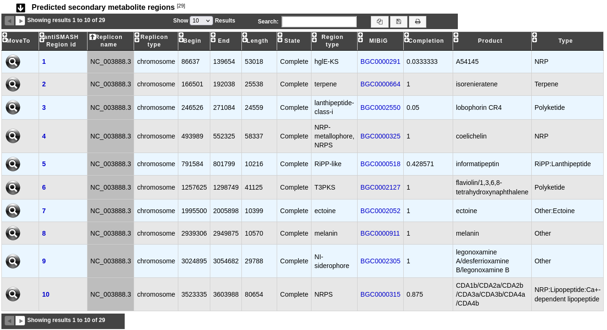

.. _antiSMASH:

#####################
Secondary metabolites
#####################

What are secondary metabolites?
-------------------------------

Secondary metabolism (also called specialized metabolism) refers to pathways and small molecule products of metabolism that are not absolutely required for the survival of the organism.
Secondary metabolites are produced by many microbes, plants, fungi and animals.
Bacterial secondary metabolites are an important source of antimicrobial and cytostatic drugs.
These molecules are often synthesized in a stepwise fashion by multimodular megaenzymes that are encoded in clusters of genes encoding enzymes for precursor supply and modification.

What is antiSMASH?
------------------

AntiSMASH is a tool predicting secondary metabolite gene clusters in bacterial genomes.

Know :ref:`more <mage_antiSMASH>` about `antiSMASH <https://docs.antismash.secondarymetabolites.org/>`__.

**Reference:**

`Blin, Kai et al. antiSMASH 7.0: new and improved predictions for detection, regulation, chemical structures and visualisation. Nucleic acids research vol. 51,W1 (2023): W46-W50. <https://doi.org/10.1093/nar/gkad344>`_

These result are linked to the `Minimum Information about a Biosynthetic Gene cluster (MIBiG) database <https://mibig.secondarymetabolites.org/>`_.

`Terlouw, Barbara R et al. MIBiG 3.0: a community-driven effort to annotate experimentally validated biosynthetic gene clusters. Nucleic acids research vol. 51,D1 (2023): D603-D610. <https://doi.org/10.1093/nar/gkac1049>`_

How to access to the secondary metabolites gene clusters predicted by antiSMASH?
--------------------------------------------------------------------------------

Secondary metabolites gene clusters predictions are available through the **Metabolism** section and the **Secondary Metabolites** subsection, in the main navigation menu.

What is the "Predicted secondary metabolite regions" table?
-------------------------------------------------------------

This table enumerates all secondary metabolite regions predicted for the selected organism and its replicons.

* **antiSMASH Region id**: Identifier of the region. Click on it to open the detailled :ref:`antiSMASH cluster visualization window <domainviewer>` page,
  which allows you to visualize the full antiSMASH cluster prediction and its genomic context.
* **Replicon name** and **Replicon type** give characteristics of the replicon where the region is found.
* **Begin**, **End** and **Length** give informations about the location and the length of the region on the sequence.
* **State** indicates whether the region is complete or partial, which means that it is located on the contig edge.
* **Region type**: Type of the region, predicted by antiSMASH.
* **MIBiG**: MIBiG region identifier with the best hit (if any), click on it to open the MIBiG website page related to this MIBiG.
* **Completion**: Completion of the best hit between MIBiG region and antiSMASH predicted region (if any hit). See below for more information about its computation.
* **Product** and **Type**: Product and type of the MIBiG compound.

MIBiG completion
------------------

The completion is computed as follow :

.. math::

   \text{Completion}=\frac{\text{nb\_of\_hit}}{\text{nb\_of\_mibig\_gene}}

Where:

  * :math:`\text{nb\_of\_hit}` = number of genes with blast hit in the antiSMASH predicted region and MIBiG region
  * :math:`\text{nb\_of\_mibig\_gene}` = number of all genes in the MIBiG curated region

This means that when 2 or more genes in a single MIBiG curated region are similar, the same gene in pkgdb can hit on these MIBiG gene.
Moreover, it's also possible that several pkgdb genes can hit on a single MIBiG gene.
When these situations happen, the completion can be higher than 1 (represented by 1*).

