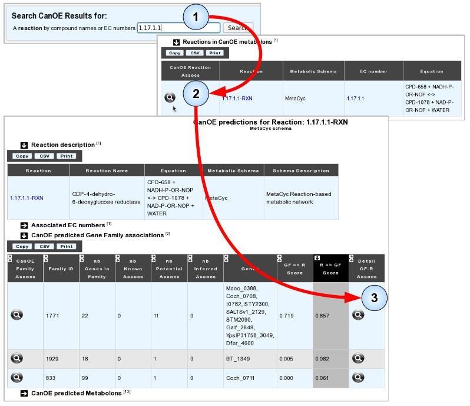
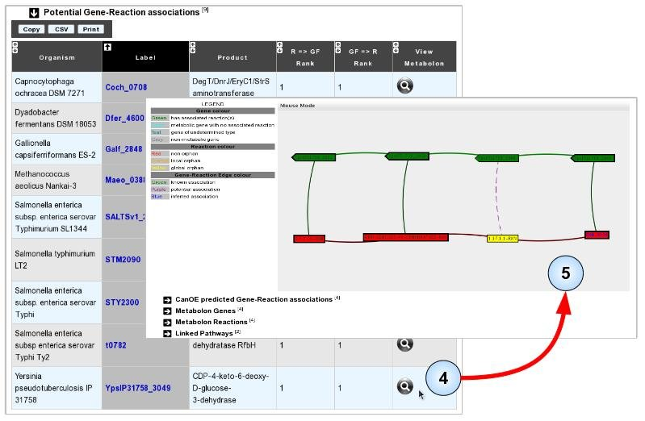
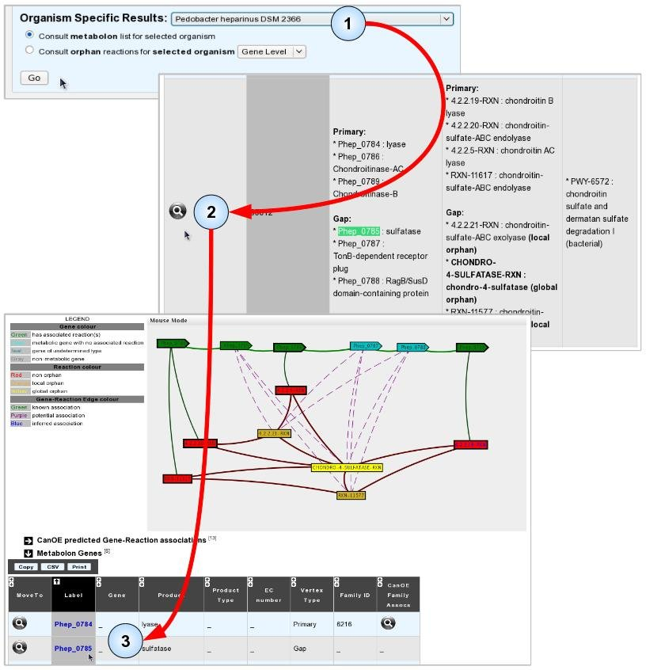
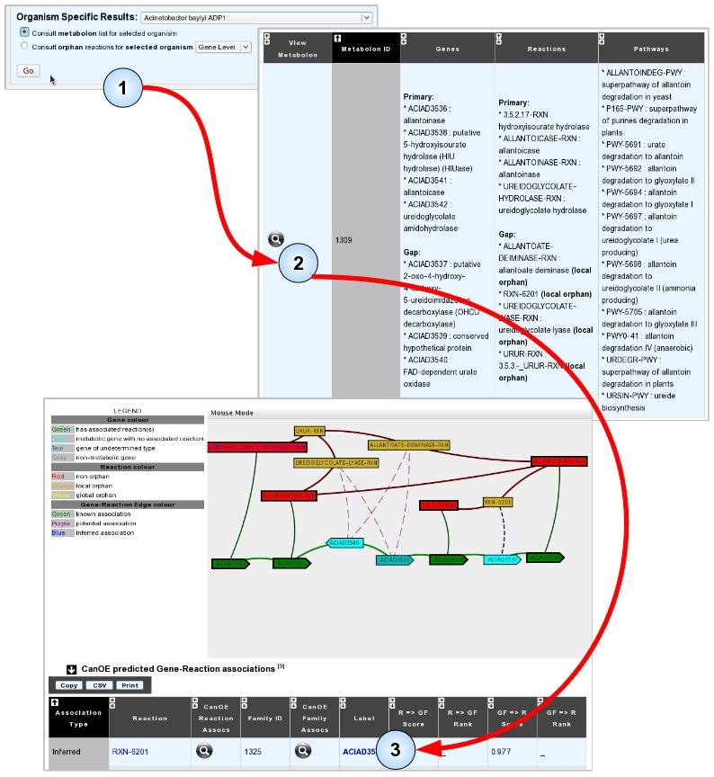
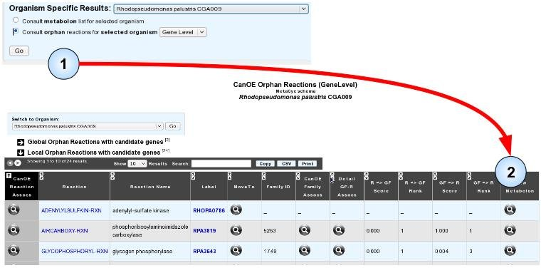

#####
CanOE
#####

Introduction
------------

The CanOE strategy is a bioinformatics strategy set up within the MicroScope platform. It was designed in order to propose candidate genes for sequence-orphan enzymatic activities, but its results can be exploited in several more traditional bioanalysis ways.

**CanOE Overview**

CanOE contains four main steps.

* The first step locates “genomic metabolons”, i.e. groups of co-localized genes coding proteins catalyzing reactions linked by shared metabolites, in one genome at a time. We use an adapted version of the CCCPart algorithm to do this [1].
* In the second step, these metabolons are used to generate candidate annotations (“Potential associations”) between un-annotated genes and gene-less reactions.
* The third step integrates these gene-reaction associations over several genomes using gene families, and summarizes the strength of family-reaction associations by several scores. Furthermore, we are able to transform some Potential associations into “Inferred” associations, whenever there is sufficient contextual backing to support cross-family functional annotation transfer.
* In the final step, the family-based scores are used to rank members of gene families which are proposed for metabolic reactions. Full details on the inner working of the CanOE strategy may be found in its dedicated article [2].

**Metabolic data used** 

CanOE was designed to support the use of multiple types of metabolic data, such as KEGG [3], MetaCyc [4], Rhea [5]... Reaction and pathway data from these resources are parsed into a global metabolic network containing all known reactions, linked by biologically-relevant compounds. Details on the construction of such networks can be found in the CanOE article [2]. Currently, all available metabolons are built using a MetaCyc-based metabolic network.

Using CanOE results
-------------------

**Basic use cases**
Data produced by the CanOE strategy can be used by bioanalysts at four different levels.

* First, genomic metabolons can serve as a visual summary representation of the metabolic contexts corresponding to groups of co-localised genes. This simplifies the reconstruction effort required to assess this context when annotating a gene of interest. As such, metabolons can be useful aids to annotation.
* Secondly, Potential gene-reaction associations are automatically generated. They can be visualised and considered when attempting to annotate the concerned genes.
* Thirdly, the integration across multiple genomes allows CanOE to propose the transfer of functional annotations on the basis of sequence similarity backed up by metabolic context. The Inferred associations can also be visualised and considered when attempting to annotate the concerned genes.
* Finally, due to its independence in respect to sequence similarity in the construction of metabolons, CanOE is able to propose candidate genes even for sequence-orphan reactions. Furthermore, gene families can receive family-based associations scores and ranks for these reactions. Candidate genes for orphan enzymatic activities can thus be ranked in each organism.

We have developed a MicroScope web interface in order to give our users access to CanOE results, so that they may exploit them in these different ways.

We shall now present the use of this interface through the exploration of several biological questions that CanOE can help answer.

Once several networks have been implemented, selecting the Metabolic network will be possible through the main page combobox illustrated below:

How can I find candidate genes for my favourite orphan enzyme?
--------------------------------------------------------------

There are several ways of accessing CanOE data in order to answer this question. We shall present one here, and shall take as an example the search for candidate genes for the enzymatic activity “CDP-4-dehydro-6-deoxyglucose reductase” (EC 1.17.1.1) which is catalogued by the OrEnzA database [6] as an sequence-orphan reaction across all of UniProt.

* **Item #1**. From CanOE’s main page, enter the EC number (or a keyword corresponding to part of the reaction name or one of the compounds it involves) into the search box. Here, we use “1.17.1.1”.
* **Item #2**. From the list of search results, click the “CanOE Reaction Details” magnifying glass to examine all CanOE data for this reaction. In this case, only one result was found.
* **Item #3**. From the reaction’s page, you can select one of the best-scoring families that contain candidate genes for this reaction. In this example, we choose the first family as its “R=>F” score is magnitudes higher than those of the other families.

* **Item #4**. Select any one of the listed associations to visualise the metabolon in which it was found. Here, we selected the metabolon from Yersinia pseudotuberculosis as one of its gene products seems to be already annotated with the target “orphan” reaction.
* **Item #5**. Manually evaluate the accuracy of the prediction using the Metabolon Viewer, associated data, or usual MicroScope tools. In this case, consulting the Gene Info page for the proposed gene shows that it shares high sequence similarity to an experimentally validated protein of Yersinia pseudotuberculosis (Q57174, PubMed ID: 8071227). “CDP-4-dehydro-6-deoxyglucose reductase” was considered as a global sequence-orphan as no proteins are correctly annotated with the corresponding EC number (1.17.1.1) in the MicroScope and UniProt resources.

I want to use CanOE data to annotate my favourite gene
------------------------------------------------------

We shall illustrate this by finding potential annotations for gene “Phep_0785” from *Pedobacter heparinus* DSM 2366.

* **Item #1**. Select the host genome for your target gene and click “Go” to open the list of metabolons for this organism.
* **Item #2**. Use the table search boxes or your browser’s “search web page box” to find occurrences of your target gene’s Genomic Object Label, and select a metabolon to view by clicking its magnifying glass.
* **Item #3**. In the selected metabolon, CanOE proposes several Potential associations for Phep_0785, making it a candidate gene for several metabolic reactions. Looking at the gene’s Gene Info page reveals that it shares significant sequence similarity with SwissProt-annotated Arylsulfatases of Eukaryotic origin (EC numbers: 3.1.6.- or 3.1.6.12). Arylsulfatases catalyse reactions similar to chondro-4-sulphatase, one of the reactions proposed for Phep_0785. We might thus propose this gene as a candidate for this reaction. Phep_0785 does not belong to any CanOE families, however, and thus has no family-based scores nor ranks to help guide this decision.

How can I use metabolons to help annotate the genome I recently submitted to MicroScope?
----------------------------------------------------------------------------------------

CanOE generates Inferred and Potential gene-reaction associations for local and global sequence-orphan metabolic reactions (i.e. reactions that have no known coding genes in a target organism or across all MicroScope organisms, respectively). Use Inferred reactions to annotate genes with local orphan reactions on the basis of sequence similarity backed by contextual clues. Use Potential associations as hypotheses that could reinforce or undermine annotations you would otherwise have difficulty in establishing. There are currently two ways of accessing metabolons and their predicted associations for a target genome:

* **Item #1**. As in the previous example, open the list of metabolons for your target organism.
* **Item #2**. The metabolon list page does not show what Potential or Inferred associations there are, but you can consult individual metabolons.
* **Item #3**. Select and analyse a metabolon for possible annotations. In the example illustrated below, analysis of an Acinetobacter baylyi ADP1 metabolon containing local orphan reactions revealed an Inferred association between gene ACIAD3537 and reaction RXN-6201, which is strong evidence that the gene may catalyse it. Notice how ACIAD3537 is NOT proposed as a candidate for any other of the gap reactions in the metabolon.

Another possibility to search for these predicted associations is to focus on orphan reactions, be they global or local, in your target genome. The organism-specific orphan reaction with candidate genes page works exactly like the global orphan reaction with candidate genes page, albeit it limits candidate genes to those of the target organism, and both local and global orphan reactions are listed.

* **Item #1**. You can open the orphan reaction list page for your genome by selecting your target genome, clicking the “*Consult orphan reactions for selected organism*” radio button, selecting the detail level (preferably at the Gene level if you want to directly access the candidate genes), and clicking “*Go*” .
* **Item #2**. You can then view any metabolon of your choice, as before.

Other useful CanOE web pages
----------------------------

There are several other CanOE web pages that are there to help bioanalysts make sense of CanOE data. The organisation of the CanOE web pages is represented below.

.. image:: img/canoe7.png

Gray pages are tool-related pages. Orange pages describe CanOE-specific objects (gene families, reactions, metabolons, associations). Blue pages are result listings. Main access links between pages are shown as black arrows, secondary as gray arrows. Some pages are organism-specific, that is, the data they show can be ascribed to only a single organism. Please note that:

* a) most pages referring to reactions also provide external links to the source metabolic databases they were drawn from
* b) most pages referring to genes provide access to MicroScope Gene Info pages and Genome Browser view pages.

Note on access rights
---------------------

CanOE is run on all the prokaryote genome sequences in MicroScope (not RefSeq genome sequences), be they public (or private) access. However, results from private genomes are only available to users with read rights to them. 

Gene families may include genes from both public and private sequences. However, again, the data concerning these genes will only be accessible to MicroScope users having read rights on them. When listed for a user without access rights, the data for these genes is ’hidden’.

References
----------

1. Boyer F, Morgat A, Labarre L, Pothier J, Viari A (2005) Syntons, metabolons and interactons: an exact graph-theoretical approach for exploring neighbourhood between genomic and functional data. Bioinformatics 21: 4209-4215.
2. `Smith AAT, Belda E, Viari A, Medigue C, Vallenet D (2012) The CanOE strategy: integrating genomic and metabolic contexts across multiple prokaryote genomes to find candidate genes for orphan enzymes. PLoS Comp Biol. <http://journals.plos.org/ploscompbiol/article?id=10.1371/journal.pcbi.1002540>`_ 
3. Kanehisa M, Goto S, Hattori M, Aoki-Kinoshita KF, Itoh M, et al. (2006) From genomics to chemical genomics: new developments in KEGG. Nucleic Acids Res 34: D354-D357.
4. Caspi R, Foerster H, Fulcher CA, Kaipa P, Krummenacker M, et al. (2008) The MetaCyc Database of metabolic pathways and enzymes and the BioCyc collection of Pathway/Genome Databases. Nucl Acids Res 36: D623-D631.
5. Alcántara R, Axelsen KB, Morgat A, Belda E, Coudert E, et al. (2012) Rhea—a manually curated resource of biochemical reactions. Nucl Acids Res 40: D754-D760.
6. Lespinet O, Labedan B (2006) ORENZA: a web resource for studying ORphan ENZyme activities. BMC Bioinformatics 7: 436-436.