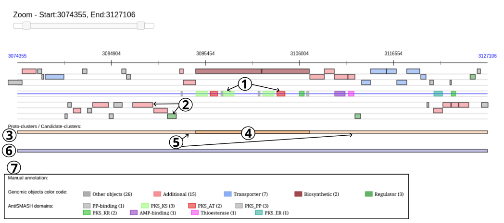
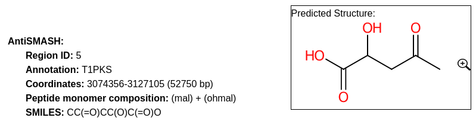

.. _domainviewer:

###############################
AntiSMASH cluster visualization
###############################

What is antiSMASH?
------------------

Know :ref:`more <mage_antiSMASH>` about `antiSMASH <http://antismash.secondarymetabolites.org/#!/about>`_.

**Reference:**

`Blin, K. et al. (2021) antiSMASH 6.0: improving cluster detection and comparison capabilities. Nucleic acids research vol. 49, W29-W35. <https://doi.org/10.1093/nar/gkab335>`_

How can I visualize the clusters predicted by antiSMASH?
--------------------------------------------------------

You can access to the **antiSMASH cluster visualization** window by clicking on the number indicated in the **Region ID** field in the antiSMASH result table.

This window allows you to visualize the antiSMASH cluster predictions and their genomic context.

You can also use the main navigation menu in the **Metabolism** section and **Secondary Metabolites** subsection to obtain the :ref:`antiSMASH predictions page <antiSMASH>`.
This page enumerates all secondary metabolite clusters detected for the selected organism and its replicons.

What information are in this window?
------------------------------------

.. image:: img/antiSMASH6_domainviewer_window.png

* **Item #1**: Viewer
* **Item #2**: Region description section
* **Item #3**: 'Knownclusters' section
* **Item #4**: 'Genomic Objects' section
* **Item #5**: 'Clusters' section

All the elements are more described below.

Viewer
------

The **Viewer** allows you to visualize a selected antiSMASH cluster prediction and its genomic context.
The representation is similar to that of MicroScope Genome Browser with the different genomic objects in the region displayed over the 6 reading phases (**item #1**).
Only some type of genomic object are represented: ``CDS``, ``fCDS``, ``tRNA``, ``rRNA``, ``misc_RNA``, ``ncRNA``, ``tmRNA``, ``misc_feature`` and ``mobile_element``.
``misc_feature`` object will appear at the bottom of the viewer.

The colored boxes (**item #2**) on the blue line in the middle of the **Viewer** represent the predicted domains of the secondary metabolite genes.

The boxes at the bottom of the viewer display firstly protoclusters (**item #3**), with their core (**item #4**) and  neighborhoods (**item #5**),
and secondly candidate clusters (**item #6**) found in this region.

All the boxes can be mouse over to obtain summarized informations about them:

* for all boxes, informations about the location and the length of the element are displayed.
* for domains boxes, the type and the predicted substrate (if there is one) of the domain and different metrics computed by antiSMASH (score, E-value) are displayed.
* for genomic objects boxes, there is information on annotation, gene name, product and  type of the genomic object.
* for protoclusters and core-protoclusters boxes, the type of the protocluster.
* for candidate clusters boxes, the type and the peptide monomer composition (if any) of the candidate cluster.

Data on genomic objects, data on proto-clusters and data on candidate clusters are also described respectively in the following tables
:ref:`Genomic Objects <genomic_objects_antismash>`, :ref:`Proto-clusters <protocluster>` and :ref:`Candidate-clusters <candidatecluster>`.

The color code of the different types of boxes is described in the viewer caption (**item #7**) and :ref:`below <colorcode_antismash>` in the documentation.

Region section
--------------

This section present a brief summary of the region, with its identifier, its annotation/type and its location and length.

In case of NRPS/PKS cluster type, the predicted peptide monomer composition may be indicated as well.

If this composition is specific enough, the SMILES prediction and its visualization are displayed.

Thanks to `simolecule <http://www.simolecule.com/cdkdepict/depict.html>`_ for Picture's displays.

Knownclusters section
---------------------

These tables provide information about similar known clusters described in `MIBiG database <https://mibig.secondarymetabolites.org/>`_.
The Minimum Information about a Biosynthetic Gene cluster (MIBiG) can help to know more on biosynthetic gene clusters, their molecular products and their related publications.

`Kautsar S.A., et al. (2020) MIBiG 2.0: a repository for biosynthetic gene clusters of known function. Nucleic acids research vol. 48, D454-D458. <https://doi.org/10.1093/nar/gkz882>`_

1. **MIBiG Region Similarities** table

  This table helps to know more on biosynthetic gene clusters by comparison with MIBiG reference database on all the region.

  .. image:: img/antiSMASH6_knownclusters_tab.png

  * **MIBiG** and **Locus**: Identifier and locus of the MIBiG hit corresponding to the region. Click on the identifier to open the corresponding MIBiG website page.
  * **Product** and **Type**: Product and type of the MIBiG compound.
  * **Completion**: Completion of the hit between MIBiG region and antiSMASH predicted region (see :ref:`below <mibig_completion>` for more information about its computation).

2. The **MIBiG Protocluster Similarities** table

  This table helps to know more on biosynthetic gene clusters by comparison with MIBiG reference database on the considered protocluster.

  This is useful when there is several protocluster in the same region to try to characterize each protocluster.

  See :ref:`below <protocluster>` to known more about protocluster.

  .. image:: img/antiSMASH6_knownprotoclusters_tab.png

  * **Protocluster id**: Protocluster identifier.
  * **MIBiG** and **Locus**: Identifier and locus of the MIBiG region which hit on the protocluster. Click on it to open the MIBiG website page related to this MIBiG.
  * **Product** and **Type**: Product and type of the MIBiG compound.
  * **Completion**: Completion of the hit between MIBiG region and antiSMASH predicted protocluster (see :ref:`below <mibig_completion>` for more information about its computation).

Genomic Objects section
-----------------------

.. _genomic_objects_antismash:

1. **Genomic Objects** Table

  This table provides informations regarding the genomic objects depicted in the graphical representation.

  Almost all fields are the same than those present in the **Genomic Objects** table of the **Genome Browser** (accessible in the **MaGe** section of the main navigation menu).
  To known more, see the documentation page of the **Genome Browser**.

  .. image:: img/antiSMASH6_go_tab.png

  * **Label**: Label of the genomic object.
  * **Begin** and **End**: Location of the genomic object on the sequence.
  * **Frame**: Reading frame of the genomic object.
  * **Gene**: Gene name if any.
  * **Evidence**: *automatic*/*validated*/*artefact* // *inprogress*/*finished*/*curated*
  * **Type**: CDS, fCDS, tRNA, rRNA, misc_RNA, ncRNA, tmRNA, misc_feature, mobile_element.
  * **Product**: Description of the gene product of the genomic object.
  * **antiSMASH annotation**: Display notably (if any) the predicted domains and SMCOG (Secondary Metabolite Clusters of Orthologous Groups) class.
  * **Status**: Genomic object type predicted by antiSMASH if any.
    It can be: *biosynthetic*, *biosynthetic-additional*, *regulatory*, *transport*, *other*.
  * **Domain type**: Type of the genomic object's domains predicted by antiSMASH if any.

  Status *biosynthetic* means that the considered gene is a major part or the core of the secondary metabolite system.

  Status *biosynthetic-additional* means that the considered gene is part of the secondary metabolite system.

2. **Tailoring Clusters Similarities** table

  This table provides informations about genes which may be involved in tailoring reactions.

  .. image:: img/antiSMASH6_tailoringclusters_tab.png

  * **TC label**, **Natural product**, **TC product class**, **PubMedId** and **Completion** help to known more about predicted tailoring clusters.
  * **Label** gives the MicroScope gene label.
  * **TC protein id**, **TC gene name** and **Protein description** give characteristics about genes which compose the tailoring cluster.
  * **% identity**, **Coverage** and **Evalue** give some mathematical indicators about the match between tailoring gene and MicroScope gene.

Clusters section
-----------------

.. _protocluster:

1. **Proto-clusters** table

  A protocluster is a cluster which contains a core with its neighbourhoods and has only one single product type.

  .. image:: img/antiSMASH6_protoclusters_tab.png

  * **Candidate id**: Identifier of the candidate in which the protocluster is found.
  * **Protocluster id**: Identifier of the protocluster.
  * **Begin** and **End**: Location of the protocluster on the sequence.
  * **Type**: Type of the protocluster.
  * **Core begin** and **Core end**: Location of the protocluster core on the sequence.

.. _candidatecluster:

2. **Candidate-clusters** table

  A candidate cluster contains one or more protoclusters. It is useful for modelisation of hybrid regions, i.e. regions which produce two or more product types.

  .. image:: img/antiSMASH6_candidateclusters_tab.png

  * **Candidate id**: Identifier of the candidate cluster.
  * **Begin** and **End**: Location of the candidate cluster on the sequence.
  * **Type**: Type of the candidate cluster
  * **Peptide monomer composition**: Composition of the predicted peptide monomer in case of NRPS/PKS cluster type, if any.
  * **Smile**: Smile prediction of the peptide monomer if the composition is specific enough.

.. _mibig_completion:

MIBiG completion
------------------

The completion is computed as follow :

.. math::

   \text{Completion}=\frac{\text{nb\_of\_hit}}{\text{nb\_of\_mibig\_gene}}

Where:

  * :math:`\text{nb\_of\_hit}` = number of genes with blast hit in the antiSMASH predicted region and MIBiG region
  * :math:`\text{nb\_of\_mibig\_gene}` = number of all genes in the MIBiG curated region

.. _colorcode_antismash:

What is the meaning of the color code in the AntiSMASH cluster visualisation window?
------------------------------------------------------------------------------------

1. Color code of the features

  .. image:: img/antiSMASH6_colorcode_features.png

2. Color code of the predicted domains

  .. image:: img/antiSMASH6_colorcode_domains.png

