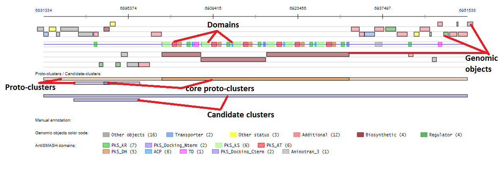
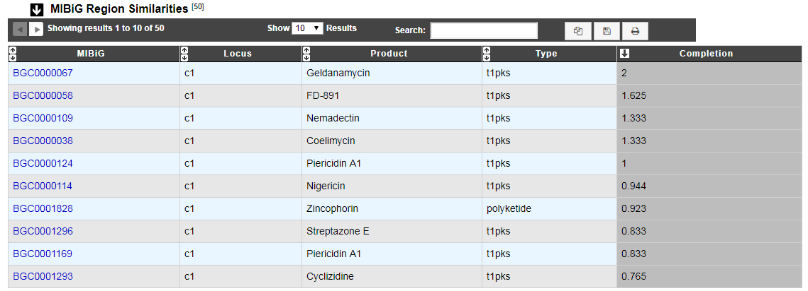
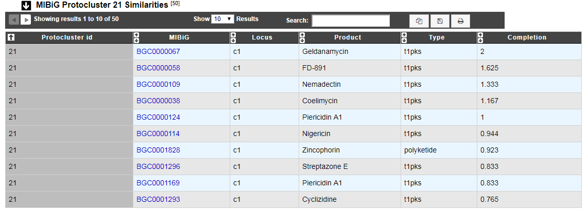
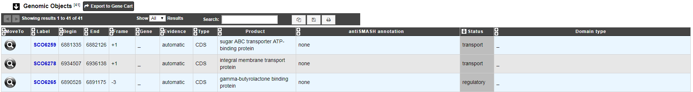
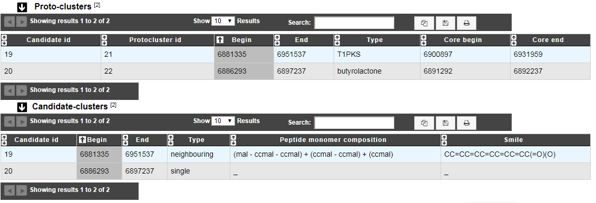

.. _domainviewer:

###############################
AntiSMASH cluster visualization
###############################

What is antiSMASH?
------------------

Know  :ref:`more <mage_antiSMASH>` about `antiSMASH <http://antismash.secondarymetabolites.org/#!/about>`_

**References:** 

`antiSMASH 5.0: updates to the secondary metabolite genome mining pipeline
Kai Blin, Simon Shaw, Katharina Steinke, Rasmus Villebro, Nadine Ziemert, Sang Yup Lee, Marnix H Medema, & Tilmann Weber
Nucleic Acids Research (2019). <https://doi.org/10.1093/nar/gkz310>`_

How can I visualize the clusters predicted by antiSMASH?
--------------------------------------------------------

You can access to the **AntiSMASH cluster visualization** window by clicking on the number indicated in the Cluster field in the antiSMASH result table.

You can also use the main navigation menu in the **Metabolism** section to obtain the **AntiSMASH predictions** page.
This page enumerates all secondary metabolite clusters detected for the selected organism and its replicons.

What information are in this window?
--------------------------------------------------------
This window allows you to visualize the antiSMASH cluster predictions and its genomic context.

The boxes in the middle of the viewer (on the blue line) represent the predicted domains of the predicted secondary metabolite genes.
The other boxes in the viewer represent the genomic object existing in the region. Only some type of genomic object are represented ('CDS','fCDS','tRNA','rRNA','misc_RNA','ncRNA','tmRNA','misc_feature','mobile_element'). 'misc_feature' object will appear at the bottom of the viewer.

All the boxes in the **viewer** can be mouse over to obtain summarized informations about them. The genomic object data are also described in the **Genomic Objects** table below.

In case of NRPS/PKS cluster type, the predicted peptide monomer composition may be indicated as well, if this composition is specific enough, the smile prediction and its visualization are displayed.

Proto-cluster: antiSMASH Proto-cluster prediction, gene core + neighbourhoods prediction.

Candidate cluster: contain 1 or more proto-cluster, useful for modelisation of hybrid region.

|
|

Thanks to `simolecule <http://www.simolecule.com/cdkdepict/depict.html>`_ for Picture's displays.

|
|

The **MIBiG Clusters Similarities** table provides information about similar known clusters described in MIBiG database. The Minimum Information about a Biosynthetic Gene cluster (MIBiG) can help to know more on biosynthetic gene clusters, their molecular products and their related publications.

`Medema M.H., et al. (2015) Minimum Information about a Biosynthetic Gene cluster. Nat Chem Biol. Sep;11(9):625-31. <http://www.ncbi.nlm.nih.gov/pubmed/26284661>`_

This table help to know more on biosynthetic gene clusters by comparaison with MIBiG reference database on all the region.

:ref:`know more about completion calcul <mibig_completion>`

This table help to know more on biosynthetic gene clusters by comparaison with MIBiG reference database on the considered proto-cluster. This is useful when there is several proto-cluster in the same region to try to caracterize each proto-cluster.
The completion calcul is very similar than before:

nb_of_hit = number of genes with blast hit in antiSMASH predicted proto-cluster that are "flagged" biosynthetic or biosynthetic-additional  and MIBiG region.

nb_of_mibig_gene = number of MIBiG genes (all of them) in the MIBIG curated region

.. math:: nb_of_hit/nb_of_mibig_gene

|
|

The **Genomic Objects** table provides information regarding the genomic objects depicted in the graphical representation.

Status *biosynthetic* mean that the considered gene is important (core) to the secondary metabolite system.
Status *biosynthetic-additional* mean that the considered gene is part of the secondary metabolite system.

|
|

The **Tailoring Clusters Similarities** table provides information about genes which may be involved in tailoring reactions. By clicking on the number, you can access to the Pubmed related publication.

* The 6 first columns help to know more about the predict tailoring clusters.
* *Label* column gives the MicroScope gene label.
* *TC protein id* , *TC gene name* and *Protein description* give information about genes which compose the tailoring cluster.
* *% identity*, *Coverage* and *e-values* give some mathematical information about the match between tailoring gene and MicroScope one.

.. image:: img/antiSMASH3_Tailoringcluster.PNG

|
|

These tables show the correspondence between proto-cluster/candidate-cluster and the list of the cancidate-clusters.

|
|

What is the meaning of the color code in the AntiSMASH cluster visualisation window?
-------------------------------------------------------------------------------------------

.. image:: img/antiSMASH3_domain_color_code.PNG
.. image:: img/antiSMASH3_Feature_color_code.PNG
