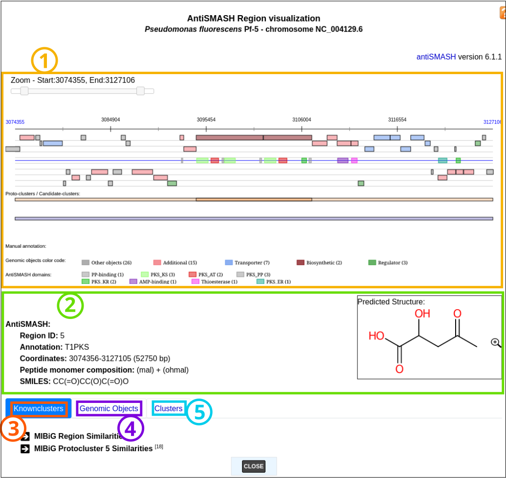
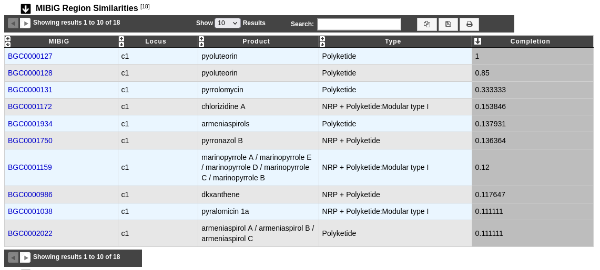
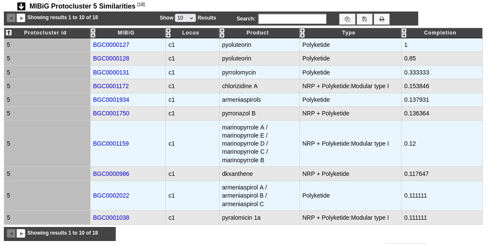
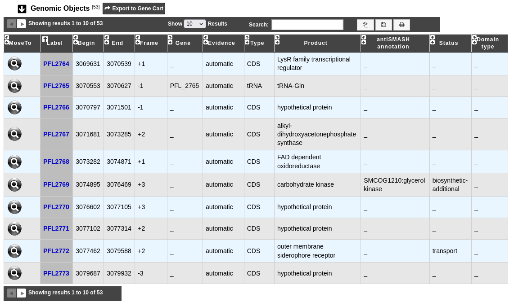
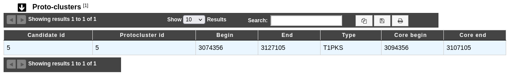
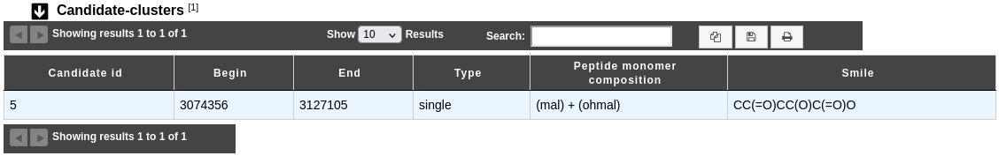
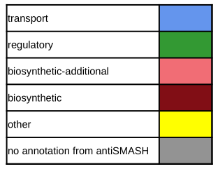
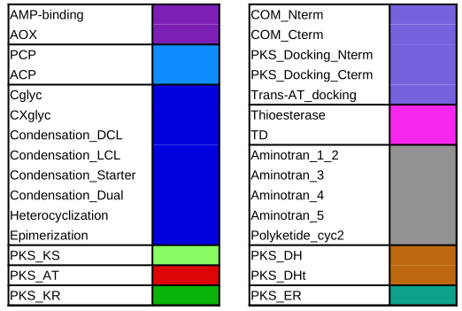

.. _domainviewer:

###############################
AntiSMASH cluster visualization
###############################

What is antiSMASH?
------------------

Know :ref:`more <mage_antiSMASH>` about `antiSMASH <http://antismash.secondarymetabolites.org/#!/about>`_.

**Reference:**

`Blin, K. et al. (2021) antiSMASH 6.0: improving cluster detection and comparison capabilities. Nucleic acids research vol. 49, W29-W35. <https://doi.org/10.1093/nar/gkab335>`_

How can I visualize the clusters predicted by antiSMASH?
--------------------------------------------------------

You can access to the **antiSMASH cluster visualization** window by clicking on the number indicated in the **Region ID** field in the antiSMASH result table.

You can also use the main navigation menu in the **Metabolism** section and **Secondary Metabolites** subsection to obtain the :ref:`antiSMASH predictions page <antiSMASH>`.
This page enumerates all secondary metabolite clusters detected for the selected organism and its replicons.

What information are in this window?
------------------------------------
This window allows you to visualize the antiSMASH cluster predictions and its genomic context.

The boxes in the middle of the viewer (on the blue line) represent the predicted domains of the predicted secondary metabolite genes.
The other boxes in the viewer represent the genomic object existing in the region. Only some type of genomic object are represented (``CDS``, ``fCDS``, ``tRNA``, ``rRNA``, ``misc_RNA``, ``ncRNA``, ``tmRNA``, ``misc_feature``, ``mobile_element``).
``misc_feature`` object will appear at the bottom of the viewer.

All the boxes in the **viewer** can be mouse over to obtain summarized informations about them. The genomic object data are also described in the **Genomic Objects** table below.

In case of NRPS/PKS cluster type, the predicted peptide monomer composition may be indicated as well, if this composition is specific enough, the smile prediction and its visualization are displayed.

Proto-cluster: antiSMASH Proto-cluster prediction, gene core + neighbourhoods prediction.

Candidate cluster: contain 1 or more proto-cluster, useful for modelisation of hybrid region.

* **Item #1**: Viewer
* **Item #2**: Region description section
* **Item #3**: 'Knownclusters' section
* **Item #4**: 'Genomic Objects' section
* **Item #5**: 'Clusters' section

|
|

Thanks to `simolecule <http://www.simolecule.com/cdkdepict/depict.html>`_ for Picture's displays.

|
|

The **MIBiG Clusters Similarities** table provides information about similar known clusters described in MIBiG database. The Minimum Information about a Biosynthetic Gene cluster (MIBiG) can help to know more on biosynthetic gene clusters, their molecular products and their related publications.

`Kautsar S.A., et al. (2020) MIBiG 2.0: a repository for biosynthetic gene clusters of known function. Nucleic acids research vol. 48, D454-D458. <https://doi.org/10.1093/nar/gkz882>`_

* **MIBiG** and **Locus**: Identifier and locus of the MIBiG hit corresponding to the region. Click on the identifier to open the corresponding MIBiG website page.
* **Product** and **Type**: Product and type of the MIBiG compound.
* **Completion**: Completion of the hit between MIBiG region and antiSMASH predicted region (see :ref:`below <mibig_completion>` for more information about its computation).

This table help to know more on biosynthetic gene clusters by comparaison with MIBiG reference database on all the region.

:ref:`know more about completion calcul <mibig_completion>`

* **Protocluster id**: Protocluster identifier.
* **MIBiG** and **Locus**: Identifier and locus of the MIBiG region which hit on the protocluster. Click on it to open the MIBiG website page related to this MIBiG.
* **Product** and **Type**: Product and type of the MIBiG compound.
* **Completion**: Completion of the hit between MIBiG region and antiSMASH predicted protocluster (see :ref:`below <mibig_completion>` for more information about its computation).

This table help to know more on biosynthetic gene clusters by comparaison with MIBiG reference database on the considered proto-cluster. This is useful when there is several proto-cluster in the same region to try to caracterize each proto-cluster.

.. _mibig_completion:

The completion is computed as follow :

.. math::

   \text{Completion}=\frac{\text{nb\_of\_hit}}{\text{nb\_of\_mibig\_gene}}

Where:

  * :math:`\text{nb\_of\_hit}` = number of genes with blast hit in the antiSMASH predicted region and MIBiG region
  * :math:`\text{nb\_of\_mibig\_gene}` = number of all genes in the MIBiG curated region

|
|

The **Genomic Objects** table provides information regarding the genomic objects depicted in the graphical representation.

* **Label**: Label of the genomic object.
* **Begin** and **End**: Location of the genomic object on the sequence.
* **Frame**: Reading frame of the genomic object.
* **Gene**: Gene name if any.
* **Evidence**: *automatic*/*validated*/*artefact* // *inprogress*/*finished*/*curated*
* **Type**: CDS, fCDS, tRNA, rRNA, misc_RNA, ncRNA, tmRNA, misc_feature, mobile_element.
* **Product**: Description of the gene product of the genomic object.
* **antiSMASH annotation**: Display notably (if any) the predicted domains and SMCOG (Secondary Metabolite Clusters of Orthologous Groups) class.
* **Status**: Genomic object type predicted by antiSMASH if any.
  It can be: *biosynthetic*, *biosynthetic-additional*, *regulatory*, *transport*, *other*.
* **Domain type**: Type of the genomic object's domains predicted by antiSMASH if any.

Status *biosynthetic* means that the considered gene is a major part or the core of the secondary metabolite system.

Status *biosynthetic-additional* means that the considered gene is part of the secondary metabolite system.

|
|

The **Tailoring Clusters Similarities** table provides information about genes which may be involved in tailoring reactions. By clicking on the number, you can access to the Pubmed related publication.

.. image:: img/antiSMASH6_tailoringclusters_tab.png

* **TC label**, **Natural product**, **TC product class**, **PubMedId** and **Completion** help to known more about predicted tailoring clusters.
* **Label** gives the MicroScope gene label.
* **TC protein id**, **TC gene name** and **Protein description** give characteristics about genes which compose the tailoring cluster.
* **% identity**, **Coverage** and **Evalue** give some mathematical indicators about the match between tailoring gene and MicroScope gene.

|
|

* **Candidate id**: Identifier of the candidate in which the protocluster is found.
* **Protocluster id**: Identifier of the protocluster.
* **Begin** and **End**: Location of the protocluster on the sequence.
* **Type**: Type of the protocluster.
* **Core begin** and **Core end**: Location of the protocluster core on the sequence.

* **Candidate id**: Identifier of the candidate cluster.
* **Begin** and **End**: Location of the candidate cluster on the sequence.
* **Type**: Type of the candidate cluster
* **Peptide monomer composition**: Composition of the predicted peptide monomer in case of NRPS/PKS cluster type, if any.
* **Smile**: Smile prediction of the peptide monomer if the composition is specific enough.

These tables show the correspondence between proto-cluster/candidate-cluster and the list of the cancidate-clusters.

|
|

What is the meaning of the color code in the AntiSMASH cluster visualisation window?
------------------------------------------------------------------------------------

